# AgentArk 全量实施计划

> 本文档是 AgentArk 从当前架构基线到可发布平台的**唯一阶段执行计划**，不是项目全部事实的唯一来源。安全与协作规则以 `AGENTS.md` 为准，目标架构和决策以 `docs/architecture/` 为准，数据库逻辑模型以 `docs/database/` 为准。
> 它面向具备仓库访问和工具执行能力的 Coding Agent，要求直接检查仓库、读取固定版本上游源码、修改代码并执行真实验证，不得仅输出建议、伪代码或虚构结果。

---

## 0. 文档目的

AgentArk 已经拥有：

- `docs/architecture/overview.md` 与生效 ADR：系统目标架构与不可破坏约束；
- `docs/database/*.md`：三个 MySQL Schema 的逻辑模型与 Flyway 规范；
- `README.md`：项目定位、模块总览和公开说明；
- AgentScope Java 本地源码；
- DeepSeek Harness 本地源码。

下一步不是继续扩写抽象设计，而是按照稳定顺序把架构落实为：

1. 可构建的多模块工程；
2. 可运行的四平面后端；
3. 可复现的 Agent 发布与 Runtime；
4. 可治理的 MCP、Skill、RAG、Secret、权限与 HITL；
5. 可操作的 AgentArk Web；
6. 可部署、可恢复、可观测、可升级的生产系统。

本计划将整个工作拆分为 **24 个阶段（Phase 00–23）**。任何阶段只有满足其验收条件后才能标记完成并进入下一阶段。

---

## 1. 固定路径与变量

在每次 AI 开始工作时，先从 AgentArk 仓库根目录执行：

```bash
export AGENTARK_ROOT="$(git rev-parse --show-toplevel)"
export AGENTARK_ARCH="$AGENTARK_ROOT/docs/architecture/overview.md"
export AGENTARK_PLAN="$AGENTARK_ROOT/PLAN.md"
export AGENTARK_README="$AGENTARK_ROOT/README.md"

export AGENTSCOPE_REPO="${AGENTSCOPE_REPO:-$(dirname "$AGENTARK_ROOT")/agentscope-java}"
export AGENTSCOPE_SOURCE_COMMIT="0c61e7494197ded54eefdeaf9bdeb51807beb752"
export AGENTSCOPE_ROOT="${AGENTSCOPE_ROOT:-$AGENTARK_ROOT/.agentark/upstreams/agentscope-java-2.0.2}"

export DEEPSEEK_HARNESS_REPO="${DEEPSEEK_HARNESS_REPO:-$(dirname "$AGENTARK_ROOT")/deepseek-harness}"
export DEEPSEEK_HARNESS_SOURCE_COMMIT="47f943859bef60e4160492346772ded9b24f765a"
export DEEPSEEK_HARNESS_ROOT="${DEEPSEEK_HARNESS_ROOT:-$AGENTARK_ROOT/.agentark/upstreams/deepseek-harness}"
```

必须验证：

```bash
test "$(git -C "$AGENTARK_ROOT" rev-parse --show-toplevel)" = "$AGENTARK_ROOT"
test -f "$AGENTARK_ARCH"
test -f "$AGENTARK_PLAN"
test -f "$AGENTARK_README"

git -C "$AGENTSCOPE_REPO" cat-file -e "$AGENTSCOPE_SOURCE_COMMIT^{commit}"
test "$(git -C "$AGENTSCOPE_ROOT" rev-parse HEAD)" = "$AGENTSCOPE_SOURCE_COMMIT"
test -d "$AGENTSCOPE_ROOT/agentscope-service"
test -d "$AGENTSCOPE_ROOT/agentscope-harness"

git -C "$DEEPSEEK_HARNESS_REPO" cat-file -e "$DEEPSEEK_HARNESS_SOURCE_COMMIT^{commit}"
test "$(git -C "$DEEPSEEK_HARNESS_ROOT" rev-parse HEAD)" = "$DEEPSEEK_HARNESS_SOURCE_COMMIT"
test -d "$DEEPSEEK_HARNESS_ROOT/apps"
test -d "$DEEPSEEK_HARNESS_ROOT/packages"
```

固定视图由 Phase 00 使用只读 detached Worktree 创建。任何阶段都不得直接读取两套上游仓库的移动 `main` 工作区作为版本证据，也不得修改上游工作区。

Phase 00 创建固定视图时使用：

```bash
mkdir -p "$AGENTARK_ROOT/.agentark/upstreams"

test ! -e "$AGENTSCOPE_ROOT" && \
  git -C "$AGENTSCOPE_REPO" worktree add --detach "$AGENTSCOPE_ROOT" "$AGENTSCOPE_SOURCE_COMMIT"

test ! -e "$DEEPSEEK_HARNESS_ROOT" && \
  git -C "$DEEPSEEK_HARNESS_REPO" worktree add --detach "$DEEPSEEK_HARNESS_ROOT" "$DEEPSEEK_HARNESS_SOURCE_COMMIT"
```

若目录已存在，禁止覆盖，必须先用 `tools/harness/verify_upstreams.py --require-worktrees` 证明其 Commit 正确；移除固定视图时使用对应来源仓库的 `git worktree remove <exact-path>`，不得直接递归删除。

---

## 2. 信息源优先级

出现冲突时按以下顺序裁决：

1. **`AGENTS.md`**
   定义安全、权限、工作方式、验证和知识路由；不会覆盖领域事实。
2. **`docs/architecture/overview.md` 与生效 ADR**
   定义产品定位、领域边界、模块、依赖方向、数据所有权、安全和技术基线。ADR 只有在架构同步后才生效。
3. **`docs/database/`、`contracts/` 与配置参考**
   分别定义持久化、接口/Event 和运行配置的规范事实。
4. **`PLAN.md`**
   只定义实施顺序、阶段任务、验收门槛和执行协议，禁止反向改写架构事实。
5. **`README.md`**
   定义公开定位和当前能力说明，不能反向覆盖架构。
6. **AgentArk 当前源码与测试**
   是当前实现事实，但不是保留错误设计的理由。
7. **固定 Commit 的 AgentScope Java / AgentScope Service 源码**
   是运行能力、行为和迁移参考，不是 AgentArk 最终领域模型。
8. **固定 Commit 的 DeepSeek Harness 源码**
   仅用于前端视觉、布局、交互和工程实践参考，不是 AgentArk 后端或领域架构来源。

若上游行为与 AgentArk 架构冲突：

- 保留上游可验证行为作为迁移证据；
- 在 AgentArk 防腐层或适配器中转换；
- 不允许为了少改代码而破坏架构；
- 必要时新增 ADR；
- 不要将上游临时结构包装成 AgentArk 长期公共 API。

---

## 3. AI 全局执行协议

### 3.1 每个阶段开始前必须执行

```bash
pwd
git status --short
git branch --show-current

git -C "$AGENTSCOPE_ROOT" rev-parse HEAD
git -C "$AGENTSCOPE_ROOT" status --short

git -C "$DEEPSEEK_HARNESS_ROOT" rev-parse HEAD
git -C "$DEEPSEEK_HARNESS_ROOT" status --short

sed -n '1,260p' "$AGENTARK_ARCH"
sed -n '1,220p' "$AGENTARK_PLAN"
```

随后使用 `rg`、`find`、`tree`、`sed`、IDE 索引或等价工具读取当前阶段涉及的完整源码。禁止只根据文件名或 README 猜测实现。

### 3.2 每个阶段必须采用的工作循环

```text
Inspect
  → Record baseline
  → Propose concrete file-level plan
  → Implement smallest coherent slice
  → Compile/test
  → Inspect diff
  → Fix root causes
  → Run full phase gate
  → Update docs/report
  → Summarize evidence
```

### 3.3 AI 必须遵守

- 直接执行任务，不只输出代码片段或建议；
- 先读现状，禁止假设模块、类、表或 API 已存在；
- 读取相关文件的完整上下文，不凭单个片段大改；
- 不修改两个上游源码目录，它们必须保持只读参考；
- 复制源码前记录来源 Commit、原路径、目标路径、许可证和处理方式；
- 不删除上游 Apache-2.0 文件头和 NOTICE 义务；
- 不复制 DeepSeek 品牌、Logo、商标或不必要资产；
- 不把 Go struct、JPA Entity、AgentScope 类型直接变成 AgentArk Domain；
- 每次只完成当前阶段，不顺手跨越多个阶段；
- 不创建 `agentark-common`、`common-utils`、`base-service` 等无边界模块；
- 不以 `Map<String, Object>` 代替稳定领域模型；
- 不用 `TODO`、空方法、永真 Mock 或跳过测试伪装完成；
- 不新增未解释的基础设施；
- 不引入 `latest`、动态版本或未锁定 Snapshot 依赖；
- 不执行破坏性 Git 操作；
- 未获明确授权不 `push`、不改写历史、不强制覆盖用户变更；
- 发现现有未提交用户改动时保留并绕开，不擅自回滚；
- 失败时给出根因、证据和当前安全状态，不能把失败测试直接禁用。

### 3.4 每个阶段结束时必须输出

1. 当前阶段结论：完成 / 部分完成 / 阻塞；
2. 变更文件清单；
3. 关键设计决定；
4. 从上游取用的内容和处理方式；
5. 执行过的命令；
6. 测试结果；
7. 架构约束检查；
8. 已知风险；
9. 推荐 Commit Message；
10. 下一阶段进入条件。

并创建或更新：

```text
docs/implementation/phase-XX-<slug>.md
```

阶段报告必须包含上游 Commit SHA、迁移映射、验收证据和未完成项。

---

## 4. 上游源码取用分类

每个迁移文件必须归入以下一种类别：

| 类别 | 含义 | 要求 |
|---|---|---|
| `REUSE` | 基本保留实现后迁移 | 保留许可证头；记录源/目标路径与修改 |
| `ADAPT` | 保留行为，按 AgentArk 边界重写 | 建立特征测试；记录行为来源 |
| `REFERENCE` | 只借鉴结构或交互 | 不复制实现；报告中说明借鉴点 |
| `REJECT` | 明确不进入 AgentArk | 记录拒绝理由，防止后续机械复制 |
| `DEFER` | 有价值但不在当前阶段 | 标明目标阶段和触发条件 |

建议维护：

```text
docs/migration/
├── upstream-baseline.md
├── source-inventory.md
├── migration-manifest.md
├── behavior-baseline.md
├── license-and-notice.md
└── aistio-strangler.md
```

`migration-manifest.md` 每行至少记录：

```text
source_commit
source_path
target_path
classification
owner_module
license
behavior_tests
notes
```

---

## 5. 全局架构红线

以下任一情况出现时，阶段不得验收：

- Runtime 读取 Control Catalog 表；
- Control 依赖 `agentark-runtime` 或 `agentark-runtime-provider-agentscope`；
- Scheduler 依赖 Runtime/Provider 实现或运行 Harness 推理循环；
- Gateway 依赖 Control/Runtime 业务实现；
- AgentScope Runtime 类型出现在 `agentark-runtime-provider-agentscope` 之外；
- AgentScope RAG 类型出现在 Knowledge 指定 Adapter 之外；
- Published Revision 可被原地更新；
- Session 在运行中重新解析“当前”Revision；
- Snapshot 包含明文 Secret；
- Redis 成为 Revision、Deployment、Approval、Job 的唯一事实源；
- 使用分布式锁但没有 Fencing Token 保护关键写入；
- Event 先推送后持久化；
- Scheduler Job 无幂等、无重试边界、无 Dead Letter；
- 多租户查询只依赖前端、Header 或单一 ORM 插件；
- Controller 直接操作 Mapper、RedisTemplate 或 HarnessAgent；
- 业务模块依赖 `*-server`；
- JPA 与 MyBatis-Plus 在最终架构长期混用；
- PostgreSQL 特性无隔离地进入最终 MySQL 领域设计；
- 前端完整继承 DeepSeek Harness 的 everything-is-a-plugin 架构；
- 生产配置使用共享长期 HMAC Secret 或默认管理员密码；
- 测试通过方式是删除断言、跳过用例或降低质量门槛。

---

## 6. 全局 Definition of Done

一项任务只有同时满足以下条件才算完成：

### 代码

- 模块边界和包依赖正确；
- 命名、错误模型、ID、时间、租户上下文符合架构；
- 无无界集合、无隐藏阻塞、无明显资源泄漏；
- 对外行为有明确契约；
- 关键副作用有幂等和审计；
- Secret/PII 不进入日志、异常、Trace 或 Event。

### 数据

- 所有表有 Owner；
- Flyway 可从空库执行；
- 升级路径可从上一阶段数据库执行；
- 索引、唯一约束、乐观锁和租户字段完整；
- 无跨 Schema Mapper、外键或查询；
- 大 Payload 有 Object Store 策略。

### 测试

- Domain 单测；
- Adapter 集成测试；
- 架构测试；
- 契约兼容测试；
- 关键故障/幂等/并发测试；
- 不能依赖真实外部付费 API 完成 CI。

### 工程

- Maven/前端构建通过；
- 静态检查通过；
- 无新增高危漏洞或许可证问题；
- 文档、示例配置、Migration、Schema 同步；
- 阶段报告和 PLAN 状态更新；
- Git diff 中没有生成垃圾、Secret 或临时文件。

---

## 7. 统一验收门禁

| Gate | 内容 |
|---|---|
| G0 | 路径、源码 Commit、Git 状态和阶段报告完整 |
| G1 | Java/前端编译与格式检查 |
| G2 | 单元测试 |
| G3 | ArchUnit / Maven Enforcer / 模块依赖检查 |
| G4 | MySQL、Redis、MinIO、Qdrant 等集成测试 |
| G5 | OpenAPI、JSON Schema、Event、Snapshot 契约检查 |
| G6 | Build → Publish → Deploy → Run 等 E2E |
| G7 | 身份、租户、Secret、Tool/Sandbox 安全检查 |
| G8 | 并发、恢复、SSE、Lease、Job 和性能检查 |
| G9 | 文档、迁移清单、许可证、Runbook、版本说明 |

全仓最终命令目标：

```bash
./mvnw -T 1C clean verify

pnpm --dir agentark-web install --frozen-lockfile
pnpm --dir agentark-web lint
pnpm --dir agentark-web typecheck
pnpm --dir agentark-web test
pnpm --dir agentark-web build

./tools/dev-up.sh --prepare-only

docker compose \
  -f deploy/compose/docker-compose.yml \
  --profile core \
  config
```

阶段早期某些命令尚不存在时，应先在对应阶段建立它们，不能永久以“不存在”为豁免。

---

## 8. 分支与提交建议

推荐：

```text
main
└── refinex/phase-XX-<slug>
```

提交粒度：

```text
build(...)
feat(kernel): ...
feat(control): ...
feat(runtime): ...
test(...): ...
docs(...): ...
refactor(...): ...
```

规则：

- 一个 Commit 只表达一个可解释变更；
- 不把机械迁移、架构重构、框架升级、ORM 迁移和数据库迁移放在同一 Commit；
- AI 默认只提供推荐 Commit Message；未获明确授权不得执行 `git commit`、`git push`、发布或删除分支；
- 阶段检查点可以用工作区 Diff、Patch、Tree Hash 和阶段报告证明，不得把 Commit 当成 `DONE` 的必要条件；
- 每个阶段结束应有可构建检查点；
- 上游同步使用单独 Commit，避免与业务改造混杂。

---

## 9. 阶段总览

AgentArk 实施分为 7 个里程碑、24 个阶段：

| 里程碑 | 阶段 | 主题 |
|---|---|---|
| A · 取证与治理 | 00–01 | 执行基线、上游源码审计与迁移清单 |
| B · 工程底座 | 02–06 | 机械迁入基线、Maven/BOM、Kernel/Contracts、Starters、服务骨架、持久化基线 |
| C · Control Plane | 07–10 | IAM、多租户、资产目录、Knowledge 元数据、Revision/Snapshot/Deployment |
| D · Runtime Plane | 11–13 | Runtime Domain、AgentScope Adapter、SSE/HITL/恢复 |
| E · 平台服务 | 14–16 | RAG 摄取、Scheduler、Gateway |
| F · 产品与治理 | 17–20 | Web 基础、Web 功能、可观测/成本、安全加固 |
| G · 收口与生产 | 21–23 | Go Aistio 绞杀、生产部署/DR、Release Readiness |

```mermaid
flowchart LR
    P00["00 Baseline"] --> P01["01 Source Audit"]
    P01 --> P02["02 Import & Build Foundation"]
    P02 --> P03["03 Kernel & Contracts"]
    P03 --> P04["04 Focused Starters"]
    P04 --> P05["05 Service Shells"]
    P05 --> P06["06 Persistence Baseline"]
    P06 --> P07["07 IAM & Tenancy"]
    P07 --> P08["08 Asset Catalog"]
    P08 --> P09["09 Knowledge Metadata"]
    P09 --> P10["10 Revision & Deployment"]
    P10 --> P11["11 Runtime Domain"]
    P11 --> P12["12 AgentScope Adapter"]
    P12 --> P13["13 Runtime API"]
    P13 --> P14["14 RAG"]
    P14 --> P15["15 Scheduler"]
    P15 --> P16["16 Gateway"]
    P16 --> P17["17 Web Foundation"]
    P17 --> P18["18 Web Features"]
    P18 --> P19["19 Observability & Governance"]
    P19 --> P20["20 Security Hardening"]
    P20 --> P21["21 Aistio Strangler"]
    P21 --> P22["22 Production"]
    P22 --> P23["23 Release Readiness"]
```



---

## 10. 阶段状态表

> 执行时只修改状态、完成日期、证据链接和备注，不删除历史。

| Phase | 状态 | 完成日期 | 阶段报告 | 备注 |
|---|---|---|---|---|
| 00 | DONE | 2026-08-15 | `docs/implementation/phase-00-execution-baseline.md` | 固定上游、工具链和仓库规范已验收 |
| 01 | DONE | 2026-08-15 | `docs/implementation/phase-01-upstream-audit.md` | 固定上游结构、行为、迁移分类与许可边界已验收 |
| 02 | DONE | 2026-08-15 | `docs/implementation/phase-02-build-foundation.md` | 机械迁入证据、Maven/BOM、质量生命周期与 CI 已验收 |
| 03 | DONE | 2026-08-15 | `docs/implementation/phase-03-kernel-contracts.md` | Kernel、Snapshot/Event/API 契约与架构门禁已完成验收 |
| 04 | DONE | 2026-08-15 | `docs/implementation/phase-04-foundation-starters.md` | 六个职责单一 Starter、条件化配置、安全默认与架构规则已验收 |
| 05 | DONE | 2026-08-15 | `docs/implementation/phase-05-service-shells.md` | 四服务空业务骨架、Core/RAG Compose、Secret 与三 Schema 隔离已验收 |
| 06 | DONE | 2026-08-15 | `docs/implementation/phase-06-persistence-baseline.md` | 三 Schema、Flyway、MyBatis-Plus、Testcontainers 与迁移规范已验收 |
| 07 | DONE | 2026-08-16 | `docs/implementation/phase-07-iam-tenancy.md` | IAM、租户隔离、授权、API Key、契约与越权测试已验收 |
| 08 | NOT_STARTED | — | `docs/implementation/phase-08-asset-catalog.md` | |
| 09 | NOT_STARTED | — | `docs/implementation/phase-09-knowledge-metadata.md` | |
| 10 | NOT_STARTED | — | `docs/implementation/phase-10-revision-deployment.md` | |
| 11 | NOT_STARTED | — | `docs/implementation/phase-11-runtime-domain.md` | |
| 12 | NOT_STARTED | — | `docs/implementation/phase-12-agentscope-adapter.md` | |
| 13 | NOT_STARTED | — | `docs/implementation/phase-13-runtime-api.md` | |
| 14 | NOT_STARTED | — | `docs/implementation/phase-14-knowledge-rag.md` | |
| 15 | NOT_STARTED | — | `docs/implementation/phase-15-scheduler.md` | |
| 16 | NOT_STARTED | — | `docs/implementation/phase-16-gateway.md` | |
| 17 | NOT_STARTED | — | `docs/implementation/phase-17-web-foundation.md` | |
| 18 | NOT_STARTED | — | `docs/implementation/phase-18-web-features.md` | |
| 19 | NOT_STARTED | — | `docs/implementation/phase-19-observability-governance.md` | |
| 20 | NOT_STARTED | — | `docs/implementation/phase-20-security-hardening.md` | |
| 21 | NOT_STARTED | — | `docs/implementation/phase-21-aistio-strangler.md` | |
| 22 | NOT_STARTED | — | `docs/implementation/phase-22-production.md` | |
| 23 | NOT_STARTED | — | `docs/implementation/phase-23-release-readiness.md` | |

状态只允许：

```text
NOT_STARTED
IN_PROGRESS
BLOCKED
DONE
```

---

# 里程碑 A：取证与迁移治理

## Phase 00 — 执行基线与仓库规范化

**前置条件：** 无
**目标：** 确认 AgentArk、两套上游源码和本机工具链的真实状态，建立固定 Commit 的只读源码视图和后续阶段可重复使用的执行证据。

### 本阶段读取

```text
$AGENTARK_ROOT/README.md
$AGENTARK_ROOT/PLAN.md
$AGENTARK_ROOT/docs/architecture/overview.md
$AGENTARK_ROOT/docs/architecture/decisions/
$AGENTARK_ROOT/docs/database/
$AGENTARK_ROOT/.gitignore

$AGENTSCOPE_REPO/.git
$DEEPSEEK_HARNESS_REPO/.git
```

本阶段只读取两个上游仓库的 Git 元数据和顶层目录，不迁移源码。

### 任务

- [x] 确认当前目录确实是 AgentArk Git 根目录；
- [x] 记录 AgentArk 当前 Branch、HEAD、工作区状态；
- [x] 验证两个固定 Commit 存在，并记录来源仓库 Branch、HEAD、Tag、工作区状态；
- [x] 在 `.agentark/upstreams/` 创建两个固定 Commit 的 detached Worktree；若已存在则验证 HEAD，禁止静默复用错误版本；
- [x] 验证两套固定 Worktree 不会被 AgentArk 构建或格式化工具修改；
- [x] 更新 `README.md` 中所有旧架构文档链接；扫描未发现旧路径，无需机械修改；
- [x] 检查 `README.md` 与架构文档的模块名、版本和路径是否一致；
- [x] 建立本阶段实际需要的 `docs/implementation/` 与 `docs/migration/` 文档；不提交空目录；
- [x] 创建 `docs/migration/upstream-baseline.md`；
- [x] 记录 JDK、Maven、Node、pnpm、Docker、Git 的实际版本；
- [x] 检查 `.gitignore` 是否阻止本地 Secret、构建输出和运行数据入库；
- [x] 更新本计划 Phase 00 状态为 `IN_PROGRESS`，完成后改为 `DONE`；
- [x] 不创建业务模块，不引入新框架，不修改上游源码。

### 产物

```text
docs/architecture/overview.md
docs/implementation/phase-00-execution-baseline.md
docs/migration/upstream-baseline.md
docs/migration/
docs/architecture/decisions/
```

### 验收条件

- [x] 架构、ADR 和数据库文档均可从知识地图直达；
- [x] `README.md` 和 `PLAN.md` 指向该路径；
- [x] 两个上游 Commit SHA 已记录；
- [x] 上游工作区在阶段前后无新增改动；
- [x] 环境版本和缺失工具已准确记录；
- [x] `git diff HEAD --check` 通过；
- [x] Markdown 链接检查无失效的仓库内相对路径；
- [x] 未引入业务代码或依赖。

### 验收命令

```bash
git status --short
git diff HEAD --check

test -f docs/architecture/overview.md
test -f docs/database/control-schema.md
test -f docs/database/runtime-schema.md
test -f docs/database/scheduler-schema.md

rg -n "docs/(harness/)?control-plane/system-architecture.md" . \
  --glob '*.md' \
  --glob '!target/**' \
  --glob '!node_modules/**' && exit 1 || true

python3 tools/harness/verify_upstreams.py --require-worktrees
python3 tools/harness/knowledge_gate.py
```

### 执行入口

按本 Phase 的“前置条件 → 任务 → 产物 → 验收条件 → 验收命令”和第 11 节全局协议直接执行；不得复制一份易漂移的阶段提示词。

---

## Phase 01 — 上游源码审计、行为基线与迁移清单

**前置条件：** Phase 00 DONE
**目标：** 在复制任何代码前弄清 AgentScope Service、AgentScope Harness、Extensions 和 DeepSeek Harness 的真实结构、依赖、API、数据模型、测试和许可证，形成可审计迁移清单。

### 重点源码

#### AgentScope Service

```text
$AGENTSCOPE_ROOT/agentscope-service/pom.xml
$AGENTSCOPE_ROOT/agentscope-service/README.md
$AGENTSCOPE_ROOT/agentscope-service/docker-compose.yml
$AGENTSCOPE_ROOT/agentscope-service/docker/
$AGENTSCOPE_ROOT/agentscope-service/scripts/
$AGENTSCOPE_ROOT/agentscope-service/docs/

$AGENTSCOPE_ROOT/agentscope-service/service-common/
$AGENTSCOPE_ROOT/agentscope-service/service-gateway/
$AGENTSCOPE_ROOT/agentscope-service/service-dataplane/
$AGENTSCOPE_ROOT/agentscope-service/service-scheduler/
$AGENTSCOPE_ROOT/agentscope-service/aistio/
$AGENTSCOPE_ROOT/agentscope-service/frontend/
```

#### AgentScope Framework

```text
$AGENTSCOPE_ROOT/agentscope-core/
$AGENTSCOPE_ROOT/agentscope-harness/
$AGENTSCOPE_ROOT/agentscope-extensions/
$AGENTSCOPE_ROOT/agentscope-dependencies-bom/
$AGENTSCOPE_ROOT/docs/
```

必须重点定位：

- `HarnessAgent`、Builder、RuntimeContext；
- Message/ContentBlock/Event 类型；
- Permission/HITL；
- Middleware；
- Workspace、Memory、Skill、Sub-Agent；
- State Store/Distributed Backend；
- Sandbox；
- MCP；
- RAG/Knowledge/Vector Store；
- Channel/A2A/AG-UI；
- Model Provider Extensions；
- 上游对应测试和示例。

#### DeepSeek Harness

```text
$DEEPSEEK_HARNESS_ROOT/package.json
$DEEPSEEK_HARNESS_ROOT/pnpm-workspace.yaml
$DEEPSEEK_HARNESS_ROOT/apps/
$DEEPSEEK_HARNESS_ROOT/packages/
$DEEPSEEK_HARNESS_ROOT/assets/
$DEEPSEEK_HARNESS_ROOT/docs/
$DEEPSEEK_HARNESS_ROOT/AGENTS.md
$DEEPSEEK_HARNESS_ROOT/THIRD_PARTY_NOTICES.md
```

不要假设 Web 应用名称。必须通过目录、`package.json` 和依赖图确定真正的 Web Shell、Design Token、Theme、Layout、Terminal、Timeline、Editor、组件库和测试位置。

### 任务

- [x] 输出 AgentScope Service 模块、包、类、配置、Endpoint、Entity/Table、测试和启动方式清单；
- [x] 识别 `service-common` 的所有职责，并给出拆分目标；
- [x] 识别 Dataplane 的 Session、Turn、Event、SSE、HITL、Lease、Work Queue、AgentScope 组装逻辑；
- [x] 识别 Scheduler 的 Trigger、Job、Channel、Retry、Hands Worker 行为；
- [x] 识别 Gateway 的路由、认证、CORS、SSE 代理、限流行为；
- [x] 识别 Go Aistio 的 API、资源、数据库迁移、认证、Session/Team/Deployment/Runtime Command；
- [x] 识别 Frontend 的功能页面、API Client、Event 模型和状态管理；
- [x] 识别 AgentScope Harness/Core/Extensions 中应直接依赖而非复制的模块；
- [x] 识别 DeepSeek Harness 中只可借鉴的视觉与交互元素；
- [x] 为上游关键行为建立行为基线清单，必要时运行原测试或记录可复现命令；
- [x] 对每个候选源路径标注 `REUSE/ADAPT/REFERENCE/REJECT/DEFER`；
- [x] 明确许可证、文件头、NOTICE 和第三方资产要求；
- [x] 不迁移实现代码。

### 必须明确的取用决策

| 来源 | 预期取用 | 默认分类 |
|---|---|---|
| `service-common` | 错误、安全、配置、协调和实体行为清单 | `ADAPT/REJECT`，禁止整体复制 |
| `service-gateway` | Route、Filter、SSE 代理和边缘行为 | `ADAPT` |
| `service-dataplane` | Runtime 行为、事件、HITL、Lease、Harness 组装 | `ADAPT`；少量纯实现可 `REUSE` |
| `service-scheduler` | Job、Channel、Cron、Retry 行为 | `ADAPT` |
| `aistio` | Control 资源/API/迁移语义 | `REFERENCE/ADAPT` |
| `frontend` | Agent/Session/Event/HITL 功能语义 | `REFERENCE` |
| `agentscope-harness/core/extensions` | 作为依赖使用的 Runtime 能力 | `DEPENDENCY/REFERENCE`，禁止复制框架核心 |
| DeepSeek `apps/packages/assets` | Theme、Layout、交互和组件工程实践 | `REFERENCE` |
| DeepSeek Plugin Architecture | 不作为 AgentArk 应用内核 | `REJECT` |

### 产物

```text
docs/migration/source-inventory.md
docs/migration/migration-manifest.md
docs/migration/behavior-baseline.md
docs/migration/license-and-notice.md
docs/migration/aistio-strangler.md（初稿）
docs/implementation/phase-01-upstream-audit.md
```

### 验收条件

- [x] 两个上游仓库 Commit 已固定；
- [x] AgentScope Service 的四个 Java 模块、Go Control、Frontend 均有清单；
- [x] AgentScope Harness/Core/Extensions 依赖点已定位到具体模块/包/测试；
- [x] DeepSeek 前端真正入口和可借鉴范围已定位；
- [x] 每个候选迁移区都有分类和目标模块；
- [x] 已列出明确拒绝项；
- [x] 已记录原始测试/构建命令；
- [x] 未修改上游和 AgentArk 业务代码；
- [x] 清单足够支持 Phase 02–21，无“以后再看源码”的空泛条目。

### 验收命令

```bash
test -s docs/migration/source-inventory.md
test -s docs/migration/migration-manifest.md
test -s docs/migration/behavior-baseline.md
test -s docs/migration/license-and-notice.md
test -s docs/migration/aistio-strangler.md

rg -n "REUSE|ADAPT|REFERENCE|REJECT|DEFER" docs/migration/migration-manifest.md
rg -n "service-common|service-dataplane|service-gateway|service-scheduler|aistio|frontend" \
  docs/migration/source-inventory.md

git -C "$AGENTSCOPE_ROOT" status --short
git -C "$DEEPSEEK_HARNESS_ROOT" status --short
git diff HEAD --check
```

### 执行入口

按本 Phase 的“前置条件 → 任务 → 产物 → 验收条件 → 验收命令”和第 11 节全局协议直接执行；不得复制一份易漂移的阶段提示词。

---

# 里程碑 B：工程底座

## Phase 02 — 上游机械迁入基线、根工程、BOM 与 CI 门禁

**前置条件：** Phase 01 DONE
**目标：** 先在隔离 Worktree/Branch 中建立行为不变的 AgentScope Service 机械迁入基线，再回到 AgentArk 主实施分支创建最终 Maven 聚合结构、版本治理、Wrapper、质量插件和 CI 骨架。两个步骤必须使用不同工作区和证据包，不允许把机械迁入和目标架构重构混成一次变更。

### 重点源码

```text
$AGENTSCOPE_ROOT/pom.xml
$AGENTSCOPE_ROOT/agentscope-dependencies-bom/
$AGENTSCOPE_ROOT/agentscope-service/
$AGENTSCOPE_ROOT/.github/workflows/
$AGENTSCOPE_ROOT/.licenserc.yaml
$AGENTSCOPE_ROOT/.editorconfig
$AGENTSCOPE_ROOT/CONTRIBUTING.md
```

### 取用原则

- 先保留上游行为和许可证，再建立 AgentArk 目标工程；
- 机械迁入基线保留上游 JDK 17、Spring Boot 4.0.4、JPA、PostgreSQL、Go Aistio 和原包结构；
- 机械基线只用于行为、迁移和许可证证据，不作为最终模块直接合并；
- 最终实施分支使用架构规定的 JDK 21、Boot 4.1.0、MyBatis-Plus、MySQL 和最终模块边界；
- 任何源码从机械基线进入最终模块时，仍必须经过 `migration-manifest.md` 分类；
- 不把 AgentScope Framework 源码模块纳入 AgentArk Reactor；
- 最终工程通过 Maven 依赖使用 AgentScope。

### 任务

#### Work Package A — 机械迁入隔离基线

- [x] 确认 Phase 01 已记录上游 Commit 和测试命令；
- [x] 从 AgentArk 当前 HEAD 创建独立 Worktree/Branch，例如：

```bash
git worktree add \
  ../agentark-upstream-baseline \
  -b refinex/migration-agentscope-service-baseline \
  "$(git rev-parse HEAD)"
```

- [x] 在隔离 Worktree 中创建：

```text
upstream-baseline/
└── agentscope-service/
```

- [x] 将 `$AGENTSCOPE_ROOT/agentscope-service/` 按原目录结构机械复制；
- [x] 保留所有 Apache-2.0 文件头、LICENSE/NOTICE 和原始路径记录；固定 Tree/发布物均无 NOTICE，故不虚构空文件；
- [x] 不做领域重构、ORM 迁移、数据库迁移或 Go→Java；
- [x] 只允许为了独立取证所必需的最小构建路径调整；
- [x] 对任何调整逐文件记录；
- [x] 在原 AgentScope Monorepo 或隔离基线中执行可行的 Java/Go/Frontend 测试；
- [x] 记录失败测试和环境依赖，不通过删测试解决；
- [x] 生成机械迁入文件清单、文件 Hash、源 Commit 和测试报告；
- [x] 形成可复查 Diff、文件清单和 Tree Hash；未获授权，未创建 Commit；
- [x] 不将该分支整体 Merge 到目标架构分支；
- [x] 结束后回到 AgentArk 主实施 Worktree，确认上游和用户工作区未被破坏。

#### Work Package B — AgentArk 最终根工程

- [x] 创建根 `pom.xml` 聚合工程；
- [x] 创建 `agentark-bom`；
- [x] 创建最终模块目录与空 POM；
- [x] 创建 Maven Wrapper；
- [x] 设置 JDK 21 Release；
- [x] 锁定 Spring Boot、Spring Cloud、AgentScope、MyBatis-Plus 和测试依赖；
- [x] 设置统一编码、UTC、Reproducible Build；
- [x] 配置 Maven Enforcer；
- [x] 配置 Surefire/Failsafe；
- [x] 配置 JaCoCo；
- [x] 建立代码风格规范；仓库不绑定自动 Java 格式化器；
- [x] 配置 CycloneDX SBOM；
- [x] 配置 License Header/Notice 检查；
- [x] 创建 `.editorconfig` 和必要的 `.gitattributes`；
- [x] 创建基础 GitHub Actions：Backend Validate/Test、Dependency/License、Docs；
- [x] 为尚无源码的模块创建合法空 Jar 或仅 POM 聚合；
- [x] 禁止加入业务类型、Controller、Entity 或 AgentScope Adapter；
- [x] 机械基线与最终工程的 Diff/证据必须分离；未获授权，未创建 Commit。

### 目标模块

```text
agentark-bom
agentark-kernel

agentark-foundation/
├── agentark-starter-web
├── agentark-starter-security
├── agentark-starter-persistence
├── agentark-starter-redis
├── agentark-starter-storage
└── agentark-starter-observability

agentark-control
agentark-knowledge
agentark-runtime
agentark-runtime-provider-agentscope
agentark-scheduling

agentark-services/
├── agentark-gateway-server
├── agentark-control-server
├── agentark-runtime-server
└── agentark-scheduler-server
```

### 产物

```text
隔离 Branch/Worktree: refinex/migration-agentscope-service-baseline
upstream-baseline/agentscope-service/（仅存在于机械基线分支）
docs/migration/mechanical-import-report.md
docs/migration/mechanical-import-files.sha256
docs/migration/behavior-baseline.md（更新）

pom.xml
.mvn/
mvnw
mvnw.cmd
agentark-bom/pom.xml
各目标模块/pom.xml
.editorconfig
.gitattributes
.github/workflows/
docs/implementation/phase-02-build-foundation.md
```

### 验收条件

#### 机械基线

- [x] 基线对应明确 AgentScope Commit；
- [x] 文件清单和 SHA-256 可复查；
- [x] 原许可证头和 Notice 保留；固定证据不存在 NOTICE，已显式记录；
- [x] 原 Java/Go/Frontend 构建与测试结果已记录；
- [x] 基线没有架构重构、JPA→MP、PostgreSQL→MySQL 或 Go→Java；
- [x] 基线分支与最终实现分支隔离；
- [x] 不存在未经清单记录的上游代码复制。

#### 最终根工程

- [x] `./mvnw -version` 使用 JDK 21；
- [x] Root Reactor 包含且只包含批准模块；
- [x] BOM 管理所有核心版本；
- [x] 子模块不重复声明已管理版本；
- [x] Enforcer 能阻止 Java 版本错误、依赖收敛问题和 Snapshot 依赖；
- [x] 格式、测试、集成测试、覆盖率和 SBOM 生命周期明确；
- [x] CI 使用 Wrapper；
- [x] 无业务代码和模块环；
- [x] 全部 POM 可解析；
- [x] 最终分支没有 `upstream-baseline/` 源码目录；
- [x] README 当前状态没有虚假宣称功能已实现。

### 验收命令

```bash
# 机械基线分支/Worktree
git -C ../agentark-upstream-baseline status --short
git -C ../agentark-upstream-baseline log -1 --oneline
test -s docs/migration/mechanical-import-report.md
test -s docs/migration/mechanical-import-files.sha256

# 最终 AgentArk 实施分支
./mvnw -version
./mvnw -N validate
./mvnw -DskipTests help:effective-pom >/tmp/agentark-effective-pom.xml
./mvnw -DskipTests validate
./mvnw -DskipTests install

test ! -d upstream-baseline
git diff HEAD --check
```

### 执行入口

按本 Phase 的“前置条件 → 任务 → 产物 → 验收条件 → 验收命令”和第 11 节全局协议直接执行；不得复制一份易漂移的阶段提示词。

---
## Phase 03 — Kernel、语言中立 Contracts 与架构测试

**前置条件：** Phase 02 DONE
**目标：** 建立不依赖 Spring、ORM、Redis、HTTP 和 AgentScope 的稳定 AgentArk Kernel，并创建 Snapshot/Event/API 的契约骨架。

### 重点源码

```text
$AGENTSCOPE_ROOT/agentscope-core/src/
$AGENTSCOPE_ROOT/agentscope-harness/src/
$AGENTSCOPE_ROOT/agentscope-core/**/test/
$AGENTSCOPE_ROOT/agentscope-harness/**/test/
$AGENTSCOPE_ROOT/docs/
```

只参考：

- RuntimeContext 中的身份维度；
- AgentScope Message/Event/Permission 的行为语义；
- State/Workspace/Sandbox/Skill 的能力边界；
- 不复制 AgentScope Event/Message 类型作为 AgentArk 契约。

### 任务

#### Kernel

- [x] 建立包前缀 `space.refinex.agentark`；
- [x] 实现 UUIDv7 强类型 ID 基础；
- [x] 实现 `OrganizationId`、`ProjectId`、`EnvironmentId`；
- [x] 实现 `AgentId`、`RevisionId`、`SnapshotId`、`DeploymentId`；
- [x] 实现 `KnowledgeRevisionId`；
- [x] 实现 `SessionId`、`TurnId`、`RunId`、`ApprovalId`、`JobId`；
- [x] 实现 `SchemaVersion`、`Checksum`、`SecretRef`、`ObjectRef`；
- [x] 实现稳定 Domain Error Code、Violation、DomainException；
- [x] 建立 Agent/Model/Prompt/MCP/Skill/Knowledge/Memory/Workspace/Sandbox/Permission Snapshot Spec；
- [x] 建立 `AgentRevisionSnapshot` 领域模型；
- [x] Kernel 不引入 Jackson；序列化属于 Adapter；
- [x] 时间使用 `Instant`；
- [x] 参数构造时强校验，避免非法对象。

#### Contracts

- [x] 创建 `contracts/openapi/`；
- [x] 创建 `contracts/asyncapi/`；
- [x] 创建 `contracts/schemas/agent-revision-snapshot/v1.json`；
- [x] 创建 `contracts/schemas/runtime-event/v1.json`；
- [x] 创建 Contract Lint/Schema Test；
- [x] 定义 Snapshot 的 `schemaVersion`、`runtimeProvider`、`contentHash`；
- [x] 定义 Runtime Event Envelope 的稳定字段；
- [x] OpenAPI 只建立骨架和通用 Error，不提前虚构所有业务 Endpoint。

#### 架构治理

- [x] 建立 ArchUnit 测试；
- [x] Kernel 禁止 Spring、Persistence、Redis、AgentScope、厂商 SDK；
- [x] Domain 禁止依赖 Adapter；
- [x] Server 不得被 Library 依赖；
- [x] 只有 Server 包含 `@SpringBootApplication` 的规则先建立并在后续启用。

### 产物

```text
agentark-kernel/src/main/java/...
agentark-kernel/src/test/java/...
contracts/openapi/
contracts/asyncapi/
contracts/schemas/
架构测试
docs/implementation/phase-03-kernel-contracts.md
```

### 验收条件

- [x] Kernel 依赖树无 Spring/AgentScope/ORM/Redis/Jackson；
- [x] 所有 ID、Ref、Checksum、SchemaVersion 有单元测试；
- [x] Snapshot 不能携带明文 Secret；
- [x] Snapshot JSON Schema 可校验 Golden File；
- [x] Runtime Event Schema 有版本字段和稳定关联 ID；
- [x] ArchUnit 对故意违规 Fixture 能失败；
- [x] 无通用 `BaseEntity`、`BaseService`、万能 Utils；
- [x] `./mvnw -pl agentark-kernel -am verify` 通过。

### 验收命令

```bash
./mvnw -pl agentark-kernel -am clean verify
./mvnw -DskipTests dependency:tree

rg -n "org\.springframework|io\.agentscope|com\.baomidou|redis|jakarta\.persistence|com\.fasterxml" \
  agentark-kernel/src/main/java && exit 1 || true

git diff HEAD --check
```

### 执行入口

按本 Phase 的“前置条件 → 任务 → 产物 → 验收条件 → 验收命令”和第 11 节全局协议直接执行；不得复制一份易漂移的阶段提示词。

---

## Phase 04 — Focused Foundation Starters

**前置条件：** Phase 03 DONE
**目标：** 实现六个职责单一的 Foundation Starter，替代上游 `service-common` 的混合共享方式。

### 重点源码

```text
$AGENTSCOPE_ROOT/agentscope-service/service-common/
$AGENTSCOPE_ROOT/agentscope-service/service-gateway/
$AGENTSCOPE_ROOT/agentscope-service/service-dataplane/
$AGENTSCOPE_ROOT/agentscope-service/service-scheduler/
```

从 `service-common` 取用：

| 内容 | 处理 |
|---|---|
| Error/Exception 行为 | `ADAPT` 到 Web Starter |
| Auth Filter/JWT 行为 | `ADAPT` 到 Security Starter |
| Coordination/Lease 行为 | 仅提炼语义到 Redis Starter |
| JPA Entity/Repository | `REJECT`，不复制 |
| AgentScope Harness 依赖 | `REJECT` 于 Starter |
| DTO | 按 Owner 重新归属，不复制到 Starter |
| Config Entries | 按职责拆到对应 Starter |

### 任务

#### `agentark-starter-web`

- [x] RFC 9457 `ProblemDetail`；
- [x] Request ID、Trace ID、Tenant Context 基础；
- [x] Jackson/时间/ID/枚举配置；
- [x] Cursor Page 公共契约；
- [x] MVC/WebFlux 条件化自动配置；
- [x] Validation 和 Global Exception Mapping；
- [x] 不提供统一 `Result<T>`。

#### `agentark-starter-security`

- [x] Resource Server/OIDC/JWT 基础；
- [x] `AgentArkPrincipal`、Service Identity、Tenant Selection；
- [x] API Key Authentication 扩展点；
- [x] Method Security 基线；
- [x] JWK/Issuer/Audience 配置；
- [x] 不实现 User/Role/Membership 业务。

#### `agentark-starter-persistence`

- [x] MyBatis-Plus Boot 4 配置；
- [x] HikariCP、事务、分页、乐观锁；
- [x] UUIDv7 `BINARY(16)`、Instant、JSON TypeHandler；
- [x] Flyway 配置；
- [x] 数据库审计字段接口；
- [x] 不包含业务 Mapper/DO。

#### `agentark-starter-redis`

- [x] `TypedCache`；
- [x] `DistributedLeaseManager`；
- [x] `FencingTokenSource`；
- [x] `IdempotencyStore`；
- [x] `RateLimiter`；
- [x] Key Namespace/TTL/序列化规范；
- [x] 不提供万能 `RedisUtils`。

#### `agentark-starter-storage`

- [x] `ObjectStore`、`ObjectRef`、Put/Get/Head/Delete/Sign；
- [x] Local 实现；
- [x] S3-compatible SPI 骨架；
- [x] Checksum/Size/Content-Type 校验；
- [x] 不允许调用方任意构造授权路径。

#### `agentark-starter-observability`

- [x] OTel/Micrometer；
- [x] W3C Trace Context；
- [x] JSON Structured Logging；
- [x] Agent/Model/Tool/RAG/Sandbox Span 约定；
- [x] Metric Tag 白名单；
- [x] Secret/Prompt/文档默认不采集。

#### 质量

- [x] 为每个 Starter 写 `ApplicationContextRunner` 自动配置测试；
- [x] 验证禁用/启用条件；
- [x] 建立 Starter Metadata；
- [x] 建立禁止业务类型进入 Starter 的 ArchUnit 规则。

### 产物

```text
agentark-foundation/agentark-starter-web/
agentark-foundation/agentark-starter-security/
agentark-foundation/agentark-starter-persistence/
agentark-foundation/agentark-starter-redis/
agentark-foundation/agentark-starter-storage/
agentark-foundation/agentark-starter-observability/
docs/implementation/phase-04-foundation-starters.md
docs/migration/migration-manifest.md（更新）
```

### 验收条件

- [x] 六个 Starter 可独立引入；
- [x] 自动配置按条件生效；
- [x] Starter 之间无不必要环；
- [x] 无业务 Controller、Mapper、Entity、AgentScope 类型；
- [x] 无 `RedisUtils`、`SpringContextHolder`、反射 Bean Copy；
- [x] Security 只解决认证基础，不拥有 IAM；
- [x] Persistence 不启用自动 DDL；
- [x] Secret/敏感字段日志脱敏测试通过；
- [x] 全 Starter 测试和架构规则通过。

### 验收命令

```bash
./mvnw -pl agentark-foundation/agentark-starter-web,agentark-foundation/agentark-starter-security,agentark-foundation/agentark-starter-persistence,agentark-foundation/agentark-starter-redis,agentark-foundation/agentark-starter-storage,agentark-foundation/agentark-starter-observability -am clean verify

rg -n "@(Controller|RestController|Mapper|Entity|TableName)|HarnessAgent|RedisUtils|SpringContextHolder" \
  agentark-foundation && exit 1 || true

git diff HEAD --check
```

### 执行入口

按本 Phase 的“前置条件 → 任务 → 产物 → 验收条件 → 验收命令”和第 11 节全局协议直接执行；不得复制一份易漂移的阶段提示词。

---

## Phase 05 — 四服务骨架与本地 Core 基础设施

**前置条件：** Phase 04 DONE
**目标：** 让 Gateway、Control、Runtime、Scheduler 四个启动单元可以在本地以空业务状态启动，并建立 MySQL、Redis、Object Storage 的 Core Profile。

### 重点源码

```text
$AGENTSCOPE_ROOT/agentscope-service/service-gateway/
$AGENTSCOPE_ROOT/agentscope-service/service-dataplane/
$AGENTSCOPE_ROOT/agentscope-service/service-scheduler/
$AGENTSCOPE_ROOT/agentscope-service/docker-compose.yml
$AGENTSCOPE_ROOT/agentscope-service/docker/
$AGENTSCOPE_ROOT/agentscope-service/scripts/
```

取用：

- 上游端口、配置、健康检查、Docker/脚本行为：`REFERENCE/ADAPT`；
- 不复制业务 Controller/Entity；
- 不在 Runtime Shell 引入完整 Dataplane 业务；
- 不在 Scheduler Shell 引入 Harness。

### 任务

- [x] 创建四个 `@SpringBootApplication`；
- [x] Gateway 使用 WebFlux/Spring Cloud Gateway；
- [x] Control 使用 Spring MVC；
- [x] Runtime 使用 WebFlux/Reactor；
- [x] Scheduler 使用 Worker + 最小管理端点；
- [x] 本地端口固定为 8080/8081/8082/8083；
- [x] 创建 `application.yml`、`application-local.yml` 模板；
- [x] 配置 Actuator、Liveness、Readiness、Build Info；
- [x] 创建 `deploy/compose/docker-compose.yml`；
- [x] Core Profile 启动 MySQL 8.4、Redis 8.10.x GA、MinIO；
- [x] RAG Profile 预留 Qdrant 1.18.3，但默认不启动；
- [x] 创建三个 MySQL Schema 与独立账号；
- [x] 创建 `.env.example`，不提交 Secret；
- [x] 创建 `tools/dev-up.sh`、`tools/dev-down.sh`、`tools/dev-status.sh` 或等价跨平台脚本；
- [x] 四服务之间只通过配置 URL 关联，不共享实现；
- [x] Gateway 暂不配置业务路由；
- [x] Control/Runtime/Scheduler 暂无业务表和业务 API。

### 产物

```text
agentark-services/agentark-*-server/src/
deploy/compose/docker-compose.yml
deploy/compose/.env.example
tools/dev-up.sh
tools/dev-down.sh
tools/dev-status.sh
tools/verify-core.sh
docs/implementation/phase-05-service-shells.md
```

### 验收条件

- [x] 四个 Jar 可分别启动；
- [x] Core Compose 可配置解析；
- [x] MySQL/Redis/MinIO 有健康检查和持久卷；
- [x] 三个 Schema/账号权限隔离；
- [x] 不存在跨服务实现依赖；
- [x] 只有四个 Server 包含 `@SpringBootApplication`；
- [x] Actuator 健康检查可访问且无敏感配置泄露；
- [x] 停止/重启不会产生未忽略垃圾文件；
- [x] 上游目录未被修改。

### 验收命令

```bash
./mvnw \
  -pl agentark-services/agentark-gateway-server,agentark-services/agentark-control-server,agentark-services/agentark-runtime-server,agentark-services/agentark-scheduler-server \
  -am clean verify

./tools/dev-up.sh --prepare-only

docker compose \
  -f deploy/compose/docker-compose.yml \
  --profile core \
  config

docker compose \
  -f deploy/compose/docker-compose.yml \
  --profile core \
  up -d --wait --wait-timeout 240

docker compose \
  -f deploy/compose/docker-compose.yml \
  --profile core \
  ps

curl -fsS http://localhost:8080/actuator/health
curl -fsS http://localhost:8081/actuator/health
curl -fsS http://localhost:8082/actuator/health
curl -fsS http://localhost:8083/actuator/health

./tools/verify-core.sh

docker compose \
  -f deploy/compose/docker-compose.yml \
  --profile core \
  down
```

### 执行入口

按本 Phase 的“前置条件 → 任务 → 产物 → 验收条件 → 验收命令”和第 11 节全局协议直接执行；不得复制一份易漂移的阶段提示词。

---

## Phase 06 — MySQL 持久化基线、Schema 所有权与迁移规范

**前置条件：** Phase 05 DONE
**目标：** 建立 Control、Runtime、Scheduler 三套独立数据库所有权、Flyway 目录、MyBatis-Plus 持久化规范和 Testcontainers 基线，为后续领域模块提供一致但不共享业务表的数据库能力。

### 重点源码

```text
$AGENTSCOPE_ROOT/agentscope-service/service-common/src/
$AGENTSCOPE_ROOT/agentscope-service/aistio/
$AGENTSCOPE_ROOT/agentscope-service/docker-compose.yml
```

### 规范模型（必须先读）

```text
docs/database/mysql-conventions.md
docs/database/control-schema.md
docs/database/runtime-schema.md
docs/database/scheduler-schema.md
```

这些文件定义最终逻辑模型和 Owner。Phase 06 只建立三套 Flyway/测试底座；Phase 07–15 按能力增量实现业务表。Flyway 不得凭实现便利偏离逻辑模型，任何字段、约束或 Owner 变化必须先更新文档并按影响提交 ADR。

取用：

- 上游 Entity/Repository/Table/Migration：`REFERENCE`；
- 记录 PostgreSQL/Go Schema 的业务含义；
- 不复制 JPA Annotation、Hibernate 行为和 PostgreSQL 方言；
- 不把上游共享表设计原样搬入 AgentArk。

### 任务

- [x] 定义 MySQL 命名、字符集、排序规则、时区和严格模式；
- [x] 定义 UUIDv7 `BINARY(16)` 持久化；
- [x] 定义 `TIMESTAMP(6)`/UTC；
- [x] 定义 JSON 字段使用边界；
- [x] 定义乐观锁、审计字段和状态编码；
- [x] 定义软删除只按聚合语义启用；
- [x] 为 Control、Runtime、Scheduler 建立独立 Flyway Location；
- [x] 建立三套 DataSource 生产配置模板，但每个服务只加载自己的 DataSource；
- [x] 建立 Repository Adapter/DO/Mapper 命名规范；
- [x] 根据机械基线中的 JPA Repository 行为建立持久化 Contract Test；
- [x] 对分页、排序、乐观锁、事务、JSON、时间和唯一约束逐项建立 JPA → MyBatis-Plus 语义映射；
- [x] 创建 `docs/migration/jpa-to-mybatis-plus.md`；
- [x] 建立 MyBatis-Plus Tenant 防御配置，但明确它不是唯一授权；
- [x] 建立 SQL 日志脱敏和慢查询指标；
- [x] 建立 MySQL Testcontainers 基础类/Fixture；
- [x] 建立空库 Migration Test；
- [x] 建立上一版本 → 当前版本的 Migration 测试框架；
- [x] 建立禁止跨 Schema Mapper/SQL 的 ArchUnit/静态检查；
- [x] 创建 PostgreSQL → MySQL 类型映射与风险文档；
- [x] 本阶段不创建完整业务表；只允许创建必要的 Schema Baseline/元数据表，业务表由后续 Phase 按规范模型实现。

### 产物

```text
各平面 src/main/resources/db/migration/
持久化测试基础
docs/database/mysql-conventions.md
docs/database/control-schema.md
docs/database/runtime-schema.md
docs/database/scheduler-schema.md
docs/migration/jpa-to-mybatis-plus.md
docs/migration/postgresql-to-mysql.md
持久化行为 Contract Test
docs/implementation/phase-06-persistence-baseline.md
```

### 验收条件

- [x] 三个服务各自只能访问自己的 Schema；
- [x] 三个 Flyway 历史独立；
- [x] 空库 Migration 测试通过；
- [x] UUID/Instant/JSON TypeHandler 往返测试通过；
- [x] 机械基线 JPA 的关键仓储行为已由 MyBatis-Plus Contract Test 覆盖；
- [x] JPA → MyBatis-Plus 语义差异和处理方式已记录；
- [x] 无 JPA/Hibernate 依赖；
- [x] 无跨 Schema Mapper/SQL；
- [x] 不存在共享 `BaseMapper` 业务仓储；
- [x] 数据库配置无默认生产密码；
- [x] MySQL 与 PostgreSQL 差异风险已完整记录。
- [x] 三个规范模型均已纳入知识门禁，后续 Flyway 有明确归属 Phase。

### 验收命令

```bash
./mvnw -pl agentark-control,agentark-runtime,agentark-scheduling -am clean verify

./mvnw dependency:tree | rg "hibernate|spring-data-jpa|jakarta.persistence" && exit 1 || true

rg -n "agentark_(control|runtime|scheduler)\." \
  agentark-control agentark-runtime agentark-scheduling

python3 tools/harness/knowledge_gate.py
git diff HEAD --check
```

### 执行入口

按本 Phase 的“前置条件 → 任务 → 产物 → 验收条件 → 验收命令”和第 11 节全局协议直接执行；不得复制一份易漂移的阶段提示词。

---

# 里程碑 C：Control Plane

## Phase 07 — IAM、多租户、Project 与 Environment

**前置条件：** Phase 06 DONE
**目标：** 建立 Control Plane 的身份映射、Organization、Project、Environment、Membership、Role、Permission、Service Account 和 API Key 领域，形成后续所有资源的租户与授权基础。

### 重点源码

```text
$AGENTSCOPE_ROOT/agentscope-service/aistio/
$AGENTSCOPE_ROOT/agentscope-service/service-common/src/
$AGENTSCOPE_ROOT/agentscope-service/frontend/src/（权限与用户体验参考）
```

必须定位上游：

- 用户、登录、Token、内部 Token；
- 组织/项目或等价资源范围；
- Role/Permission/Policy；
- 默认开发用户；
- API Endpoint、DB Migration、测试；
- Gateway 与 Control 的身份传递方式。

处理：

- OIDC/JWT/API Key 行为：`ADAPT`；
- 默认用户/共享 Secret：`REJECT` 于生产；
- Go/JPA 数据模型：`REFERENCE`；
- AgentArk 重新建立自己的 IAM Domain。

### 领域对象

```text
Organization
Project
Environment
UserIdentity
ServiceAccount
Membership
Role
Permission
RoleBinding
ApiKey
```

### 任务

- [x] 定义资源层级和强类型 ID；
- [x] 实现 Organization/Project/Environment 聚合；
- [x] 实现外部 `UserIdentity` 映射；
- [x] 实现 Service Account；
- [x] 实现 Membership；
- [x] 实现内置角色与 Custom Role；
- [x] 实现 Permission Registry；
- [x] 实现 Scope-aware Role Binding；
- [x] 实现 API Key 创建、一次展示、哈希保存、前缀、Scope、到期、吊销；
- [x] 实现 Principal → Tenant Context；
- [x] 实现 Method/Application Authorization；
- [x] 实现租户资源访问检查；
- [x] 实现 Control MySQL 表与 Flyway；
- [x] 实现 Public API 与 OpenAPI；
- [x] 实现缓存失效事件/短 TTL；
- [x] 实现审计接口占位的真实 Port，不用空实现吞掉事件；
- [x] 提供受控 Dev Bootstrap，但不进入生产 Profile；
- [x] 建立跨租户越权测试。

### API 建议

```text
/api/v1/organizations
/api/v1/organizations/{organizationId}/projects
/api/v1/projects/{projectId}/environments
/api/v1/projects/{projectId}/memberships
/api/v1/projects/{projectId}/roles
/api/v1/projects/{projectId}/service-accounts
/api/v1/projects/{projectId}/api-keys
```

### 产物

```text
agentark-control/src/main/java/.../iam/
agentark-control/src/main/resources/db/migration/
contracts/openapi/public-control-v1.yaml（IAM 部分）
IAM 集成与越权测试
docs/implementation/phase-07-iam-tenancy.md
```

### 验收条件

- [x] 所有资源显式带 Organization/Project；
- [x] 客户端 Tenant Header 不能绕过授权；
- [x] 无权用户得到稳定 ProblemDetail；
- [x] API Key 数据库只有摘要，无明文；
- [x] API Key 只在创建时展示；
- [x] Dev Bootstrap 在生产 Profile 禁用；
- [x] Membership/Role 变化会使缓存失效；
- [x] 跨租户 SQL、ID 猜测、列表和直接对象访问测试均失败；
- [x] Controller 不直接访问 Mapper；
- [x] OpenAPI 与实现一致。

### 验收命令

```bash
./mvnw -pl agentark-control,agentark-services/agentark-control-server -am clean verify

rg -n "password *=|admin/admin|BUILDER_JWT_SECRET|BUILDER_INTERNAL_TOKEN" \
  agentark-control agentark-services && exit 1 || true

git diff HEAD --check
```

### 执行入口

按本 Phase 的“前置条件 → 任务 → 产物 → 验收条件 → 验收命令”和第 11 节全局协议直接执行；不得复制一份易漂移的阶段提示词。

---

## Phase 08 — AI 资产目录：Prompt、Model、MCP、Skill 与运行配置

**前置条件：** Phase 07 DONE
**目标：** 建立可版本化、可引用、可审计的 AI 资产目录，为 Agent Draft 和 Snapshot 提供稳定输入。

### 重点源码

```text
$AGENTSCOPE_ROOT/agentscope-service/aistio/
$AGENTSCOPE_ROOT/agentscope-service/frontend/
$AGENTSCOPE_ROOT/agentscope-harness/
$AGENTSCOPE_ROOT/agentscope-extensions/
$AGENTSCOPE_ROOT/agentscope-examples/
```

重点研究：

- Managed Agent 定义；
- Model Provider/Extension；
- MCP Client/Transport/Tool Descriptor；
- Skill Repository/Skill Markdown/Artifact；
- Memory、Workspace、Sandbox；
- Permission System；
- Secret/Environment Binding；
- 上游 API、测试和前端字段。

### 领域对象

```text
Prompt
PromptVersion

ModelProvider
ModelProfile

McpServer
McpServerVersion
McpToolDescriptor

Skill
SkillVersion

MemoryProfile
WorkspaceProfile
SandboxProfile
PermissionPolicy

SecretMetadata
SecretBinding
```

### 任务

#### Prompt

- [ ] Prompt 稳定身份；
- [ ] PromptVersion 不可变；
- [ ] 内容、变量 Schema、用途、Hash；
- [ ] Draft/Published 状态；
- [ ] 版本 Diff。

#### Model

- [ ] Provider Descriptor；
- [ ] Model Profile；
- [ ] Capability：Tool、Vision、Structured Output、Streaming 等；
- [ ] 参数约束；
- [ ] Credential 使用 `SecretRef`；
- [ ] 不在 DB 保存 API Key。

#### MCP

- [ ] Server 稳定身份与 Version；
- [ ] Transport/Endpoint/TLS/Auth；
- [ ] Tool Descriptor Snapshot；
- [ ] Allowlist、风险、读写、幂等元数据；
- [ ] 健康检查与版本内容分离；
- [ ] SSRF 防御信息模型。

#### Skill

- [ ] Skill 稳定身份与 Version；
- [ ] Artifact URI、SHA-256、媒体类型；
- [ ] 来源、许可证、签名、兼容要求；
- [ ] Object Store 上传/提交；
- [ ] 不执行 Skill。

#### Profiles/Policy

- [ ] Memory、Workspace、Sandbox Profile Version；
- [ ] PermissionPolicy Version；
- [ ] 平台/组织/项目/环境/Agent 策略组合预留；
- [ ] 默认 Decision 语义。

#### Secret

- [ ] 只保存 Metadata/External Path/Scope；
- [ ] Environment Binding；
- [ ] Secret Resolver Port；
- [ ] 开发 Local Provider；
- [ ] 生产 Provider 只有 SPI/配置，不伪造云实现。

#### API/数据

- [ ] Control DB 表和 Flyway；
- [ ] 乐观锁和版本唯一约束；
- [ ] Public API/OpenAPI；
- [ ] 资源授权；
- [ ] 审计；
- [ ] 列表 Cursor Pagination；
- [ ] 引用检查和安全删除/归档。

### 产物

```text
agentark-control/src/main/java/.../catalog/
agentark-control/src/main/java/.../secret/
资产目录 Flyway 与 Repository Adapter
资产 Public OpenAPI
Skill/Object Store 集成测试
docs/implementation/phase-08-asset-catalog.md
```

### 验收条件

- [ ] 所有行为资产有不可变 Version；
- [ ] 更新资产不会修改旧 Version；
- [ ] Model/MCP Secret 只有 `SecretRef`；
- [ ] Skill Artifact 有 Hash 和来源；
- [ ] MCP Tool 风险/幂等/权限元数据存在；
- [ ] Provider SDK/AgentScope 类型不进入 Domain/API；
- [ ] 资产跨租户不可见；
- [ ] 被引用 Version 不能物理删除；
- [ ] API/DB/Contract/审计/测试完整；
- [ ] 未实现 Runtime 执行逻辑。

### 验收命令

```bash
./mvnw -pl agentark-control,agentark-services/agentark-control-server -am clean verify

rg -n "io\.agentscope" agentark-control/src/main/java && exit 1 || true
rg -n "(apiKey|secret|token).*(String|VARCHAR)" \
  agentark-control/src/main agentark-control/src/test

git diff HEAD --check
```

### 执行入口

按本 Phase 的“前置条件 → 任务 → 产物 → 验收条件 → 验收命令”和第 11 节全局协议直接执行；不得复制一份易漂移的阶段提示词。

---

## Phase 09 — Knowledge 元数据、版本模型与 Provider Ports

**前置条件：** Phase 08 DONE
**目标：** 在接入 Qdrant 和 Embedding 之前先完成 Knowledge 的领域、元数据、版本、状态机和 Port，确保 RAG 后端不会反向塑造平台模型。

### 重点源码

```text
$AGENTSCOPE_ROOT/agentscope-extensions/
$AGENTSCOPE_ROOT/agentscope-harness/
$AGENTSCOPE_ROOT/docs/
$AGENTSCOPE_ROOT/agentscope-examples/
$AGENTSCOPE_ROOT/agentscope-service/aistio/
$AGENTSCOPE_ROOT/agentscope-service/frontend/
```

必须定位：

- AgentScope Simple Knowledge；
- `VDBStoreBase` 和 Qdrant/Elastic/Milvus/PgVector Adapter；
- Document Reader/Parser；
- Chunk/Embedding/Retriever/Reranker；
- RAG 示例和测试；
- Service 中 Knowledge/Document API/UI；
- Provider 配置和权限。

### 领域对象

```text
KnowledgeBase
DataSource
Document
DocumentRevision
KnowledgeRevision
RetrievalProfile
ParserProfile
ChunkProfile
EmbeddingProfile
```

### 状态机

```text
CREATED
INGESTING
VERIFYING
READY
FAILED
DEPRECATED
DELETING
DELETED
```

### 任务

- [ ] 建立 Knowledge Domain 与状态转换；
- [ ] 建立 Document/DocumentRevision；
- [ ] 建立不可变 KnowledgeRevision；
- [ ] READY 前不可被 Agent Revision 引用；
- [ ] 建立 Parser/Chunk/Embedding/Retrieval Profile；
- [ ] 建立 `DocumentParser` Port；
- [ ] 建立 `ChunkingStrategy` Port；
- [ ] 建立 `EmbeddingProvider` Port；
- [ ] 建立 `VectorIndex` Port；
- [ ] 建立 `Retriever`/`Reranker` Port；
- [ ] 建立 Document ACL/Metadata；
- [ ] 原文件存 Object Store；
- [ ] 实现元数据 API、Repository、Flyway、授权、审计；
- [ ] 创建 Ingestion Job 描述，但本阶段不执行真实向量摄取；
- [ ] 创建 Fake/InMemory Adapter 用于测试；
- [ ] AgentScope RAG 类型只能预留在 `adapter.out.vector.agentscope`；
- [ ] 不让 Qdrant Collection 名成为租户授权机制。

### 产物

```text
agentark-knowledge/src/main/java/.../domain/
agentark-knowledge/src/main/java/.../application/
agentark-knowledge/src/main/java/.../port/
Knowledge 元数据 Flyway 与 Public API
Fake/InMemory Knowledge Adapters
docs/implementation/phase-09-knowledge-metadata.md
```

### 验收条件

- [ ] KnowledgeRevision READY 后不可修改；
- [ ] 修改 Parser/Chunk/Embedding 生成新 Revision；
- [ ] 原文件可追踪并有 Hash；
- [ ] 文档 ACL 和租户字段完整；
- [ ] Domain 不依赖 AgentScope/Qdrant；
- [ ] Fake Adapter 可完成状态机测试；
- [ ] Agent Revision Resolver 只能解析 READY Revision；
- [ ] 删除流程有派生数据清理状态；
- [ ] 无同步大文档 Embedding。

### 验收命令

```bash
./mvnw -pl agentark-knowledge,agentark-services/agentark-control-server -am clean verify

rg -n "io\.agentscope|qdrant|elasticsearch|milvus|pgvector" \
  agentark-knowledge/src/main/java \
  -g '**/domain/**' \
  -g '**/application/**' && exit 1 || true

git diff HEAD --check
```

### 执行入口

按本 Phase 的“前置条件 → 任务 → 产物 → 验收条件 → 验收命令”和第 11 节全局协议直接执行；不得复制一份易漂移的阶段提示词。

---

## Phase 10 — Agent Draft、Revision、Immutable Snapshot 与 Deployment

**前置条件：** Phase 09 DONE
**目标：** 建立 AgentArk 最核心的发布模型：可编辑 Draft、不可变 Revision、完整 Snapshot、Environment Deployment、Promote/Rollback 和 Runtime Internal Contract。

### 重点源码

```text
$AGENTSCOPE_ROOT/agentscope-service/aistio/
$AGENTSCOPE_ROOT/agentscope-service/service-dataplane/
$AGENTSCOPE_ROOT/agentscope-service/frontend/
$AGENTSCOPE_ROOT/agentscope-harness/
```

重点研究：

- Managed Agent/Create Agent；
- Environment；
- Session 创建和 Runtime Command；
- Dataplane 如何获取 Agent 配置；
- AgentScope Harness Builder 所需配置；
- 上游发布/部署/状态语义；
- 前端 Agent/Environment/Session 流程。

处理：

- 功能语义：`ADAPT`；
- Go/JPA DTO/Entity：`REFERENCE`；
- Runtime 直接 Catalog 读取：`REJECT`；
- Snapshot Contract：AgentArk 新设计。

### 领域对象

```text
Agent
AgentDraft
AgentRevision
AgentRevisionSnapshot
Deployment
DeploymentRevision / Rollout
ValidationReport
PublishOperation
```

### 任务

#### Agent 与 Draft

- [ ] Agent 稳定身份；
- [ ] Draft 聚合资产引用；
- [ ] Draft 乐观锁；
- [ ] Draft Validation；
- [ ] Draft 不能用于生产 Runtime。

#### Publisher

- [ ] `AgentPublisher`；
- [ ] 解析 Prompt/Model/MCP/Skill/Knowledge/Profile/Policy Version；
- [ ] 检查资产访问权限和状态；
- [ ] 检查 Model Capability；
- [ ] 检查 Secret Binding；
- [ ] 检查 MCP Tool 冲突和风险；
- [ ] 检查 Knowledge READY；
- [ ] 生成 Canonical Snapshot；
- [ ] SHA-256 Content Hash；
- [ ] `schemaVersion=1`；
- [ ] 本地事务写 Revision + Snapshot + Outbox；
- [ ] Publish Idempotency；
- [ ] 发布审计与 Diff Summary。

#### Deployment

- [ ] Environment 内稳定 Deployment；
- [ ] `desiredRevisionId`；
- [ ] `desiredStatus`；
- [ ] 乐观锁；
- [ ] Promote；
- [ ] Rollback；
- [ ] Disable/Enable；
- [ ] Canary/Traffic Policy 先定义模型，最小实现可为全量切换；
- [ ] 已发布 Revision 不可编辑；
- [ ] 被 Session 引用的 Revision 不删除。

#### Internal Contract

- [ ] `/internal/v1/agent-revisions/{revisionId}/snapshot`；
- [ ] ETag/If-None-Match；
- [ ] Deployment Descriptor；
- [ ] Runtime Provider/Schema Capability 校验；
- [ ] Internal Service Authorization；
- [ ] OpenAPI Client 生成或稳定手写 Client Contract；
- [ ] Runtime 不读 Control DB。

### 产物

```text
Agent/Release/Deployment Domain 与 Adapter
Snapshot v1 Canonical Serializer
Control Public/Internal OpenAPI
Control Flyway
Outbox
docs/implementation/phase-10-revision-deployment.md
```

### 验收条件

- [ ] 发布同一请求幂等；
- [ ] Snapshot 完整、有 Schema、Hash、Runtime Provider；
- [ ] Snapshot 无明文 Secret；
- [ ] 资产更新不改变旧 Snapshot；
- [ ] Published Revision 数据库层不可更新；
- [ ] Deployment Rollback 只改变指针；
- [ ] Runtime Internal API 不暴露 Control Entity；
- [ ] ETag 缓存语义正确；
- [ ] Publish 失败不产生半成品 Revision；
- [ ] Outbox 与 Revision/Snapshot 同事务；
- [ ] 跨租户引用被拒绝；
- [ ] Contract/Golden File/Integration/E2E 测试通过。

### 验收命令

```bash
./mvnw -pl agentark-control,agentark-knowledge,agentark-services/agentark-control-server -am clean verify

rg -n "HarnessAgent|io\.agentscope" agentark-control/src/main/java && exit 1 || true
rg -n "secret.*(value|plain|credential)" contracts/schemas agentark-control/src/main && exit 1 || true

git diff HEAD --check
```

### 执行入口

按本 Phase 的“前置条件 → 任务 → 产物 → 验收条件 → 验收命令”和第 11 节全局协议直接执行；不得复制一份易漂移的阶段提示词。

---

# 里程碑 D：Runtime Plane

## Phase 11 — Runtime 中立领域、状态机、Event Log 与持久化

**前置条件：** Phase 10 DONE
**目标：** 在接入 AgentScope 之前先建立 AgentArk 自己的 Session、Turn、Run、Event、Approval、Checkpoint、Lease 和 Usage 领域，使 Runtime 核心状态机可使用 Fake Engine 独立测试。

本阶段的表、索引和事务必须逐项匹配 `docs/database/runtime-schema.md`；`runtime_work_item` 和 `runtime_agent_state` 均属于 Runtime，不允许由 AgentScope Adapter 自动建表。

### 重点源码

```text
$AGENTSCOPE_ROOT/agentscope-service/service-dataplane/
$AGENTSCOPE_ROOT/agentscope-service/service-common/
$AGENTSCOPE_ROOT/agentscope-core/
$AGENTSCOPE_ROOT/agentscope-harness/
```

从 Dataplane 提取：

- Session/Turn/Run 概念；
- Event Log；
- SSE 所需序列；
- HITL 状态；
- Turn Lease；
- Work Queue；
- Runtime Instance；
- Recovery/Cancel；
- Usage。

处理：

- 状态语义和测试：`ADAPT`；
- JPA Entity/DTO：`REFERENCE/REJECT`；
- AgentScope Event：后续 Adapter 映射；
- Catalog 直读：`REJECT`。

### 领域对象

```text
Session
Turn
Run
RuntimeEvent
Approval
Checkpoint
RuntimeInstance
RuntimeWorkItem
Lease
FencingToken
AgentStateVersion
UsageRecord
IdempotencyRecord
```

### 状态机

#### Turn

```text
ACCEPTED
QUEUED
RUNNING
WAITING_APPROVAL
COMPLETED
FAILED
CANCELLED
TIMED_OUT
```

#### Run

```text
CREATED
CLAIMED
RUNNING
PAUSED
SUCCEEDED
FAILED
CANCELLED
ABANDONED
```

#### Approval

```text
PENDING
APPROVED
REJECTED
EXPIRED
CANCELLED
```

### 任务

- [ ] 建立 Runtime Domain/Application/Port/Adapter 包；
- [ ] 实现 Session 固定 Deployment/Revision/Snapshot；
- [ ] 实现 Turn 与 Run 分离；
- [ ] 实现 Run Attempt；
- [ ] 实现状态转换不变量；
- [ ] 定义 `AgentExecutionEngine`；
- [ ] 定义 `SnapshotLoader`；
- [ ] 定义 `RuntimeEventStore`；
- [ ] 定义 `CheckpointStore`；
- [ ] 定义 Provider 中立的 `AgentStateStore`；
- [ ] 定义 `ApprovalRepository`；
- [ ] 定义 `LeaseManager`/Fencing Port；
- [ ] 定义 `RuntimeWorkQueue`；
- [ ] 定义 `UsageRecorder`；
- [ ] 定义 Cancellation/Resume Command；
- [ ] Runtime DB Flyway；
- [ ] `runtime_work_item` 持久 Claim 索引与状态迁移；
- [ ] `runtime_agent_state` 版本、Hash、ObjectRef 和 Checkpoint 可见性；
- [ ] 追加式 Event 表；
- [ ] 每个 Run/Session 单调 Sequence；
- [ ] 大 Payload `ObjectRef`；
- [ ] 关键写入带 Fencing Token；
- [ ] Idempotency Record；
- [ ] Runtime Outbox；
- [ ] 禁止 AgentScope/MyBatis/Application Auto-DDL；
- [ ] Fake `AgentExecutionEngine`；
- [ ] 状态机、并发、过期 Owner、重复命令测试；
- [ ] Domain/Application 禁止 AgentScope Import。

### Event 规则

- Event 必须先持久化；
- `eventId` 全局唯一；
- `sequence` 单调；
- 终态有明确 Event；
- Event 不可原地修改；
- SSE 是消费方式，不是事实存储；
- Payload 太大进入 Object Store；
- Event Schema 使用 Phase 03 契约；
- 不暴露隐藏 Chain-of-Thought。

### 产物

```text
agentark-runtime/src/main/java/.../domain/
agentark-runtime/src/main/java/.../application/
agentark-runtime/src/main/java/.../port/
Runtime Flyway、Event Store、Fake Engine
Runtime Event Contract 更新
docs/implementation/phase-11-runtime-domain.md
```

### 验收条件

- [ ] Fake Engine 可完成成功、失败、取消、暂停/恢复；
- [ ] Session 创建后固定 Revision/Snapshot；
- [ ] Turn 重试创建新 Run，不覆盖旧 Run；
- [ ] 非法状态转换被拒绝；
- [ ] Event Sequence 并发下单调且唯一；
- [ ] 旧 Fencing Token 写入被数据库拒绝；
- [ ] Idempotency Key 重复返回同一资源；
- [ ] 同 Key 不同 Request Hash 返回冲突；
- [ ] Event/Object Payload 一致；
- [ ] Runtime Domain/Application 无 AgentScope 类型；
- [ ] Runtime DB 不访问 Control Schema。
- [ ] Redis 全量丢失后可从 Runtime MySQL/Object Storage 恢复权威状态。

### 验收命令

```bash
./mvnw -pl agentark-runtime -am clean verify

rg -n "io\.agentscope" \
  agentark-runtime/src/main/java \
  -g '**/domain/**' \
  -g '**/application/**' && exit 1 || true

rg -n "agentark_control\." agentark-runtime && exit 1 || true

git diff HEAD --check
```

### 执行入口

按本 Phase 的“前置条件 → 任务 → 产物 → 验收条件 → 验收命令”和第 11 节全局协议直接执行；不得复制一份易漂移的阶段提示词。

---

## Phase 12 — AgentScope Java 2 防腐层、Snapshot Compiler 与执行引擎

**前置条件：** Phase 11 DONE
**目标：** 在独立 `agentark-runtime-provider-agentscope` 模块中把不可变 Snapshot 编译成可执行 AgentScope Harness Runtime，并把 AgentScope Event/State/Error 转换为稳定 AgentArk 语义。

### 重点源码

```text
$AGENTSCOPE_ROOT/agentscope-core/
$AGENTSCOPE_ROOT/agentscope-harness/
$AGENTSCOPE_ROOT/agentscope-extensions/
$AGENTSCOPE_ROOT/agentscope-examples/
$AGENTSCOPE_ROOT/agentscope-service/service-dataplane/
```

必须通过实际源码定位：

- `HarnessAgent` Builder；
- `RuntimeContext`；
- Model Registry/Provider；
- Message/ContentBlock；
- `streamEvents()`/调用入口；
- Typed Events；
- Permission/HITL；
- Middleware；
- MCP；
- Skill Repository；
- Memory/Workspace；
- Sandbox；
- Knowledge/RAG；
- Sub-Agent；
- State Store/Distributed Backend；
- Cancel/Resume；
- 对应测试。

不要根据 API 记忆编写；以本地源码 Commit 为准。

### 包边界

```text
space.refinex.agentark.runtime.provider.agentscope
├── compiler
├── model
├── prompt
├── mcp
├── skill
├── knowledge
├── memory
├── workspace
├── sandbox
├── permission
├── state
├── event
└── error
```

只有该包及其测试允许 import AgentScope Runtime 类型。

### 任务

#### Capability

- [ ] 建立 Runtime Provider Descriptor；
- [ ] 声明 Provider Version；
- [ ] 声明支持 Snapshot Schema；
- [ ] 声明 Model/Workspace/Sandbox/State Capability；
- [ ] Control 发布校验可读取 Capability。

#### Compiler

- [ ] 验证 Snapshot Schema/Hash/Provider；
- [ ] 映射 Model；
- [ ] 映射 System Prompt/Prompt；
- [ ] 映射 MCP Server/Tool；
- [ ] 映射 Skill Artifact；
- [ ] 映射 Knowledge Retriever；
- [ ] 映射 Memory；
- [ ] 映射 Workspace；
- [ ] 映射 Sandbox；
- [ ] 映射 Permission；
- [ ] 映射 Sub-Agent/Team 基础；
- [ ] 解析 SecretRef；
- [ ] 生成 `RuntimeHandle`；
- [ ] 记录 `compilerVersion`；
- [ ] 结构化编译错误。

#### Cache

- [ ] Cache Key 为 Provider + Schema + Snapshot Hash + Compiler Version；
- [ ] 不缓存 Session 可变状态；
- [ ] Secret 值不进入 Redis/磁盘缓存；
- [ ] 可重用和不可重用组件明确；
- [ ] Cache 可丢失重建；
- [ ] 并发编译使用 Single Flight。

#### Engine

- [ ] 实现 `AgentExecutionEngine`；
- [ ] 构造 `RuntimeContext`；
- [ ] 输入 Message 转换；
- [ ] `streamEvents` 订阅；
- [ ] Cancel；
- [ ] Approval Resume；
- [ ] 仅通过 `agentark-runtime` 的 AgentState/Checkpoint Port 关联状态；
- [ ] 禁用 AgentScope Store Auto-DDL，不直接依赖 MyBatis、DataSource 或 Runtime Mapper；
- [ ] Reactor 背压与资源关闭；
- [ ] AgentScope Error 分类。

#### Event Mapping

- [ ] AgentScope Typed Event → AgentArk Event；
- [ ] Text Delta；
- [ ] Model Call；
- [ ] Tool/MCP；
- [ ] RAG；
- [ ] Approval；
- [ ] Result/Failure；
- [ ] 未知 Event 的前向兼容策略；
- [ ] 不直接序列化 AgentScope Event；
- [ ] 不暴露隐藏推理链。

### 测试

- [ ] Golden Snapshot → 编译成功；
- [ ] 不兼容 Schema/Provider；
- [ ] 缺失 Secret；
- [ ] Model Capability 不匹配；
- [ ] MCP Tool 冲突；
- [ ] Skill Hash 错误；
- [ ] Fake Model Streaming；
- [ ] Fake MCP；
- [ ] Permission/HITL；
- [ ] State Recovery；
- [ ] Event Mapping Golden；
- [ ] 多 Session 并发状态隔离；
- [ ] Cache 不泄漏状态/Secret；
- [ ] AgentScope 依赖升级检测。
- [ ] 上游 `agentscope_sessions` 兼容行为对照，但生产 Schema 只使用 `runtime_agent_state`。

### 产物

```text
agentark-runtime-provider-agentscope/src/main/java/space/refinex/agentark/runtime/provider/agentscope/
AgentScope Runtime Provider Descriptor
Snapshot Compiler 与 RuntimeHandle
AgentScope Event/Error Mapping
AgentScope Compatibility Matrix 初稿
docs/implementation/phase-12-agentscope-adapter.md
```

### 验收条件

- [ ] 除指定 Adapter 外无 AgentScope Import；
- [ ] Snapshot 可以完全独立编译；
- [ ] Compiler 不查询 Control Catalog；
- [ ] Secret 只按需解析且不持久化；
- [ ] 多 Session 不共享可变状态；
- [ ] AgentScope Event 不泄漏到 API/DB；
- [ ] 未知 Event 不导致整个流崩溃；
- [ ] Cancel/Resume/Recovery 测试通过；
- [ ] AgentScope 升级影响被限制在 Adapter/测试；
- [ ] Provider 模块不依赖 Control、Persistence Starter、Mapper 或 `*-server`；
- [ ] 与上游 Dataplane 关键行为基线对照通过。

### 验收命令

```bash
./mvnw -pl agentark-runtime-provider-agentscope -am clean verify

rg -n "import io\.agentscope" agentark-runtime/src/main/java && exit 1 || true
rg -n "agentark-control|starter-persistence|agentark-services" \
  agentark-runtime-provider-agentscope/pom.xml && exit 1 || true

rg -n "apiKey|secretValue|credentialValue" \
  agentark-runtime-provider-agentscope/src/main/java \
  -g '**/cache/**' && exit 1 || true

git diff HEAD --check
```

### 执行入口

按本 Phase 的“前置条件 → 任务 → 产物 → 验收条件 → 验收命令”和第 11 节全局协议直接执行；不得复制一份易漂移的阶段提示词。

---

## Phase 13 — Runtime API、SSE、HITL、Lease/Fencing、取消与恢复

**前置条件：** Phase 12 DONE
**目标：** 将 Runtime Domain 与 AgentScope Engine 组装为可横向扩展的托管 Runtime 服务，提供 Session、Turn、Event Stream、HITL 和恢复能力。

### 重点源码

```text
$AGENTSCOPE_ROOT/agentscope-service/service-dataplane/
$AGENTSCOPE_ROOT/agentscope-service/service-common/
$AGENTSCOPE_ROOT/agentscope-service/frontend/（Event/HITL 交互参考）
```

重点提取：

- Session/Create；
- Turn/Create；
- SSE Endpoint；
- Event Replay；
- Lease；
- Work Queue；
- HITL；
- Runtime Instance；
- Cancel；
- Recovery；
- Usage；
- 错误语义。

### API

```text
POST /api/v1/runtime/sessions
GET  /api/v1/runtime/sessions/{sessionId}
POST /api/v1/runtime/sessions/{sessionId}/turns
GET  /api/v1/runtime/runs/{runId}
POST /api/v1/runtime/runs/{runId}:cancel
GET  /api/v1/runtime/runs/{runId}/events
GET  /api/v1/runtime/runs/{runId}/events:stream
GET  /api/v1/runtime/approvals
POST /api/v1/runtime/approvals/{approvalId}:decide
```

实际路径以 OpenAPI 一致性为准，命令式操作可以使用动作子资源。

### 任务

#### Session/Turn

- [ ] 从 Deployment 解析并固定 Revision/Snapshot；
- [ ] Snapshot Cache + ETag；
- [ ] 创建 Session 幂等；
- [ ] 创建 Turn 幂等；
- [ ] 单一 Runtime MySQL 事务提交 Turn、Run、WorkItem、幂等结果、`run.accepted` Event 和 Outbox；
- [ ] 仅在上述事务提交后返回 `202 Accepted`，Snapshot 加载/编译不得位于接单事务之前；
- [ ] 持久 Work Queue，状态与 Claim 索引匹配 `docs/database/runtime-schema.md`；
- [ ] Runtime Worker Claim。

#### Lease/Fencing

- [ ] Redis Lease；
- [ ] 单调 Fencing Token；
- [ ] DB 当前 Token；
- [ ] 续租；
- [ ] 过期 Owner 写拒绝；
- [ ] Release 校验 Owner/Token；
- [ ] Lease 丢失停止新外部调用；
- [ ] Reconciliation。

#### SSE

- [ ] 先持久化再通知；
- [ ] `Last-Event-ID`；
- [ ] 回放后切实时；
- [ ] Heartbeat；
- [ ] 有界缓冲；
- [ ] Slow Consumer；
- [ ] Gateway 断线后可恢复；
- [ ] SSE 关闭不取消 Run。

#### HITL

- [ ] Approval Requested；
- [ ] 参数摘要和 Hash；
- [ ] 授权；
- [ ] 幂等 Decision；
- [ ] Approve/Reject/Expire/Cancel；
- [ ] Checkpoint；
- [ ] 新 Lease/Fencing Resume；
- [ ] 审计。

#### 运行控制

- [ ] Cancel；
- [ ] Timeout；
- [ ] Pod Drain；
- [ ] Orphan Run Reconciliation；
- [ ] Recoverable/Non-recoverable Attempt；
- [ ] Runtime Instance Heartbeat；
- [ ] Usage/Cost 原始记录；
- [ ] Provider 429/Timeout 分类；
- [ ] Control 短暂不可用时 Snapshot Cache 策略。

### 产物

```text
agentark-runtime/src/main/java/.../adapter/in/web/
agentark-runtime-provider-agentscope/
agentark-services/agentark-runtime-server/
contracts/openapi/public-runtime-v1.yaml
contracts/asyncapi/runtime-events-v1.yaml
SSE/HITL/Lease/Recovery 集成测试
Runtime 运维 Runbook 初稿
docs/implementation/phase-13-runtime-api.md
```

### 验收条件

- [ ] Session 固定 Snapshot；
- [ ] 重复 Turn 请求不重复执行；
- [ ] 两个 Runtime 实例竞争只有一个有效 Owner；
- [ ] 陈旧 Worker 无法写 Event/终态；
- [ ] SSE 断开重连不丢持久事件；
- [ ] 慢客户端不拖垮执行；
- [ ] Approval 重复决策幂等；
- [ ] 无权审批被拒绝；
- [ ] Pod 中断后 Run 可恢复或形成新 Attempt；
- [ ] Cancel/Timeout 形成明确终态；
- [ ] Control 中断不影响已缓存 Snapshot 的运行；
- [ ] Runtime OpenAPI/Event Contract/E2E 通过。
- [ ] 接单后 Worker 在 Snapshot 加载/编译失败时仍产生可查询的失败或重试状态，`runId` 不丢失。

### 验收命令

```bash
./mvnw -pl agentark-runtime,agentark-runtime-provider-agentscope,agentark-services/agentark-runtime-server -am clean verify

# 使用 Testcontainers 或本地 Compose 运行多实例/Redis/MySQL 测试
./mvnw -pl agentark-runtime -Dtest='*Lease*,*Fencing*,*Sse*,*Recovery*,*Approval*' test

git diff HEAD --check
```

### 执行入口

按本 Phase 的“前置条件 → 任务 → 产物 → 验收条件 → 验收命令”和第 11 节全局协议直接执行；不得复制一份易漂移的阶段提示词。

---

# 里程碑 E：平台服务

## Phase 14 — Knowledge Ingestion、Qdrant 与 RAG Retrieval

**前置条件：** Phase 13 DONE
**目标：** 在 Phase 09 的中立 Knowledge 领域上实现安全异步摄取、Qdrant 版本索引、检索、Rerank、Citation 和 AgentScope Knowledge Adapter。

### 重点源码

```text
$AGENTSCOPE_ROOT/agentscope-extensions/
$AGENTSCOPE_ROOT/agentscope-harness/
$AGENTSCOPE_ROOT/agentscope-examples/
$AGENTSCOPE_ROOT/docs/
$AGENTSCOPE_ROOT/agentscope-service/service-scheduler/
```

重点定位：

- Qdrant Store；
- `VDBStoreBase`；
- Embedding；
- Reader/Parser；
- Chunk；
- Retriever/Reranker；
- Knowledge 和 Harness 绑定；
- 对应测试；
- Scheduler 中 Ingestion/异步任务模式。

### 任务

#### 摄取

- [ ] 上传/注册 Data Source；
- [ ] 原文不可变 Object；
- [ ] Parser Worker；
- [ ] 文件类型/大小/病毒/压缩炸弹检查接口；
- [ ] Parser 在受限进程/Sandbox；
- [ ] 规范化 Section；
- [ ] Versioned Chunk Strategy；
- [ ] Chunk Artifact；
- [ ] Embedding Batch；
- [ ] Rate Limit/Retry；
- [ ] Qdrant Upsert；
- [ ] Count/Checksum Verify；
- [ ] 生成 `IngestionResult`（attempt/count/checksum/artifactRefs），通过幂等 Internal Command 提交 Control；
- [ ] Control 校验后转换 KnowledgeRevision 为 READY/FAILED 并写 Outbox；Worker 不写 Control DB；
- [ ] 失败重试与新 Attempt；
- [ ] 删除传播。

#### Qdrant

- [ ] Qdrant 1.18.3 Profile；
- [ ] Collection Strategy；
- [ ] 强制 Payload：Organization/Project/KnowledgeRevision/Document；
- [ ] Payload Index；
- [ ] 服务端强制 Tenant Filter；
- [ ] Revision 切换；
- [ ] Snapshot/Backup 文档；
- [ ] 不把 Collection 名当授权。

#### Retrieval

- [ ] Query Embedding；
- [ ] Vector Search；
- [ ] 可选 Hybrid Port；
- [ ] Rerank；
- [ ] Dedupe；
- [ ] Context Budget；
- [ ] Citation；
- [ ] Retrieval Trace/Usage；
- [ ] 无结果和失败策略；
- [ ] Prompt Injection 信任标记；
- [ ] Runtime 只按 Snapshot 固定 KnowledgeRevision 查询。

#### AgentScope Adapter

- [ ] 只在 `adapter.out.vector.agentscope` 使用 AgentScope RAG 类型；
- [ ] 将 AgentArk Retrieval Port 映射到 Harness；
- [ ] 不复制 AgentScope Vector 实现；
- [ ] Provider Capability/版本兼容测试。

### 产物

```text
agentark-knowledge/src/main/java/.../adapter/out/vector/agentscope/
agentark-knowledge/src/main/java/.../adapter/out/provider/
Qdrant RAG Compose Profile
摄取与检索 Pipeline
Citation/Trace Contract
Knowledge 安全与删除测试
docs/implementation/phase-14-knowledge-rag.md
```

### 验收条件

- [ ] 大文档摄取不在 HTTP 请求线程同步完成；
- [ ] READY 前不可检索；
- [ ] 新 Revision 构建不污染旧 Revision；
- [ ] Tenant Filter 无法被客户端移除；
- [ ] Document ACL 生效；
- [ ] 原文、Chunk、Vector、Metadata 可追踪；
- [ ] 删除能清理派生数据；
- [ ] Qdrant 不可用有明确失败/降级 Event；
- [ ] Retrieval 产生 Citation 和 Trace；
- [ ] Runtime 查询固定 KnowledgeRevision；
- [ ] 使用 Scheduler 数据库权限运行的摄取 Worker 无法连接或写入 Control Schema；
- [ ] Domain/Application 无 Qdrant/AgentScope 类型；
- [ ] Testcontainers Qdrant E2E 通过。

### 验收命令

```bash
./mvnw -pl agentark-knowledge,agentark-runtime,agentark-runtime-provider-agentscope -am clean verify

docker compose \
  -f deploy/compose/docker-compose.yml \
  --profile rag \
  config

rg -n "io\.agentscope|io\.qdrant" \
  agentark-knowledge/src/main/java/**/domain \
  agentark-knowledge/src/main/java/**/application && exit 1 || true

git diff HEAD --check
```

### 执行入口

按本 Phase 的“前置条件 → 任务 → 产物 → 验收条件 → 验收命令”和第 11 节全局协议直接执行；不得复制一份易漂移的阶段提示词。

---

## Phase 15 — Scheduler、持久 Job、Cron、Webhook、Channel 与重试

**前置条件：** Phase 14 DONE
**目标：** 建立独立 Scheduler Plane，负责持久触发、异步任务、Knowledge Ingestion、Webhook/Channel 投递和 Dead Letter，但不拥有 Agent 推理循环。

表、索引、状态和幂等约束必须匹配 `docs/database/scheduler-schema.md`。Scheduler 只能经版本化 Client 调用 Runtime/Control，禁止共享 Mapper、DataSource 或跨 Schema 写入。

### 重点源码

```text
$AGENTSCOPE_ROOT/agentscope-service/service-scheduler/
$AGENTSCOPE_ROOT/agentscope-service/service-common/
$AGENTSCOPE_ROOT/agentscope-harness/
$AGENTSCOPE_ROOT/agentscope-extensions/
$AGENTSCOPE_ROOT/agentscope-service/aistio/
```

重点提取：

- Cron；
- Channel；
- Outbound Job；
- Hands Worker；
- Retry/Backoff；
- Wakeup；
- Runtime Command；
- 任务状态和测试。

处理：

- Job/Channel 行为：`ADAPT`；
- Harness 推理：`REJECT` 于 Scheduler；
- AgentScope Channel Adapter 可在独立 Adapter 包复用；
- Runtime 只通过 Internal API 调用。

### 领域对象

```text
TriggerDefinition
TriggerCursor
Job
JobAttempt
JobLease
Delivery
DeadLetter
SchedulerOutbox
```

### 任务

- [ ] Durable Job 状态机；
- [ ] 至少一次派发；
- [ ] Handler 幂等；
- [ ] Job Claim；
- [ ] Lease + Fencing；
- [ ] Retry Budget；
- [ ] Exponential Backoff + Jitter；
- [ ] Timeout；
- [ ] Dead Letter；
- [ ] Replay/Redrive 授权和审计；
- [ ] Cron 计算与执行分离；
- [ ] Webhook 输入签名/Nonce/Replay Protection；
- [ ] Outbound Webhook Delivery；
- [ ] Channel 中立消息模型；
- [ ] AgentScope Channel Adapter（指定 Adapter 包）；
- [ ] Knowledge Ingestion Handler；
- [ ] Knowledge 完成/失败只提交幂等 Ingestion Result，由 Control 转换 Revision 状态；
- [ ] Runtime Internal Client；
- [ ] Control Internal Client；
- [ ] Scheduler MySQL Flyway；
- [ ] Worker Pool 按 Job Type 隔离；
- [ ] Queue Depth/Oldest Age 指标；
- [ ] 管理 API 只用于状态/重试/取消；
- [ ] 不依赖 `agentark-runtime` 或 `agentark-runtime-provider-agentscope`。

### 产物

```text
agentark-scheduling/src/main/java/
agentark-scheduling/src/main/resources/db/migration/
agentark-services/agentark-scheduler-server/
Scheduler Internal/Public 管理 Contract
Job/Cron/Webhook/Channel/Dead Letter 集成测试
Scheduler Runbook
docs/implementation/phase-15-scheduler.md
```

### 验收条件

- [ ] 同一 Trigger 重复不产生不可控重复副作用；
- [ ] 两个 Scheduler 实例只允许一个有效 Job Owner；
- [ ] 旧 Fencing Token 不能提交结果；
- [ ] Handler 重试幂等；
- [ ] 写操作无幂等声明时默认不自动重试；
- [ ] 达到 Retry Budget 进入 Dead Letter；
- [ ] Redrive 有权限与审计；
- [ ] Knowledge Ingestion 可由 Scheduler 调度；
- [ ] Agent Turn 只通过 Runtime Internal API 创建；
- [ ] Scheduler 无 HarnessAgent/推理循环；
- [ ] 多实例/时钟/Cron/DST/故障测试通过。
- [ ] Scheduler 账号对 Control/Runtime Schema 的连接或写入测试被拒绝。

### 验收命令

```bash
./mvnw -pl agentark-scheduling,agentark-services/agentark-scheduler-server -am clean verify

rg -n "HarnessAgent|AgentExecutionEngine|io\.agentscope\.harness" \
  agentark-scheduling agentark-services/agentark-scheduler-server && exit 1 || true

rg -n "agentark-runtime|agentark-runtime-provider-agentscope" \
  agentark-scheduling/pom.xml && exit 1 || true

git diff HEAD --check
```

### 执行入口

按本 Phase 的“前置条件 → 任务 → 产物 → 验收条件 → 验收命令”和第 11 节全局协议直接执行；不得复制一份易漂移的阶段提示词。

---

## Phase 16 — Gateway、公共认证、路由、限流与 SSE 代理

**前置条件：** Phase 15 DONE
**目标：** 建立生产可用的统一公共入口，完成 OIDC/JWT/API Key 认证前置、路由、CORS、限流、请求上下文和 SSE 代理，同时保持 Gateway 无业务状态。

### 重点源码

```text
$AGENTSCOPE_ROOT/agentscope-service/service-gateway/
$AGENTSCOPE_ROOT/agentscope-service/service-common/
$AGENTSCOPE_ROOT/agentscope-service/docker/
$AGENTSCOPE_ROOT/agentscope-service/frontend/
```

取用：

- Route/Filter/SSE/CORS 行为：`ADAPT`；
- Shared HMAC Secret 和固定内部 Token：生产 `REJECT`；
- 开发模式可有明确隔离的简化实现；
- 业务 DTO/Repository：`REJECT`。

### 任务

- [ ] Control 路由；
- [ ] Runtime 路由；
- [ ] Scheduler Public/Callback 路由按架构限制；
- [ ] OIDC/JWT Resource Server；
- [ ] Issuer/Audience/Algorithm/JWK；
- [ ] API Key 提取与 Control 验证/缓存；
- [ ] Service Identity 向下游传播；
- [ ] 下游仍需独立验证；
- [ ] Request ID/Trace Context；
- [ ] Tenant Selection Header 仅作为意图；
- [ ] CORS 精确配置；
- [ ] Security Headers；
- [ ] Redis Rate Limit；
- [ ] 路由级请求大小/Timeout；
- [ ] SSE 禁用缓冲；
- [ ] SSE 长连接 Timeout/Drain；
- [ ] `Last-Event-ID` 透传；
- [ ] 错误统一为 ProblemDetail；
- [ ] Webhook Route 保护；
- [ ] Actuator 网络/认证隔离；
- [ ] Gateway 不连接业务数据库；
- [ ] Gateway 不依赖业务模块。

### 产物

```text
agentark-services/agentark-gateway-server/
Gateway Route 与 Security 配置
API Key/OIDC/SSE/Rate Limit 集成测试
Gateway 生产与开发配置模板
docs/implementation/phase-16-gateway.md
```

### 验收条件

- [ ] 未认证请求被拒绝；
- [ ] JWT Issuer/Audience/Algorithm 校验；
- [ ] API Key 吊销后缓存可在受控时间失效；
- [ ] 伪造 Tenant Header 不能越权；
- [ ] 下游不盲信未签名 Header；
- [ ] CORS 不使用生产通配；
- [ ] SSE 可长连接、重连和透传事件 ID；
- [ ] Gateway 重启后客户端可恢复；
- [ ] 限流不影响健康检查/内部必要通信；
- [ ] Gateway 无 Mapper/业务 Entity/Control/Runtime 实现依赖；
- [ ] 路由与安全集成测试通过。

### 验收命令

```bash
./mvnw -pl agentark-services/agentark-gateway-server -am clean verify

rg -n "@Mapper|TableName|JpaRepository|agentark-control|agentark-runtime" \
  agentark-services/agentark-gateway-server && exit 1 || true

git diff HEAD --check
```

### 执行入口

按本 Phase 的“前置条件 → 任务 → 产物 → 验收条件 → 验收命令”和第 11 节全局协议直接执行；不得复制一份易漂移的阶段提示词。

---

# 里程碑 F：产品体验、可观测与安全治理

## Phase 17 — AgentArk Web 工程基础、设计系统与 API/SSE Client

**前置条件：** Phase 16 DONE
**目标：** 创建独立的 AgentArk Web 工程、信息架构、设计系统、认证外壳、生成式 API Client 和可靠 SSE Client；本阶段建立产品基础，不一次性实现全部页面。

### 重点源码

#### AgentScope Service Frontend

```text
$AGENTSCOPE_ROOT/agentscope-service/frontend/package.json
$AGENTSCOPE_ROOT/agentscope-service/frontend/src/
$AGENTSCOPE_ROOT/agentscope-service/frontend/（构建与测试配置）
```

重点取用：

- Agent、Environment、Session、Event、HITL、Team 等功能语义；
- API Client 和 Event 处理；
- TanStack Query/Router/Radix/Tailwind 的工程经验；
- SSE/Event UI 行为。

默认分类：`REFERENCE`。只有非常通用且许可证清晰的独立工具代码经过清单记录后才可 `ADAPT/REUSE`。

#### DeepSeek Harness

```text
$DEEPSEEK_HARNESS_ROOT/package.json
$DEEPSEEK_HARNESS_ROOT/pnpm-workspace.yaml
$DEEPSEEK_HARNESS_ROOT/apps/
$DEEPSEEK_HARNESS_ROOT/packages/
$DEEPSEEK_HARNESS_ROOT/assets/
$DEEPSEEK_HARNESS_ROOT/docs/
$DEEPSEEK_HARNESS_ROOT/THIRD_PARTY_NOTICES.md
```

重点取用：

- 工作台视觉层次；
- 深色主题与终端感；
- Sidebar/Header/Command/Panel/Layout；
- Typography、Spacing、Border、Surface、Status；
- Editor/Terminal/Timeline/Inspector 交互；
- pnpm/TypeScript/Vitest 工程实践。

明确拒绝：

- DeepSeek Logo、品牌、商标和产品文案；
- 完整 everything-is-a-plugin 应用内核；
- 与 AgentArk 无关的 Native/Python/Plugin Runtime；
- 大量复制后再改名；
- 未核对许可证的资产。

### 任务

#### 工程

- [ ] 建立 `agentark-web`；
- [ ] Node.js 24 LTS；
- [ ] pnpm 11 精确 `packageManager`；
- [ ] React 19.2；
- [ ] TypeScript 6.x；
- [ ] Vite 8.x；
- [ ] Tailwind CSS 4；
- [ ] Radix UI；
- [ ] TanStack Query；
- [ ] React Router；
- [ ] Lucide；
- [ ] Vitest/Testing Library/Playwright；
- [ ] ESLint/Formatter/Type Check；
- [ ] Lockfile 入库；
- [ ] CI 前端任务。

#### 结构

```text
agentark-web/src/
├── app/
├── features/
├── entities/
├── shared/
└── widgets/
```

- [ ] App Router；
- [ ] Provider；
- [ ] Error Boundary；
- [ ] Auth Session；
- [ ] Organization/Project/Environment Context；
- [ ] Feature Flags；
- [ ] Route Guard；
- [ ] Lazy Loading；
- [ ] Global ProblemDetail 展示。

#### Design System

- [ ] AgentArk 独立 Design Token；
- [ ] Light/Dark Theme；
- [ ] Typography；
- [ ] Surface/Border/Status；
- [ ] Button/Input/Dialog/Popover/Menu/Tabs/Table；
- [ ] Split Pane/Inspector/Timeline/Code/Json Viewer；
- [ ] Loading/Empty/Error/Skeleton；
- [ ] Toast/Notification；
- [ ] Keyboard/Focus/Reduced Motion；
- [ ] WCAG 2.2 AA 基线；
- [ ] 不复制 DeepSeek 品牌资产。

#### API

- [ ] 从 Public OpenAPI 生成 Type/基础 Client；
- [ ] Feature 层封装 Query/Mutation；
- [ ] 不把 Generated Client 当 UI Domain；
- [ ] ProblemDetail 解析；
- [ ] ETag/If-Match；
- [ ] Idempotency-Key；
- [ ] Cursor Pagination；
- [ ] Auth Token/API Key 安全传递。

#### SSE

- [ ] Runtime Event v1 解析；
- [ ] `Last-Event-ID`；
- [ ] 自动重连和退避；
- [ ] Event ID 去重；
- [ ] Schema Version；
- [ ] 有界本地 Event Store；
- [ ] 页面隐藏/恢复；
- [ ] 连接状态；
- [ ] 终态停止；
- [ ] 不在浏览器持久化敏感全量 Event。

### 产物

```text
agentark-web/
docs/frontend/design-system.md
docs/frontend/information-architecture.md
docs/frontend/source-reference.md
docs/implementation/phase-17-web-foundation.md
```

### 验收条件

- [ ] `pnpm install --frozen-lockfile` 通过；
- [ ] Lint、Typecheck、Unit、Build 通过；
- [ ] OpenAPI Client 可重生成且无脏 Diff；
- [ ] SSE Client 重连/去重测试通过；
- [ ] Theme/核心组件有 Story/测试页或视觉基线；
- [ ] 键盘、Focus、对比度基础检查通过；
- [ ] 无 DeepSeek/AgentScope 品牌残留；
- [ ] 无 Plugin Runtime 依赖；
- [ ] 不提交 Token/Secret；
- [ ] Web 目录和 README 与架构一致。

### 验收命令

```bash
pnpm --dir agentark-web install --frozen-lockfile
pnpm --dir agentark-web lint
pnpm --dir agentark-web typecheck
pnpm --dir agentark-web test
pnpm --dir agentark-web build

rg -ni "deepseek|agentscope service|everything is a plugin" agentark-web/src && exit 1 || true
git diff HEAD --check
```

### 执行入口

按本 Phase 的“前置条件 → 任务 → 产物 → 验收条件 → 验收命令”和第 11 节全局协议直接执行；不得复制一份易漂移的阶段提示词。

---

## Phase 18 — AgentArk Web 核心产品流程

**前置条件：** Phase 17 DONE
**目标：** 基于真实 API 实现 Build → Publish → Deploy → Run → Approve → Observe 的完整产品体验，并覆盖 IAM、资产、Knowledge 和 Scheduler 操作。

### 重点源码

```text
$AGENTSCOPE_ROOT/agentscope-service/frontend/src/
$DEEPSEEK_HARNESS_ROOT/apps/
$DEEPSEEK_HARNESS_ROOT/packages/
```

AgentScope Frontend 重点参考功能：

- Login/Navigation；
- Agent 管理；
- Environment；
- Session；
- Event Stream；
- HITL；
- Dashboard/Runtime 状态；
- Team/Task 交互中有价值的时间线和操作模式。

DeepSeek Harness 重点参考体验：

- Workbench；
- Panel/Split View；
- Command Palette；
- Editor/Terminal；
- Inspect/Debug；
- Dense List/Table；
- Responsive/Keyboard。

### 任务

#### Govern / IAM

- [ ] Organization/Project 切换；
- [ ] Environment；
- [ ] Members/Membership；
- [ ] Role/Binding；
- [ ] Service Account/API Key；
- [ ] Secret Metadata/Binding；
- [ ] 权限拒绝和只读状态。

#### Build

- [ ] Agent List/Detail；
- [ ] Agent Draft Editor；
- [ ] Prompt/Version/Diff；
- [ ] Model Provider/Profile；
- [ ] MCP Server/Tool Inspector；
- [ ] Skill/Version/Artifact；
- [ ] Memory/Workspace/Sandbox；
- [ ] Permission Policy；
- [ ] Knowledge Base/Document/Revision；
- [ ] 引用选择器只显示可访问且可用版本。

#### Release

- [ ] Validation Report；
- [ ] 发布确认；
- [ ] Snapshot Inspector；
- [ ] Revision Diff；
- [ ] Deployment；
- [ ] Environment Promote；
- [ ] Rollback；
- [ ] Prod 风险确认；
- [ ] 乐观锁冲突处理。

#### Run

- [ ] Session 创建；
- [ ] Turn 输入；
- [ ] Run 状态；
- [ ] Event Timeline；
- [ ] Message Streaming；
- [ ] Model/Tool/MCP/RAG/Sub-Agent 调用树；
- [ ] Trace/Usage 链接；
- [ ] Cancel；
- [ ] SSE 重连状态；
- [ ] Artifact 下载。

#### Approval

- [ ] Approval Center；
- [ ] Tool/参数摘要；
- [ ] Risk/Policy；
- [ ] Approve/Reject；
- [ ] 重复决策冲突；
- [ ] Expired；
- [ ] Audit Link。

#### Operate

- [ ] Trigger/Job；
- [ ] Retry/Dead Letter；
- [ ] Webhook/Channel；
- [ ] Knowledge Ingestion 状态；
- [ ] Runtime Instance/Deployment 状态摘要。

### UX 规则

- Server State 只由 TanStack Query 管理；
- 表单 Draft 与 Server Cache 分离；
- Publish/Deployment/Permission 不做危险乐观更新；
- Secret 值不回显；
- Prod 操作显示环境和影响；
- Error 显示稳定 Code/Trace ID；
- Event 不只显示聊天气泡，必须有 Timeline/Tree/Inspector；
- 未授权资源不隐藏后就算完成，服务端错误也要正确处理；
- 大列表 Cursor Pagination/虚拟化；
- 无 mock 路径进入生产构建。

### E2E 场景

- [ ] 创建 Project/Environment；
- [ ] 配置 Prompt/Model/MCP/Skill/Knowledge；
- [ ] 创建 Agent Draft；
- [ ] 验证失败并修复；
- [ ] Publish；
- [ ] Deploy；
- [ ] 创建 Session/Turn；
- [ ] SSE；
- [ ] HITL；
- [ ] 完成；
- [ ] 发布新 Revision；
- [ ] Promote；
- [ ] 老 Session 保持旧 Revision；
- [ ] Rollback；
- [ ] 权限拒绝；
- [ ] API Key 吊销；
- [ ] Job Dead Letter/Redrive。

### 产物

```text
agentark-web/src/features/
agentark-web/src/widgets/
核心产品路由与页面
Playwright 主流程与安全 E2E
前端交互/截图文档
docs/implementation/phase-18-web-features.md
```

### 验收条件

- [ ] 主流程使用真实后端 API；
- [ ] 没有 Production Mock；
- [ ] Draft/Revision/Deployment/Session 语义正确；
- [ ] 老 Session 不随 Promote 漂移；
- [ ] Event Timeline 可恢复；
- [ ] Approval 权限和终态正确；
- [ ] Secret 不回显；
- [ ] 跨租户 UI/API E2E 被拒绝；
- [ ] Playwright 主流程通过；
- [ ] Keyboard/Responsive/Accessibility 关键路径通过；
- [ ] 前端错误和 Empty/Loading 状态完整。

### 验收命令

```bash
pnpm --dir agentark-web lint
pnpm --dir agentark-web typecheck
pnpm --dir agentark-web test
pnpm --dir agentark-web build
pnpm --dir agentark-web exec playwright test

git diff HEAD --check
```

### 执行入口

按本 Phase 的“前置条件 → 任务 → 产物 → 验收条件 → 验收命令”和第 11 节全局协议直接执行；不得复制一份易漂移的阶段提示词。

---

## Phase 19 — OpenTelemetry、Audit、Usage/Cost、Quota 与 Evaluation 基线

**前置条件：** Phase 18 DONE
**目标：** 将可观测、审计、计量、成本、配额和发布评估落实为平台能力，并在 Web 中提供可操作视图。

### 重点源码

```text
$AGENTSCOPE_ROOT/agentscope-core/
$AGENTSCOPE_ROOT/agentscope-harness/
$AGENTSCOPE_ROOT/agentscope-service/service-dataplane/
$AGENTSCOPE_ROOT/agentscope-service/aistio/
$AGENTSCOPE_ROOT/agentscope-service/frontend/
```

参考：

- AgentScope Event/Middleware/Model/Tool 指标；
- Dataplane Event/Usage；
- Aistio Dashboard/Audit/Metric；
- Frontend Dashboard/Session Inspect；
- 不直接暴露上游 Telemetry 类型。

### 任务

#### Telemetry

- [ ] Gateway/Control/Runtime/Scheduler OTel；
- [ ] W3C Trace Context；
- [ ] `control.agent.publish`；
- [ ] `control.deployment.promote`；
- [ ] `runtime.turn.execute`；
- [ ] `runtime.agent.compile`；
- [ ] `agent.run`；
- [ ] `model.call`；
- [ ] `tool.call`/`mcp.call`；
- [ ] `knowledge.retrieve`；
- [ ] `sandbox.execute`；
- [ ] `scheduler.job.execute`；
- [ ] Event/Trace 关联；
- [ ] Prompt/文档/Secret 默认不采集。

#### Metrics

- [ ] HTTP/JVM/DB/Redis/Object/Qdrant；
- [ ] Active Session/Run；
- [ ] Turn/Model/Tool/RAG/HITL 延迟；
- [ ] Event Delivery Lag；
- [ ] Lease Conflict；
- [ ] Job Queue/Oldest Age/Retry/Dead Letter；
- [ ] Outbox Lag；
- [ ] 限制高基数 Label；
- [ ] Dashboard/Alert Rule。

#### Audit

- [ ] Append-only Audit Event；
- [ ] Principal/Scope/Action/Result；
- [ ] Diff Summary；
- [ ] Policy/Role Version；
- [ ] Trace/Request；
- [ ] 发布/部署/回滚；
- [ ] Role/API Key/Secret；
- [ ] HITL；
- [ ] Run Cancel；
- [ ] Data Export/Delete；
- [ ] Dead Letter Redrive；
- [ ] 跨租户管理员访问；
- [ ] 严格查询授权；
- [ ] 可选防篡改导出/归档 Port。

#### Usage/Cost

- [ ] Model Token；
- [ ] Embedding；
- [ ] Tool；
- [ ] Sandbox Duration；
- [ ] Provider Usage 优先；
- [ ] Estimate 标识；
- [ ] Price Table Version；
- [ ] Currency；
- [ ] 明细与聚合；
- [ ] Organization/Project/Agent/Revision；
- [ ] Web Cost View。

#### Quota

- [ ] Organization/Project/Deployment/Model；
- [ ] Soft/Hard Limit；
- [ ] Rate/Token/Cost/Concurrent Run；
- [ ] 运行前检查；
- [ ] 运行中预算策略；
- [ ] 审批/停止；
- [ ] Cache 与一致性。

#### Evaluation

- [ ] Dataset；
- [ ] Test Case；
- [ ] Candidate Revision；
- [ ] Evaluator；
- [ ] Score/Threshold；
- [ ] Regression Comparison；
- [ ] 发布 Gate 最小实现；
- [ ] 固定 Snapshot/Dataset/Evaluator Version；
- [ ] Fake/Deterministic Evaluator 测试。

### 产物

```text
四服务 OTel/Micrometer/Structured Log 实现
Audit/Usage/Cost/Quota/Evaluation Domain 与 API
deploy/observability/
AgentArk Web 治理与观测页面
Dashboard/Alert 配置
docs/implementation/phase-19-observability-governance.md
```

### 验收条件

- [ ] Trace 能从 Gateway 到 Model/Tool/RAG；
- [ ] Secret/Prompt/文档不出现在默认 Telemetry；
- [ ] Metric 无 Session/User/Project 等无界 Label；
- [ ] Audit 与 Runtime Event/Log 明确分离；
- [ ] Usage 可追溯到 Revision/Run；
- [ ] Cost 有 Price Version 和 Estimate 标记；
- [ ] Hard Quota 并发下不会明显超卖；
- [ ] Evaluation 固定所有版本；
- [ ] Web 可查看 Trace Link、Usage、Cost、Audit、Quota、Evaluation；
- [ ] OTel Backend 不可用不阻断业务；
- [ ] Dashboard 和告警有可部署配置。

### 验收命令

```bash
./mvnw -T 1C clean verify

pnpm --dir agentark-web lint
pnpm --dir agentark-web typecheck
pnpm --dir agentark-web test
pnpm --dir agentark-web build

rg -n "sessionId|userId|projectId" deploy/observability \
  -g '*metric*' \
  && echo "Review metric cardinality manually"

git diff HEAD --check
```

### 执行入口

按本 Phase 的“前置条件 → 任务 → 产物 → 验收条件 → 验收命令”和第 11 节全局协议直接执行；不得复制一份易漂移的阶段提示词。

---

## Phase 20 — 安全加固、Sandbox、MCP/Skill 供应链与威胁测试

**前置条件：** Phase 19 DONE
**目标：** 对身份、租户、Secret、MCP、Skill、Tool、RAG、Sandbox、供应链和部署进行系统性威胁建模与加固，证明架构中的安全边界真实有效。

### 重点源码

```text
$AGENTSCOPE_ROOT/agentscope-harness/
$AGENTSCOPE_ROOT/agentscope-extensions/
$AGENTSCOPE_ROOT/agentscope-core/
$AGENTSCOPE_ROOT/agentscope-service/
$DEEPSEEK_HARNESS_ROOT/THIRD_PARTY_NOTICES.md
$DEEPSEEK_HARNESS_ROOT/AGENTS.md
```

重点研究：

- AgentScope Permission；
- Sandbox Local/Docker/Kubernetes/Remote；
- Workspace/Filesystem；
- Skill Repository；
- MCP Transport；
- Tool Execution；
- State Backend；
- 上游安全测试和限制；
- 两个上游许可证/第三方 Notice。

### 任务

#### Threat Model

- [ ] 资产与数据分类；
- [ ] Trust Boundary；
- [ ] Actor/Abuse Case；
- [ ] STRIDE 或等价分析；
- [ ] 租户越权；
- [ ] Secret 泄漏；
- [ ] SSRF/DNS Rebinding；
- [ ] Prompt Injection；
- [ ] Tool Side Effect；
- [ ] Sandbox Escape；
- [ ] Skill/MCP 供应链；
- [ ] Event/Log/Data Exfiltration；
- [ ] DoS/Cost Exhaustion；
- [ ] Webhook Replay；
- [ ] Internal API Spoofing。

#### Secret

- [ ] 生产 Secret Manager/KMS Adapter 至少实现一种或提供可验证集成；
- [ ] Local Provider 仅 Dev；
- [ ] Rotation；
- [ ] Disable/Revoke；
- [ ] Access Audit；
- [ ] Secret Scan；
- [ ] Error/Log/Trace/Event 脱敏测试。

#### MCP/Tool

- [ ] Endpoint Allowlist；
- [ ] DNS/IP/Metadata Endpoint 阻断；
- [ ] TLS；
- [ ] Timeout/Size；
- [ ] Egress Policy；
- [ ] Tool Risk/Read/Write/Idempotency；
- [ ] Permission 层级；
- [ ] 参数 Schema；
- [ ] Approval 参数 Hash；
- [ ] Tool 返回作为不可信内容；
- [ ] 写副作用 Provider Idempotency。

#### Skill

- [ ] 来源；
- [ ] Artifact Hash；
- [ ] 签名；
- [ ] License；
- [ ] SBOM；
- [ ] 兼容要求；
- [ ] 扫描；
- [ ] 不可信 Skill 在 Sandbox；
- [ ] 禁止未知/无 Hash Artifact。

#### Sandbox

- [ ] 独立 Trust Zone；
- [ ] Non-root；
- [ ] Read-only Root FS；
- [ ] CPU/Memory/PID/Disk/Time/Output Limit；
- [ ] Network Default Deny；
- [ ] 无 Docker Socket；
- [ ] 租户 Workspace；
- [ ] Image Digest；
- [ ] Scan/Signature；
- [ ] Artifact/Secret/PII 检查；
- [ ] Cleanup；
- [ ] Kubernetes NetworkPolicy/SecurityContext。

#### RAG/Prompt Injection

- [ ] System/User/RAG/Tool 信任标签；
- [ ] 文档指令不提升权限；
- [ ] 检索 ACL；
- [ ] Context Budget；
- [ ] 数据外传 Tool Allowlist；
- [ ] 敏感项目模型/MCP 区域策略；
- [ ] 安全事件但不泄露规则细节。

#### Supply Chain

- [ ] CycloneDX SBOM；
- [ ] License/NOTICE；
- [ ] Dependency/Container/IaC Scan；
- [ ] Image Signing；
- [ ] Provenance；
- [ ] Secret Scan；
- [ ] 上游迁移来源清单完整；
- [ ] DeepSeek 借鉴没有品牌/许可问题。

### 安全测试

- [ ] 跨租户 SQL/API/Qdrant/Object/SSE；
- [ ] JWT Confusion/Audience/Expired/Unknown Key；
- [ ] API Key 泄漏/吊销；
- [ ] SSRF；
- [ ] Webhook Replay；
- [ ] Approval 参数替换；
- [ ] Lease/Fencing 绕过；
- [ ] Prompt Injection + Tool；
- [ ] Malicious Document；
- [ ] Zip Bomb；
- [ ] Sandbox Egress/Privilege；
- [ ] Secret in Log/Trace/Event；
- [ ] Dependency/Container 漏洞门禁。

### 产物

```text
docs/security/threat-model.md
docs/security/security-architecture.md
docs/runbooks/secret-rotation.md
docs/runbooks/security-incident.md
Sandbox/MCP/Skill/RAG 安全实现与测试
SBOM/扫描/签名/Provenance CI
NOTICE 与 THIRD_PARTY_NOTICES 更新
docs/implementation/phase-20-security-hardening.md
```

### 验收条件

- [ ] Threat Model 有 Owner、严重度、缓解和验证；
- [ ] Critical/High 风险无未解释开放项；
- [ ] 生产 Profile 不能使用不安全 Dev Secret/Token；
- [ ] MCP SSRF 测试通过；
- [ ] Approval 参数替换失败；
- [ ] Sandbox 默认网络拒绝和资源限制生效；
- [ ] 无 Secret 泄漏到任何输出；
- [ ] Skill/MCP 来源和 Hash 可审计；
- [ ] SBOM、镜像签名/Provenance 流程可运行；
- [ ] License/NOTICE 完整；
- [ ] 安全 Runbook 和应急吊销流程完成。

### 验收命令

```bash
./mvnw -T 1C clean verify

pnpm --dir agentark-web lint
pnpm --dir agentark-web test
pnpm --dir agentark-web build

# 执行仓库已配置的 SCA、Secret、Container、IaC 和 License 检查
# 具体命令由 Phase 02/20 固化到 tools/ 与 CI。

git diff HEAD --check
```

### 执行入口

按本 Phase 的“前置条件 → 任务 → 产物 → 验收条件 → 验收命令”和第 11 节全局协议直接执行；不得复制一份易漂移的阶段提示词。

---

# 里程碑 G：迁移收口与生产化

## Phase 21 — Go Aistio Strangler、数据迁移与 Java Control 全量切换

**前置条件：** Phase 20 DONE
**目标：** 在保持 Internal Contract 稳定的前提下，将 Go `aistio` 的必要控制面能力迁移或映射到 Java Control，完成影子比对、数据校验、灰度切换和默认部署去 Go 化。

### 重点源码

```text
$AGENTSCOPE_ROOT/agentscope-service/aistio/
$AGENTSCOPE_ROOT/agentscope-service/service-dataplane/
$AGENTSCOPE_ROOT/agentscope-service/service-scheduler/
$AGENTSCOPE_ROOT/agentscope-service/service-gateway/
$AGENTSCOPE_ROOT/agentscope-service/frontend/
$AGENTSCOPE_ROOT/agentscope-service/docker-compose.yml
$AGENTSCOPE_ROOT/agentscope-service/scripts/
$AGENTSCOPE_ROOT/agentscope-service/docs/
```

必须完整审计：

- Go Module/Package；
- API Route；
- Resource/DTO；
- Auth；
- DB Migration；
- Agent/Environment/Session/Team；
- Runtime Command；
- Registration/Discovery；
- Kubernetes/CRD/gRPC；
- UI 静态资源；
- 测试；
- 配置；
- 数据生命周期；
- 生产/本地部署。

### 原则

- 不逐行翻译 Go；
- Internal API v1 保持语言中立；
- Java Control 以 AgentArk Domain 为主；
- 上游能力只迁移 AgentArk 产品范围内需要的部分；
- 不在切换期让 Runtime 同时读取两套 Catalog；
- 双写只在有明确幂等、顺序和回滚方案时使用；
- 优先 Shadow Read/Compare + 一次性数据迁移 + 灰度路由；
- 数据不一致必须可定位到资源和字段；
- 切换后保留可控回退窗口；
- 最终默认 Compose/Helm 不依赖 Go。

### 任务

#### Wave 1 — Contract Freeze

- [ ] 固化 Go 实际 API；
- [ ] 固化 Java Internal API；
- [ ] 字段语义对照；
- [ ] 错误/状态/分页对照；
- [ ] Consumer Contract；
- [ ] Compatibility Proxy/Adapter。

#### Wave 2 — Catalog 与资产

- [ ] User/Project/Environment 映射；
- [ ] Agent；
- [ ] Prompt/Model/MCP/Skill/Profile；
- [ ] Secret Metadata；
- [ ] Knowledge Metadata；
- [ ] 读 Shadow Compare；
- [ ] 数据迁移工具；
- [ ] Count/Hash/Reference 校验。

#### Wave 3 — Revision 与 Deployment

- [ ] 将旧 Agent 定义冻结为 AgentRevisionSnapshot；
- [ ] 保留来源版本/Commit；
- [ ] Environment → Deployment；
- [ ] Runtime 获取 Snapshot；
- [ ] 旧 Session 固定映射；
- [ ] Promote/Rollback 语义比对。

#### Wave 4 — Session/Runtime Command

- [ ] Session Metadata；
- [ ] Runtime Instance；
- [ ] Runtime Command；
- [ ] Event/State 边界；
- [ ] 确保活动 Run 不因切换中断；
- [ ] Scheduler Client 不变。

#### Wave 5 — Team/Registration/非核心能力

- [ ] Agent Registration；
- [ ] Agent Team/Task；
- [ ] CRD/gRPC/Kubernetes Integrations；
- [ ] 逐项标记 MIGRATE/ADAPT/DEFER/REJECT；
- [ ] 只迁移与 AgentArk 定位一致的能力；
- [ ] 延后项进入 ADR/Backlog，不阻塞核心切换。

#### Wave 6 — Cutover

- [ ] Tenant/Capability 灰度；
- [ ] Java Primary；
- [ ] Go Fallback；
- [ ] 对比错误率/延迟/数据；
- [ ] 停止 Go 写；
- [ ] 完成最终数据同步；
- [ ] 删除默认 Go 路由；
- [ ] 观察窗口；
- [ ] 移除生产依赖；
- [ ] 归档迁移工具与 Runbook。

### 数据迁移要求

- [ ] 幂等；
- [ ] Dry Run；
- [ ] Resume；
- [ ] Checkpoint；
- [ ] 每资源错误报告；
- [ ] Count；
- [ ] Primary Key；
- [ ] Foreign Reference；
- [ ] Canonical Hash；
- [ ] Snapshot Hash；
- [ ] 时间/时区；
- [ ] Status Mapping；
- [ ] Secret 只迁引用；
- [ ] 大对象迁 Object Store；
- [ ] 回滚/只读备份；
- [ ] 迁移审计。

### 产物

```text
Compatibility Proxy/Shadow Compare
Go/PostgreSQL → AgentArk Migration Tool
数据校验报告格式与 Cutover Flags
docs/migration/aistio-strangler.md（完成）
docs/runbooks/aistio-cutover.md
docs/runbooks/aistio-rollback.md
docs/implementation/phase-21-aistio-strangler.md
默认 Compose/Helm Java-only 配置
```

### 验收条件

- [ ] Runtime/Scheduler/Gateway Client Contract 未因 Go→Java 改写；
- [ ] Java 与 Go Shadow Compare 达到批准阈值；
- [ ] 数据迁移 Count/Hash/Reference 校验通过；
- [ ] 活动 Session/Run 无非计划中断；
- [ ] 默认 Compose/Helm 不启动 Go Aistio；
- [ ] Java Control 覆盖 AgentArk 目标范围；
- [ ] 未迁能力有明确 DEFER/REJECT ADR；
- [ ] Go Fallback 有时限且最终关闭；
- [ ] 无 Java Runtime 读取 Go/PostgreSQL Catalog；
- [ ] 许可证和来源记录保留；
- [ ] 迁移/回滚 Runbook 完成。

### 验收命令

```bash
./mvnw -T 1C clean verify

docker compose \
  -f deploy/compose/docker-compose.yml \
  --profile core \
  config | rg -ni "aistio|golang" && exit 1 || true

rg -n "aistio" \
  agentark-* deploy contracts README.md \
  --glob '!docs/migration/**' \
  --glob '!docs/implementation/**'

git diff HEAD --check
```

### 执行入口

按本 Phase 的“前置条件 → 任务 → 产物 → 验收条件 → 验收命令”和第 11 节全局协议直接执行；不得复制一份易漂移的阶段提示词。

---

## Phase 22 — Kubernetes、HA、备份恢复、性能与故障演练

**前置条件：** Phase 21 DONE
**目标：** 建立可部署的生产拓扑、扩缩容、滚动升级、备份恢复、容量基线和故障演练，验证系统质量属性。

### 重点源码

```text
$AGENTSCOPE_ROOT/agentscope-service/docker/
$AGENTSCOPE_ROOT/agentscope-service/scripts/
$AGENTSCOPE_ROOT/agentscope-service/docs/
$AGENTSCOPE_ROOT/agentscope-service/docker-compose.yml
$AGENTSCOPE_ROOT/agentscope-harness/（Kubernetes Sandbox/State）
$AGENTSCOPE_ROOT/agentscope-extensions/
```

只取运维经验和兼容约束，不复制过时部署假设。

### 任务

#### Container

- [ ] 四服务多阶段 Dockerfile；
- [ ] 非 Root；
- [ ] Read-only Root FS 兼容；
- [ ] JVM Container 参数；
- [ ] Health Check；
- [ ] Image Digest/Label/SBOM；
- [ ] Web 静态部署；
- [ ] 镜像签名。

#### Helm/Kubernetes

- [ ] Chart；
- [ ] Gateway/Control/Runtime/Scheduler Deployment；
- [ ] Service；
- [ ] Ingress；
- [ ] ServiceAccount；
- [ ] RBAC；
- [ ] ConfigMap；
- [ ] External Secret；
- [ ] NetworkPolicy；
- [ ] SecurityContext；
- [ ] PDB；
- [ ] HPA/KEDA；
- [ ] Pod Topology Spread；
- [ ] Affinity；
- [ ] Resource Request/Limit；
- [ ] Startup/Readiness/Liveness；
- [ ] PreStop/Termination Grace；
- [ ] Flyway Migration Job；
- [ ] Runtime/Scheduler Drain；
- [ ] Sandbox 独立 Namespace/RuntimeClass；
- [ ] OTel Collector；
- [ ] 可选 Qdrant/Elastic/Neo4j 外部连接配置。

#### 配置与发现

- [ ] Kubernetes Service DNS；
- [ ] 不默认引入 Nacos/Consul；
- [ ] 不默认引入 Service Mesh；
- [ ] 动态 Agent 行为仍走 Control Version；
- [ ] Secret 不在 ConfigMap；
- [ ] GitOps/Values Schema；
- [ ] Production Validation。

#### HA/扩缩容

- [ ] Gateway 按 Request/SSE；
- [ ] Control 按 Request/DB Pool；
- [ ] Runtime 按 Active Run/Queue/Event Lag；
- [ ] Scheduler 按 Queue Depth/Oldest Age；
- [ ] 无 Session Sticky 依赖；
- [ ] Redis/MySQL/Object/Qdrant Managed/HA 假设；
- [ ] Provider Concurrency Limit；
- [ ] Noise Neighbor/Quota。

#### Backup/Restore

- [ ] MySQL Full + PITR；
- [ ] Object Version/Replication；
- [ ] Qdrant Snapshot；
- [ ] Secret Provider；
- [ ] Redis State Backend 语义；
- [ ] Contracts/Config/Git；
- [ ] 恢复顺序；
- [ ] Outbox/Lease/Job/Deployment Reconcile；
- [ ] 实际恢复演练；
- [ ] RPO/RTO 记录。

#### 性能/故障

- [ ] Gateway SSE 长连接；
- [ ] Runtime 慢模型/慢 Tool；
- [ ] Event 写/回放；
- [ ] Snapshot 编译冷/热；
- [ ] Scheduler Retry Storm；
- [ ] 大文档 Ingestion；
- [ ] MySQL/Redis/Qdrant/Object 故障；
- [ ] Pod Kill/Node Drain；
- [ ] Control 不可用；
- [ ] Provider 429/Timeout；
- [ ] OTel Backend 不可用；
- [ ] Rolling Upgrade；
- [ ] Snapshot N/N-1；
- [ ] DB Expand/Migrate/Contract。

### 目标基线

正式数值以实测报告批准；至少验证架构目标：

```text
Control 常规读 API P95 < 300 ms
Control 常规写 API P95 < 800 ms
Runtime Turn 接受 P95 < 500 ms
Event 持久化到 SSE P95 < 1 s
Scheduler 到期任务启动 P95 < 5 s
Core RPO ≤ 5 min
Core RTO ≤ 60 min
```

模型首 Token、外部 Tool、Sandbox 冷启动单独统计。

### 产物

```text
生产 Dockerfiles
deploy/helm/agentark/
Kubernetes/NetworkPolicy/SecurityContext 资源
deploy/observability/
性能与故障注入脚本
备份/恢复/升级/扩缩容 Runbook
RPO/RTO 与容量报告
docs/implementation/phase-22-production.md
```

### 验收条件

- [ ] Helm Lint/Template/Kubernetes Schema 检查通过；
- [ ] 四服务多副本运行；
- [ ] Runtime 无 Sticky Session 依赖；
- [ ] Pod Drain 不接受新工作且能恢复在途任务；
- [ ] 滚动升级兼容 Snapshot/Event/DB；
- [ ] Backup 真正恢复成功；
- [ ] RPO/RTO 有实测值；
- [ ] 关键性能目标通过或有批准容量结论；
- [ ] Redis/MySQL/Qdrant/Control/Runtime 故障行为符合架构；
- [ ] NetworkPolicy/SecurityContext 生效；
- [ ] 默认未引入 Nacos/Service Mesh/Kafka/ES/Neo4j；
- [ ] Runbook 完整。

### 验收命令

```bash
./mvnw -T 1C clean verify

helm lint deploy/helm/agentark
helm template agentark deploy/helm/agentark \
  --values deploy/helm/agentark/values.yaml >/tmp/agentark-rendered.yaml

docker compose \
  -f deploy/compose/docker-compose.yml \
  --profile core \
  config

# 执行仓库固化的 k6/Gatling、故障注入和 restore rehearsal 命令。
git diff HEAD --check
```

### 执行入口

按本 Phase 的“前置条件 → 任务 → 产物 → 验收条件 → 验收命令”和第 11 节全局协议直接执行；不得复制一份易漂移的阶段提示词。

---

## Phase 23 — Release Readiness、架构漂移审计与首个完整基线

**前置条件：** Phase 22 DONE
**目标：** 对全仓进行最终架构、功能、数据、安全、性能、许可证和文档审计，形成可发布的首个完整开发基线；不得通过删测试或降低门槛完成。

### 重点源码与输入

```text
$AGENTARK_ROOT/pom.xml
$AGENTARK_ROOT/agentark-*/
$AGENTARK_ROOT/contracts/
$AGENTARK_ROOT/deploy/
$AGENTARK_ROOT/docs/
$AGENTARK_ROOT/agentark-web/
$AGENTARK_ROOT/README.md
$AGENTARK_ROOT/PLAN.md

$AGENTSCOPE_ROOT/agentscope-core/
$AGENTSCOPE_ROOT/agentscope-harness/
$AGENTSCOPE_ROOT/agentscope-extensions/
$AGENTSCOPE_ROOT/agentscope-service/（仅用于最终兼容与迁移对照）
```

本阶段不再从上游迁移新功能；上游只用于验证 Compatibility Matrix、许可证、行为基线和迁移完整性。

### 任务

#### 架构审计

- [ ] 对照 `system-architecture.md` 逐条核验；
- [ ] 对照全局架构红线；
- [ ] Maven 模块无环；
- [ ] 包依赖正确；
- [ ] AgentScope Import 白名单；
- [ ] Control/Runtime/Scheduler/Gateway 数据和代码边界；
- [ ] Snapshot/Session 不变量；
- [ ] Redis/Event/Lease/Fencing；
- [ ] Tenant/Secret/Sandbox；
- [ ] 渐进式基础设施；
- [ ] 延后决策无偷渡实现。

#### 功能审计

- [ ] IAM；
- [ ] Assets；
- [ ] Knowledge；
- [ ] Agent Draft；
- [ ] Publish/Snapshot；
- [ ] Deployment/Promote/Rollback；
- [ ] Session/Turn/Run；
- [ ] SSE；
- [ ] HITL；
- [ ] Scheduler；
- [ ] Gateway；
- [ ] Web；
- [ ] Audit/Usage/Cost/Quota/Evaluation。

#### 兼容与升级

- [ ] AgentScope 2.0.2 Compatibility Matrix；
- [ ] Snapshot Schema N/N-1；
- [ ] Runtime Event Schema；
- [ ] OpenAPI Breaking Change；
- [ ] Flyway 从上一候选版本升级；
- [ ] Rolling Upgrade；
- [ ] Go Aistio 不再是默认依赖；
- [ ] Provider Version Pin；
- [ ] 镜像 Digest。

#### 质量

- [ ] Full Maven Verify；
- [ ] Frontend 全检查；
- [ ] Compose Core/RAG；
- [ ] E2E；
- [ ] Contract；
- [ ] Security；
- [ ] Performance；
- [ ] Restore；
- [ ] Coverage 报告；
- [ ] Flaky Test 排查；
- [ ] 无 Skip/Disabled 关键测试；
- [ ] 无 TODO/FIXME/临时 Mock；
- [ ] 无未使用模块/依赖。

#### 文档

- [ ] README 与真实能力一致；
- [ ] Architecture 与实现一致；
- [ ] PLAN 状态；
- [ ] ADR；
- [ ] OpenAPI/AsyncAPI/Schema；
- [ ] Development Guide；
- [ ] Contributing；
- [ ] Security Policy；
- [ ] Release/Upgrade/Rollback；
- [ ] Deployment；
- [ ] Backup/Restore；
- [ ] Runbook；
- [ ] Source Migration/License；
- [ ] Changelog；
- [ ] Compatibility Matrix。

#### 供应链与发布物

- [ ] LICENSE；
- [ ] NOTICE；
- [ ] THIRD_PARTY_NOTICES；
- [ ] SBOM；
- [ ] Source Artifact；
- [ ] Maven Artifact；
- [ ] Web Artifact；
- [ ] Container Images；
- [ ] Signatures；
- [ ] Provenance；
- [ ] Checksum；
- [ ] Release Notes；
- [ ] Known Limitations。

### 最终 E2E

必须从空环境执行：

```text
Bootstrap
→ Create Organization/Project/Environment
→ Configure Secret/Model/Prompt/MCP/Skill/Knowledge
→ Ingest Knowledge
→ Create Agent Draft
→ Validate
→ Publish immutable Revision
→ Deploy
→ Create Session
→ Send Turn
→ Receive SSE
→ Request/Resolve HITL
→ Complete Run
→ Inspect Event/Trace/Usage/Cost/Audit
→ Publish Revision 2
→ Promote
→ Verify old Session remains Revision 1
→ Create new Session on Revision 2
→ Roll back
→ Trigger Scheduled Run
→ Create Dead Letter and Redrive
→ Revoke API Key/Secret
→ Verify access/execution is blocked
→ Backup
→ Destroy
→ Restore
→ Reconcile and verify state
```

### 产物

```text
最终 Architecture Drift Audit
完整 Gate G0–G9 验收报告
AgentScope Compatibility Matrix
Release/Upgrade/Rollback/Deployment/DR 文档
CHANGELOG.md
CONTRIBUTING.md
SECURITY.md
NOTICE
THIRD_PARTY_NOTICES.md
SBOM、Checksum、Signature、Provenance 清单
docs/implementation/phase-23-release-readiness.md
```

### 验收条件

- [ ] 所有 Gate G0–G9 通过；
- [ ] 所有 Phase 00–22 有 DONE 证据；
- [ ] 架构红线零违规；
- [ ] Critical/High 安全问题零开放或有正式风险接受；
- [ ] 全链路 E2E 和恢复演练通过；
- [ ] Snapshot/Session 可复现；
- [ ] AgentScope 升级边界明确；
- [ ] README 不夸大；
- [ ] 许可证与来源完整；
- [ ] 发布物可校验；
- [ ] Known Limitations 真实明确；
- [ ] PLAN Phase 23 标记 DONE 后保留为历史执行基线。

### 验收命令

```bash
./mvnw -T 1C clean verify

pnpm --dir agentark-web install --frozen-lockfile
pnpm --dir agentark-web lint
pnpm --dir agentark-web typecheck
pnpm --dir agentark-web test
pnpm --dir agentark-web build
pnpm --dir agentark-web exec playwright test

docker compose \
  -f deploy/compose/docker-compose.yml \
  --profile core \
  config

docker compose \
  -f deploy/compose/docker-compose.yml \
  --profile rag \
  config

helm lint deploy/helm/agentark

rg -n "\b(TODO|FIXME|HACK|TEMPORARY)\b" \
  --glob '!PLAN.md' \
  --glob '!docs/implementation/**' \
  --glob '!target/**' \
  --glob '!node_modules/**'

git diff HEAD --check
git status --short
```

### 执行入口

按本 Phase 的“前置条件 → 任务 → 产物 → 验收条件 → 验收命令”和第 11 节全局协议直接执行；不得复制一份易漂移的阶段提示词。

---

# 11. AI 会话主提示词

每次新建 ChatGPT 开发会话时，先发送下面的主提示词，再追加当前 Phase 的专用提示词。

```text
你正在 AgentArk 仓库根目录进行真实开发，不是进行概念讨论。

固定文件：
- 架构：docs/architecture/overview.md
- 计划：PLAN.md
- 项目说明：README.md

固定上游源码：
- 只使用 PLAN 顶部变量指向的固定 Commit detached Worktree；
- 来源仓库的移动分支只用于验证 Commit 存在，不作为实现证据。

执行规则：
1. 先读取架构、PLAN 当前阶段、README、当前 Git 状态和相关源码完整上下文。
2. 验证两个上游固定 Commit；绝不修改来源仓库或固定 Worktree。
3. 遵循 AGENTS → Architecture/ADR → Database/Contracts/Config → PLAN 的裁决链，上游只作行为/源码参考。
4. 直接检查、修改文件、运行命令和测试；不要只提供建议、伪代码或片段。
5. 当前会话只完成一个阶段或该阶段一个可验收 Work Package，不跨阶段。
6. 不创建 giant common，不破坏四平面，不跨库，不让 AgentScope 类型污染平台领域。
7. 复制上游代码必须记录来源、分类、许可证和行为测试；DeepSeek 只借鉴前端视觉/交互，不复制品牌或插件内核。
8. 不使用 TODO、空实现、跳过测试、永真 Mock、动态版本、latest 或默认不安全 Secret。
9. 发现用户未提交改动时保留，不覆盖；不执行破坏性 Git；未获授权不 push。
10. 每个实现循环都要 Inspect→Plan→Implement→Test→Inspect Diff→Fix→Full Gate→Report。
11. 失败必须给根因和证据，不能降低门槛。
12. 完成后更新 docs/implementation/phase-XX-*.md、必要 Contract/ADR/Migration Manifest 和 PLAN 状态。

开始时先输出：
- 当前 Phase 和前置条件是否满足；
- 将读取的具体路径；
- 预计修改的具体模块；
- 本次 Work Package 的明确边界；
然后立即执行。
```

---

# 12. 重型阶段拆分规则

Phase 01、03、06–15、18–23 必须按风险拆成可独立验收的 Work Package。不得因为阶段较大而一次性生成大量未经测试代码。

阶段报告中维护：

| Work Package | 状态 | 输入 | 产物 | Gate |
|---|---|---|---|---|
| PXX-W01 | TODO | | | |
| PXX-W02 | TODO | | | |
| PXX-W03 | TODO | | | |

每个 Work Package 必须：

- 形成单一业务或架构闭环；
- 有独立测试；
- 不留下编译中间态；
- 不提前依赖下一 Work Package 的空实现；
- 完成后更新阶段报告；
- 只有全部 Work Package 验收后 Phase 才能 DONE。

建议拆分：

| Phase | 推荐 Work Package |
|---|---|
| 01 | Service Audit / Harness Audit / Frontend Audit / Manifest |
| 03 | IDs & Errors / Snapshot Model / Schemas / ArchUnit |
| 04 | 每个 Starter 独立一个 Package |
| 07 | Org/Project / Membership-RBAC / Service Account-API Key / Authorization |
| 08 | Prompt-Model / MCP / Skill / Profiles-Policy / Secret |
| 09 | Domain-State / Ports / Persistence-API / Fake Adapter |
| 10 | Agent-Draft / Publisher-Snapshot / Deployment / Internal Contract |
| 11 | State Machines / Persistence-Event / Lease-Idempotency / Fake Engine |
| 12 | Capability-Compiler / Model-Prompt / MCP-Skill / Knowledge-Memory-Sandbox / Event-Engine |
| 13 | Session-Turn / Work Queue-Lease / SSE / HITL / Recovery-Usage |
| 14 | Parser-Chunk / Embedding-Qdrant / Retrieval / Runtime Adapter / Security |
| 15 | Job Core / Cron / Webhook-Channel / Ingestion-Runtime Clients / Ops |
| 18 | Govern / Build / Release / Run-Approval / Operate / E2E |
| 19 | Telemetry / Audit / Usage-Cost / Quota / Evaluation / Web |
| 20 | Threat Model / Secret / MCP-Skill / Sandbox / RAG / Supply Chain |
| 21 | Contract / Catalog / Revision / Session / Extended Capabilities / Cutover |
| 22 | Containers-Helm / HA / Backup-Restore / Performance / Chaos |
| 23 | Architecture / Functional / Security / Performance / Docs-Release |

---

# 13. 阶段报告模板

````markdown
# Phase XX — <Title>

## Status

- Status:
- Started:
- Completed:
- Branch:
- AgentArk HEAD:
- AgentScope Source Commit / Worktree HEAD:
- DeepSeek Harness Source Commit / Worktree HEAD:

## Scope

### Included

### Excluded

## Inputs Read

- `path`
- `path`

## Upstream Reuse

| Source | Target | Classification | License | Behavior Preserved | Notes |
|---|---|---|---|---|---|

## Decisions

| Decision | Reason | Alternatives | ADR |
|---|---|---|---|

## Changes

| File/Module | Change |
|---|---|

## Database/Contracts

### Flyway

### OpenAPI/AsyncAPI/Schema

### Compatibility

## Security Review

## Observability Review

## Commands Executed

```bash
...
```

## Test Results

| Gate | Result | Evidence |
|---|---|---|

## Architecture Red-Line Review

- [ ] No cross-plane DB access
- [ ] No forbidden module dependency
- [ ] No forbidden AgentScope type leakage
- [ ] No mutable published revision
- [ ] No plaintext secret
- [ ] No Redis-as-source-of-truth
- [ ] No unsafe skipped tests

## Known Issues

## Recommended Commit Message

## Next Phase Entry Conditions
````

---

# 14. 上游源码到实施阶段的映射

## AgentScope Service

| 源码 | 主要阶段 | 取用内容 |
|---|---|---|
| `agentscope-service/pom.xml` | 01、02 | 模块/版本/插件基线参考 |
| `service-common` | 01、04、06、07、11、15、16 | 错误、安全、协调、实体语义；禁止整体复制 |
| `service-gateway` | 01、05、16 | Route、Filter、SSE、CORS、认证行为 |
| `service-dataplane` | 01、05、10–13、19、21 | Session、Turn、Event、HITL、Lease、Runtime、Usage |
| `service-scheduler` | 01、05、14、15、21 | Job、Cron、Channel、Retry、Hands/Ingestion |
| `aistio` | 01、06–10、19、21 | Control API、资源、DB、认证、Session/Team/Runtime Command |
| `frontend` | 01、07–10、13、16–19、21 | 功能语义、Event/HITL/Agent/Environment UX |
| `docker/scripts/docs` | 01、05、16、21、22 | 本地/生产启动、配置、运维经验 |

## AgentScope Framework

| 源码 | 主要阶段 | 取用内容 |
|---|---|---|
| `agentscope-core` | 01、03、11–13、19 | Message、Event、RuntimeContext、Middleware 语义 |
| `agentscope-harness` | 01、03、08–09、12–15、19–20、22 | HarnessAgent、Workspace、Memory、Skill、Sandbox、State、HITL |
| `agentscope-extensions` | 01、08–09、12、14–15、20、22 | Model、MCP、RAG、Qdrant、Channel、State、Sandbox Provider |
| `agentscope-examples` | 01、08–09、12、14 | 正确组装方式和测试输入 |
| `docs` | 全阶段按需 | 当前 API 和设计语义；实现仍以源码/测试为准 |

## DeepSeek Harness

| 源码 | 主要阶段 | 取用内容 |
|---|---|---|
| Root `package.json`/pnpm/tsconfig | 01、17 | 前端工程实践 |
| `apps/` | 01、17、18 | Web Shell、页面/工作台交互参考 |
| `packages/` | 01、17、18 | Token、UI、Panel、Editor、Terminal、状态模式参考 |
| `assets/` | 01、17 | 只审计，不默认复制 |
| `docs/`/`AGENTS.md` | 01、17 | 架构与开发约定参考 |
| `THIRD_PARTY_NOTICES.md` | 01、17、20 | 许可审计 |

---

# 15. 可并行性

默认按 Phase 顺序执行。以下只允许在边界稳定后有限并行：

| 工作 | 可并行条件 |
|---|---|
| Phase 14 RAG 与 Phase 15 Scheduler 部分基础 | Phase 09 Ports、Phase 11 Job/Runtime Contract 已稳定 |
| Phase 17 Web Foundation | Phase 16 Public API/Auth 已稳定 |
| Phase 19 Telemetry Backend 与 Web Dashboard | Event/Usage Contract 已稳定 |
| Phase 20 Threat Model | 可以从 Phase 07 开始持续更新，但最终验收必须在 Phase 19 后 |
| Phase 22 Helm 与性能脚本 | 服务配置和接口冻结后 |

禁止并行：

- Kernel/Contracts 与依赖它们的业务模块；
- Snapshot 与 Runtime 编译契约；
- Runtime Domain 与 SSE/HITL；
- ORM 和数据库迁移；
- Go Cutover 与大规模 API 改造；
- Release Readiness 与未完成核心功能。

---

# 16. 执行资源原则

PLAN 不绑定具体模型、产品界面或推理强度。执行资源按风险、上下文规模和验证成本配置，但任何资源等级都不能替代固定源码读取、真实测试和可复查证据。

---

# 17. 首次执行入口

完成本文件入库后，首个开发会话应发送：

```text
按照仓库根目录 PLAN.md 执行 Phase 00。

你必须直接在当前 AgentArk 仓库检查并修改文件，读取：
- docs/architecture/overview.md
- PLAN.md
- README.md
- .gitignore

只读检查：
- PLAN 顶部变量声明的两个固定 Commit Worktree

严格遵守 PLAN.md 的 AI 全局执行协议、架构红线、阶段任务和验收条件。
先报告前置条件与将读取的路径，然后立即执行；不要只给建议。
```

Phase 00 完成并有证据后，才复制 Phase 01 的专用提示词开始下一阶段。

---

# 18. 计划维护规则

- 架构改变：先 ADR，再改架构文档，再改 PLAN；
- 任务顺序改变：记录原因、依赖和风险；
- 新阶段：只有现有阶段无法合理容纳独立风险边界时增加；
- 删除阶段：禁止删除历史，改为 `SUPERSEDED` 并链接替代项；
- Phase DONE 后发现缺陷：在原阶段报告增加 Errata，并在当前阶段修复；
- README 只反映真实完成状态；
- PLAN 不记录具体发布日期承诺；
- 依赖和基础设施版本升级必须更新 Compatibility Matrix；
- 上游 Commit 改变必须重新评估迁移清单和相关阶段测试；
- 每次发布保留一份已完成 PLAN 版本作为审计基线。

---

# 19. 最终完成定义

AgentArk 只有在下列事实同时成立时才算完成本计划：

```text
Build
  Agent assets are versioned and governed

Release
  AgentRevisionSnapshot is immutable and reproducible

Run
  Sessions pin snapshots and survive replica changes

Operate
  Events, HITL, jobs, RAG, retries and recovery are durable

Govern
  Identity, tenant, secret, permission, audit, quota and cost are enforced

Evolve
  AgentScope is isolated behind adapters and Go Control is removed from the default path

Deploy
  Core/RAG profiles, Kubernetes, backup, restore and rolling upgrades are verified

Prove
  Contracts, tests, security evidence, performance evidence and documentation agree
```

任何“功能看起来能用”但无法满足版本可复现、数据所有权、租户隔离、恢复、审计或架构依赖约束的实现，都不视为完成。
