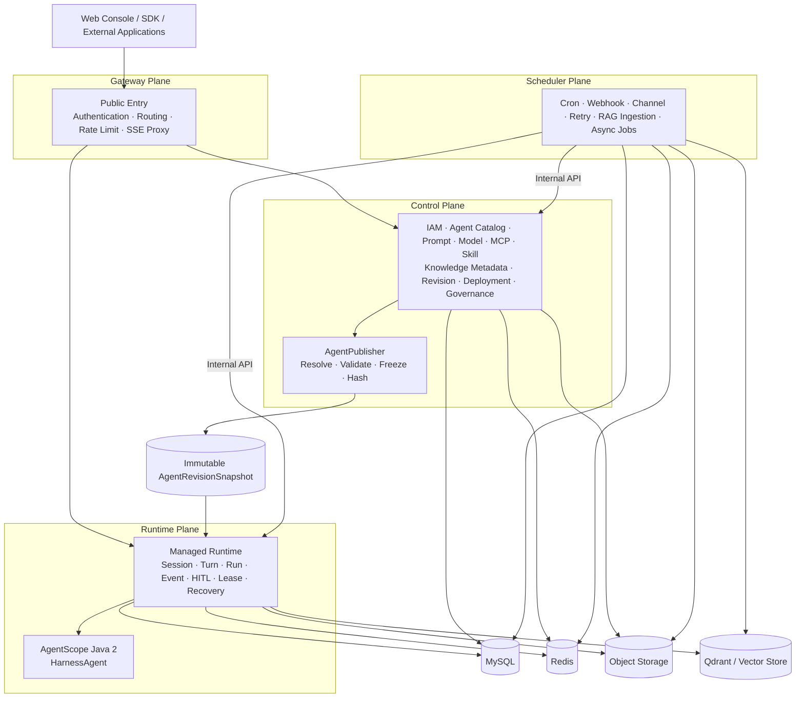
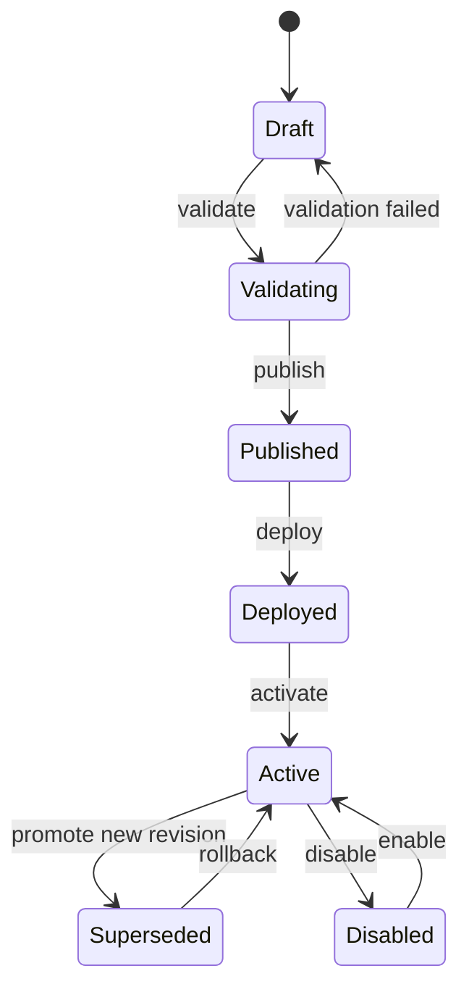

<div align="center">

<h1>AgentArk</h1>

<p>
  <strong>A production-oriented Agent Application Platform for Java.</strong>
</p>

<p>
  Build, version, deploy, run, observe, and govern AI agents on top of
  <a href="https://github.com/agentscope-ai/agentscope-java"><strong>AgentScope Java 2</strong></a>.
</p>

<p>
  <a href="https://github.com/Refinex-Space/agentark">
    
  </a>
  <a href="./LICENSE">
    
  </a>
  
  
  
  
</p>

<p>
  <a href="#overview">Overview</a> ·
  <a href="#architecture">Architecture</a> ·
  <a href="#project-structure">Project Structure</a> ·
  <a href="#technology-baseline">Technology</a> ·
  <a href="#roadmap">Roadmap</a> ·
  <a href="#documentation">Documentation</a>
</p>

</div>

---

> [!IMPORTANT]
> **AgentArk is in early development.**
> The target architecture and engineering boundaries are being established before the upstream service code is migrated and reshaped. Public APIs, module coordinates, deployment manifests, and operational behavior should be considered unstable until the first development milestone is announced.

## Overview

**AgentArk** is a Java-first platform for managing the complete lifecycle of production AI agents.

The platform uses **AgentScope Java 2** as its primary Harness Runtime while adding the control-plane capabilities needed to turn agent code and configuration into a governable product:

- **Build** — Agents, prompts, models, MCP servers, tools, skills, knowledge, memory, workspace, sandbox, and policies.
- **Release** — Draft validation, immutable revisions, reproducible runtime snapshots, environments, deployments, promotion, and rollback.
- **Run** — Sessions, turns, runs, event streams, SSE, HITL approvals, distributed leases, recovery, and AgentScope Harness execution.
- **Operate** — Scheduling, webhooks, channels, async jobs, RAG ingestion, retries, usage, and cost.
- **Govern** — Organizations, projects, RBAC, service accounts, secrets, audit, quotas, permissions, observability, and evaluation.

AgentArk is intentionally **not** a reimplementation of AgentScope. AgentScope owns the agent runtime primitives; AgentArk owns the platform lifecycle, governance, versioning, deployment, and operational model around them.

### Why AgentArk?

| Concern | AgentScope Java 2 | AgentArk |
|---|---:|---:|
| Agent / Harness runtime | ✅ | Uses AgentScope |
| Model, Tool, MCP, Skill, Memory, Sandbox | ✅ | Configures & governs |
| RAG runtime primitives | ✅ | Versions & operates knowledge |
| Agent catalog and lifecycle | — | ✅ |
| Immutable release snapshots | — | ✅ |
| Environment & deployment management | — | ✅ |
| Multi-tenant IAM / RBAC | — | ✅ |
| Session / run operations | Runtime primitives | ✅ managed plane |
| HITL governance | Runtime capability | ✅ policy + audit |
| Scheduling / webhook / channel jobs | — | ✅ |
| Audit / quota / cost / platform observability | — | ✅ |

---

## Core Design Principles

AgentArk is designed around a small set of non-negotiable architectural invariants.

1. **Runtime executes immutable snapshots.**
   A published `AgentRevision` produces an immutable `AgentRevisionSnapshot`. Runtime never rebuilds a live agent by reading whichever Prompt, MCP, Skill, or Knowledge version happens to be current.

2. **Sessions are reproducible.**
   A Session pins its Deployment, Revision, and Snapshot when it is created. Promoting a new revision affects new sessions, not existing ones.

3. **Control and Runtime own different data.**
   No cross-plane table reads. Cross-plane collaboration happens through versioned contracts, immutable snapshots, and durable events.

4. **AgentScope stays behind an anti-corruption layer.**
   Provider-neutral runtime logic lives in `agentark-runtime`; AgentScope runtime types are restricted to `agentark-runtime-provider-agentscope`. They do not become AgentArk REST DTOs, persistence models, or platform-domain types.

5. **No giant `common` module.**
   Reusable infrastructure is split into focused starters; business persistence and domain logic stay with the owning module.

6. **Four planes, not dozens of microservices.**
   Gateway, Control, Runtime, and Scheduler are independent operational planes. Prompt, MCP, Skill, and Knowledge are domain capabilities, not microservices by default.

7. **Infrastructure complexity is progressive.**
   MySQL, Redis, and object storage form the core. Qdrant is added for RAG. Elasticsearch, Neo4j, and Kafka remain optional until a concrete workload requires them.

---

## Architecture



The four planes have deliberately different responsibilities and scaling characteristics:

| Plane | Owns | Does **not** own |
|---|---|---|
| **Gateway** | public entry, authentication front door, routing, rate limiting, CORS, request identity, SSE proxy | business state, agent compilation, persistence |
| **Control** | IAM, catalogs, drafts, revisions, snapshots, deployments, policies, secret metadata, audit | Harness inference loops, runtime event ownership |
| **Runtime** | snapshots, Session/Turn/Run, events, SSE, HITL, leases, recovery, AgentScope execution | editable product catalog, user directory, cron scanning |
| **Scheduler** | cron, webhook, channels, ingestion, durable jobs, retry/dead-letter | public API ownership, Harness inference loop |

<details>
<summary><strong>Immutable release model</strong></summary>

<br/>

```text
Agent Draft
    │
    ├── Prompt Version
    ├── Model Profile
    ├── MCP Server Version
    ├── Skill Version
    ├── Knowledge Revision
    ├── Memory / Workspace / Sandbox Profile
    └── Permission Policy
    │
    ▼
publish()
    │
    ▼
AgentRevision
    │
    ▼
AgentRevisionSnapshot  ── immutable / hashed / schema-versioned
    │
    ▼
Deployment
    │
    ▼
Session ── pins revision + snapshot
    │
    ▼
AgentScope Harness Runtime
```

</details>

---

## Project Structure

The target repository layout is:

```text
agentark
├── agentark-bom
├── agentark-kernel
│
├── agentark-foundation
│   ├── agentark-starter-web
│   ├── agentark-starter-security
│   ├── agentark-starter-persistence
│   ├── agentark-starter-redis
│   ├── agentark-starter-storage
│   └── agentark-starter-observability
│
├── agentark-control
├── agentark-knowledge
├── agentark-runtime
├── agentark-runtime-provider-agentscope
├── agentark-scheduling
│
├── agentark-services
│   ├── agentark-gateway-server
│   ├── agentark-control-server
│   ├── agentark-runtime-server
│   └── agentark-scheduler-server
│
├── agentark-web
├── contracts
│   ├── openapi
│   ├── asyncapi
│   └── schemas
├── deploy
│   ├── compose
│   ├── helm
│   └── kubernetes
├── docs
└── tools
```

### Module Responsibilities

| Module | Type | Responsibility |
|---|---|---|
| `agentark-bom` | BOM | Central third-party and internal dependency version management |
| `agentark-kernel` | Pure Java library | Stable IDs, domain specifications, snapshot model, minimal cross-plane contracts |
| `agentark-starter-web` | Starter | Problem Details, request context, Jackson, pagination, API conventions |
| `agentark-starter-security` | Starter | OIDC/JWT, service identity, API-key framework, method security |
| `agentark-starter-persistence` | Starter | MyBatis-Plus, Flyway, transactions, type handlers, persistence conventions |
| `agentark-starter-redis` | Starter | Typed cache, lease, fencing, idempotency, rate limiting |
| `agentark-starter-storage` | Starter | Object-store SPI and Local/S3/OSS/COS adapters |
| `agentark-starter-observability` | Starter | OpenTelemetry, Micrometer, structured logging, agent telemetry conventions |
| `agentark-control` | Domain/Application | IAM, Agent catalog, revisions, snapshots, deployments, governance |
| `agentark-knowledge` | Domain/Application | Knowledge bases, ingestion, revisions, retrieval and RAG adapters |
| `agentark-runtime` | Runtime Domain/Application | Session, Turn, Run, durable work queue, events, Agent State, HITL, fencing and recovery |
| `agentark-runtime-provider-agentscope` | Runtime Provider | Snapshot compiler, Harness execution, AgentState adapter, event/error mapping and AgentScope anti-corruption layer |
| `agentark-scheduling` | Domain/Application | Triggers, durable jobs, retries, webhook/channel delivery, ingestion workers |
| `agentark-*-server` | Applications | Thin Spring Boot composition and deployment units |
| `agentark-web` | Web app | AgentArk product console |
| `contracts` | Repository contracts | OpenAPI, AsyncAPI, JSON Schema |
| `deploy` | Deployment | Compose, Helm, Kubernetes assets |

> [!NOTE]
> Only the four `*-server` modules are backend deployment units. The rest are libraries or repository-level artifacts.

---

## Technology Baseline

AgentArk deliberately uses a conservative **LTS-first, production-oriented** baseline.

| Area | Target |
|---|---|
| Java | **JDK 21 LTS** |
| Agent Runtime | **AgentScope Java 2.0.2**, source evidence pinned by [ADR-0005](./docs/architecture/decisions/0005-upstream-and-technology-baseline.md) |
| Spring Boot | **4.1.0** |
| Spring Cloud | **2025.1.2** |
| Persistence | **MyBatis-Plus 3.5.17** + Flyway |
| Relational DB | **MySQL 8.4 LTS** |
| Cache / coordination | **Redis 8.10.x GA** |
| Object storage | S3-compatible abstraction; Local/MinIO for development |
| Default vector database | **Qdrant 1.18.3** initial validated baseline |
| Search | Elasticsearch 9.5.1+ — optional |
| Graph | Neo4j 5.26 LTS — optional |
| Observability | OpenTelemetry + Micrometer + Prometheus/Grafana |
| Frontend | React 19.2 + TypeScript 6 + Vite 8 + Tailwind CSS 4 |
| UI primitives | Radix UI + Lucide |
| Server state | TanStack Query |
| Deployment | Docker Compose + Kubernetes/Helm |

### Progressive Infrastructure

```text
Core
├── MySQL
├── Redis
└── Object Storage

RAG
└── + Qdrant

Search
└── + Elasticsearch

GraphRAG
└── + Neo4j

High-volume event streaming
└── + Kafka, only when justified
```

Kafka, Elasticsearch, and Neo4j are intentionally **not** mandatory dependencies for a basic AgentArk installation.

---

## Agent Lifecycle



A published revision is immutable. Rollback changes the Deployment pointer; it never rewrites an old revision.

---

## Runtime Model

AgentArk treats runtime execution as durable state, not as the lifetime of an HTTP connection.

```text
Session
└── Turn
    ├── Run / Attempt
    ├── Runtime Events
    ├── Checkpoints
    ├── HITL Approvals
    └── Usage / Cost
```

Key runtime guarantees:

- durable Session / Turn / Run metadata;
- durable Work Item acceptance before returning `202 Accepted`;
- append-only runtime events;
- SSE reconnect with `Last-Event-ID`;
- distributed lease **plus fencing token**;
- idempotent commands;
- explicit cancellation and terminal states;
- HITL pause / approve / reject / expire / resume;
- snapshot-based recovery;
- Agent State and Checkpoint authority in Runtime MySQL/Object Storage; Redis is never the sole state copy;
- AgentScope event mapping behind stable AgentArk event contracts.

---

## Security Model

Security is part of the default architecture, not an optional enterprise add-on.

- OIDC / OAuth 2.0 and JWK-based external identity.
- Project-scoped API keys and service accounts.
- Service-to-service identity using mTLS or short-lived audience-bound tokens.
- Organization → Project → Environment resource hierarchy.
- Server-side tenant filtering for SQL, vector search, object storage, and jobs.
- Secrets stored through a Secret Manager / KMS abstraction; snapshots store only `SecretRef`.
- Hierarchical Tool/MCP/Skill permission policies.
- HITL for sensitive actions.
- Restricted sandbox for untrusted code and parsers.
- Audit for publishing, deployment, permission, secret, approval, and privileged actions.
- Prompt-injection boundaries between system instructions, user input, RAG content, and tool output.

---

## Documentation

Repository instructions route contributors to the normative source for each decision; `PLAN.md` governs execution order but does not override architecture, ADRs, database models, contracts, or safety rules.

| Document | Purpose |
|---|---|
| [`AGENTS.md`](./AGENTS.md) | Repository safety rules, commands, boundaries, definition of done, and knowledge map |
| [`docs/README.md`](./docs/README.md) | Documentation index and ownership routes |
| [`docs/architecture/overview.md`](./docs/architecture/overview.md) | Complete target system architecture, module boundaries, runtime, security, data, deployment, migration, and ADR summary |
| [`docs/architecture/decisions/`](./docs/architecture/decisions/) | Accepted Architecture Decision Records |
| [`docs/database/`](./docs/database/) | MySQL conventions and Control/Runtime/Scheduler logical models |
| [`PLAN.md`](./PLAN.md) | Canonical Phase 00–23 execution sequence and evidence gates |
| `contracts/` | Versioned OpenAPI, AsyncAPI, and JSON Schema contracts once created by the corresponding phase |

> [!TIP]
> Start with the **System Architecture** document before introducing a new module, cross-plane dependency, storage technology, public contract, or runtime provider.

---

## Development Status

AgentArk currently follows an **architecture-first migration strategy**. The Phase 02 build foundation is present: the fixed upstream evidence baseline, Maven Wrapper, approved empty module reactor, dependency BOM, quality lifecycle, license/SBOM generation, and CI skeleton can be verified. No business feature or runnable backend service has been implemented yet.

The initial implementation will be derived from the useful service-plane capabilities in AgentScope Java's `agentscope-service`, while deliberately reshaping module boundaries and gradually replacing the Go control plane with Java.

The migration sequence is designed to avoid changing package names, modules, JDK, Spring Boot, ORM, database, runtime contracts, and frontend architecture in one untraceable step.

### Planned migration sequence

1. Freeze and characterize the upstream AgentScope Service baseline.
2. Mechanically migrate selected source while preserving behavior and license notices.
3. Establish AgentArk Kernel, focused starters, contracts, and final module boundaries.
4. Introduce immutable Agent revisions and snapshots.
5. Move to JDK 21 / Spring Boot 4.1.
6. Migrate JPA → MyBatis-Plus.
7. Migrate PostgreSQL → MySQL 8.4.
8. Strangle the Go `aistio` control plane behind versioned internal contracts.
9. Build the independent AgentArk Web experience.
10. Complete production hardening, observability, security, and recovery testing.

---

## Roadmap

| Milestone | Scope | Status |
|---|---|---|
| **A — Architecture & Engineering Foundation** | BOM, Kernel, starters, contracts, four service shells, CI, Compose | 🟡 In progress — build foundation established |
| **B — Control Plane MVP** | IAM, Agent catalog, assets, revisions, snapshots, deployments | ⚪ Planned |
| **C — Runtime MVP** | Session, Turn, Run, events, SSE, AgentScope compiler, HITL, recovery | ⚪ Planned |
| **D — Knowledge / RAG** | ingestion, Qdrant, Knowledge Revision, retrieval, citations | ⚪ Planned |
| **E — Scheduler & Integrations** | cron, webhook, channels, retry/dead-letter | ⚪ Planned |
| **F — AgentArk Web** | design system, Agent builder, runtime console, governance | ⚪ Planned |
| **G — Production Hardening** | Kubernetes, HA, security, DR, quotas, cost, evaluation | ⚪ Planned |

The roadmap describes architectural sequencing rather than release dates.

---

## Development

### Prerequisites

The target development environment uses:

- JDK 21
- Docker / Docker Compose
- Node.js 24 LTS
- pnpm 11
- Git

Clone the repository:

```bash
git clone https://github.com/Refinex-Space/agentark.git
cd agentark
```

Validate the pinned toolchain and root build policy:

```bash
./mvnw -version
./mvnw -N validate
```

Validate the complete 20-project reactor, run available unit/integration tests, check formatting and license headers, and generate dependency evidence:

```bash
./mvnw verify
```

Install the current reactor into the local Maven repository without running tests:

```bash
./mvnw -DskipTests install
```

The current Jar modules are intentionally empty Phase 02 placeholders. There is no Spring Boot main class, HTTP endpoint, `agentark-web` build, Compose profile, Helm chart, or runnable product stack yet. Generated SBOM and third-party reports are written below the ignored root `target/` directory.

### Engineering Rules

Before contributing implementation code:

- do not introduce a generic `common` module;
- do not make Control depend on Runtime implementation code;
- do not let Runtime read Control-owned tables;
- do not expose AgentScope types from public AgentArk APIs;
- do not make Redis or search indexes the authoritative business store;
- do not execute unpublished mutable drafts in production paths;
- do not add Kafka, Elasticsearch, Neo4j, or additional services without a workload-driven ADR;
- keep migrations, contracts, security, observability, and recovery behavior testable.

---

## Upstream & Inspiration

AgentArk builds on and learns from several open-source projects:

- [AgentScope Java](https://github.com/agentscope-ai/agentscope-java) — primary Java Agent/Harness runtime.
- [AgentScope Service fixed source](https://github.com/Refinex-Space/agentscope-java/tree/0c61e7494197ded54eefdeaf9bdeb51807beb752/agentscope-service) — service-plane behavior and runtime-management reference.
- [DeepSeek Harness fixed reference](https://github.com/Refinex-Space/deepseek-harness/tree/47f943859bef60e4160492346772ded9b24f765a) — frontend visual and interaction reference.

AgentArk maintains its own platform domain model, module architecture, UI system, deployment model, and long-term compatibility boundaries.

When AgentScope source code is migrated or modified, the applicable Apache-2.0 copyright headers, notices, and attribution requirements must be preserved.

---

## Contributing

AgentArk is currently shaping its first implementation baseline. Large changes should start with an Issue or architecture discussion before code is introduced.

Changes that affect any of the following require explicit architectural review:

- module or service boundaries;
- Control ↔ Runtime contracts;
- Snapshot or Runtime Event schemas;
- storage ownership;
- authentication or authorization;
- runtime provider boundaries;
- new mandatory infrastructure;
- migration compatibility;
- security-sensitive Tool/MCP/Sandbox behavior.

Formal contribution, security, and release-process documents will be added alongside the implementation foundation.

---

## License

AgentArk is licensed under the [Apache License 2.0](./LICENSE).

Third-party components and migrated upstream source remain subject to their respective licenses and notice requirements.

---

<div align="center">

<sub>
Built as a Java-first platform around reproducible Agent releases, governed runtime execution, and explicit architectural boundaries.
</sub>

</div>
