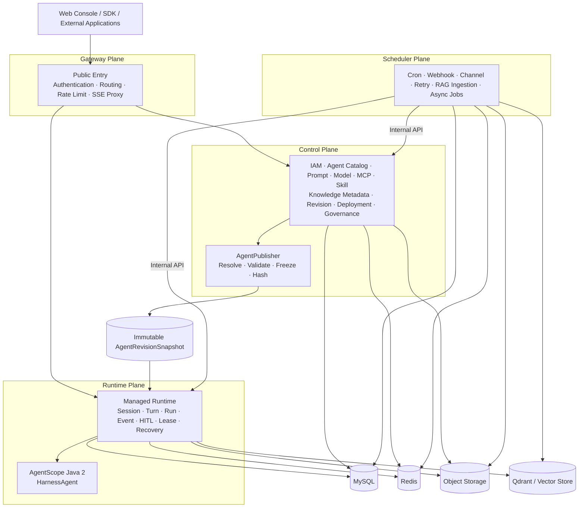
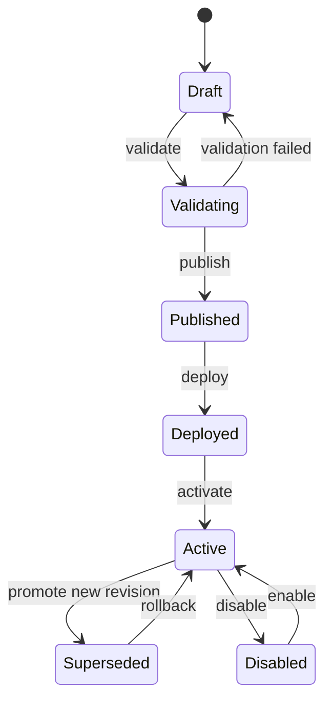

<div align="center">

<h1>AgentArk</h1>

<p>
  <strong>English</strong> · <a href="./README.zh-CN.md">简体中文</a>
</p>

<p>
  <strong>A production-oriented Agent Application Platform for Java.</strong>
</p>

<p>
  Build, version, deploy, run, observe, and govern AI agents on top of
  <a href="https://github.com/agentscope-ai/agentscope-java"><strong>AgentScope Java 2</strong></a>.
</p>

<p>
  <a href="https://github.com/Refinex-Space/agentark">
    
  </a>
  <a href="./LICENSE">
    
  </a>
  
  
  
  
</p>

<p>
  <a href="#overview">Overview</a> ·
  <a href="#architecture">Architecture</a> ·
  <a href="#project-structure">Project Structure</a> ·
  <a href="#technology-baseline">Technology</a> ·
  <a href="#roadmap">Roadmap</a> ·
  <a href="#documentation">Documentation</a>
</p>

</div>

---

> [!IMPORTANT]
> **AgentArk 0.1.0 is the first complete development baseline, not a production approval.**
> The four-plane implementation, contracts, Web console, security controls and deployment assets are available for integration validation. Public compatibility is frozen at the 0.1.0 contract baseline, but a real deployment must still validate its built-in identity or external OIDC, Vault/Secret Manager, managed MySQL/Redis/Object/Qdrant services, registry signatures, NetworkPolicy and disaster-recovery objectives before carrying production traffic.

## Overview

**AgentArk** is a Java-first platform for managing the complete lifecycle of production AI agents.

The platform uses **AgentScope Java 2** as its primary Harness Runtime while adding the control-plane capabilities needed to turn agent code and configuration into a governable product:

- **Build** — Agents, prompts, models, MCP servers, tools, skills, knowledge, memory, workspace, sandbox, and policies.
- **Release** — Draft validation, immutable revisions, reproducible runtime snapshots, environments, deployments, promotion, and rollback.
- **Run** — Sessions, turns, runs, event streams, SSE, HITL approvals, distributed leases, recovery, and AgentScope Harness execution.
- **Operate** — Scheduling, webhooks, channels, async jobs, RAG ingestion, retries, usage, and cost.
- **Govern** — Organizations, projects, RBAC, service accounts, secrets, audit, quotas, permissions, observability, and evaluation.

AgentArk is intentionally **not** a reimplementation of AgentScope. AgentScope owns the agent runtime primitives; AgentArk owns the platform lifecycle, governance, versioning, deployment, and operational model around them.

### Why AgentArk?

| Concern | AgentScope Java 2 | AgentArk |
|---|---:|---:|
| Agent / Harness runtime | ✅ | Uses AgentScope |
| Model, Tool, MCP, Skill, Memory, Sandbox | ✅ | Configures & governs |
| RAG runtime primitives | ✅ | Versions & operates knowledge |
| Agent catalog and lifecycle | — | ✅ |
| Immutable release snapshots | — | ✅ |
| Environment & deployment management | — | ✅ |
| Multi-tenant IAM / RBAC | — | ✅ |
| Session / run operations | Runtime primitives | ✅ managed plane |
| HITL governance | Runtime capability | ✅ policy + audit |
| Scheduling / webhook / channel jobs | — | ✅ |
| Audit / quota / cost / platform observability | — | ✅ |

---

## Core Design Principles

AgentArk is designed around a small set of non-negotiable architectural invariants.

1. **Runtime executes immutable snapshots.**
   A published `AgentRevision` produces an immutable `AgentRevisionSnapshot`. Runtime never rebuilds a live agent by reading whichever Prompt, MCP, Skill, or Knowledge version happens to be current.

2. **Sessions are reproducible.**
   A Session pins its Deployment, Revision, and Snapshot when it is created. Promoting a new revision affects new sessions, not existing ones.

3. **Control and Runtime own different data.**
   No cross-plane table reads. Cross-plane collaboration happens through versioned contracts, immutable snapshots, and durable events.

4. **AgentScope stays behind an anti-corruption layer.**
   Provider-neutral runtime logic lives in `agentark-runtime`; AgentScope runtime types are restricted to `agentark-runtime-provider-agentscope`. They do not become AgentArk REST DTOs, persistence models, or platform-domain types.

5. **No giant `common` module.**
   Reusable infrastructure is split into focused starters; business persistence and domain logic stay with the owning module.

6. **Four planes, not dozens of microservices.**
   Gateway, Control, Runtime, and Scheduler are independent operational planes. Prompt, MCP, Skill, and Knowledge are domain capabilities, not microservices by default.

7. **Infrastructure complexity is progressive.**
   MySQL, Redis, and object storage form the core. Qdrant is added for RAG. Elasticsearch, Neo4j, and Kafka remain optional until a concrete workload requires them.

---

## Architecture



The four planes have deliberately different responsibilities and scaling characteristics:

| Plane | Owns | Does **not** own |
|---|---|---|
| **Gateway** | public entry, authentication front door, routing, rate limiting, CORS, request identity, SSE proxy | business state, agent compilation, persistence |
| **Control** | IAM, catalogs, drafts, revisions, snapshots, deployments, policies, secret metadata, audit | Harness inference loops, runtime event ownership |
| **Runtime** | snapshots, Session/Turn/Run, events, SSE, HITL, leases, recovery, AgentScope execution | editable product catalog, user directory, cron scanning |
| **Scheduler** | cron, webhook, channels, ingestion, durable jobs, retry/dead-letter | public API ownership, Harness inference loop |

<details>
<summary><strong>Immutable release model</strong></summary>

<br/>

```text
Agent Draft
    │
    ├── Prompt Version
    ├── Model Profile
    ├── MCP Server Version
    ├── Skill Version
    ├── Knowledge Revision
    ├── Memory / Workspace / Sandbox Profile
    └── Permission Policy
    │
    ▼
publish()
    │
    ▼
AgentRevision
    │
    ▼
AgentRevisionSnapshot  ── immutable / hashed / schema-versioned
    │
    ▼
Deployment
    │
    ▼
Session ── pins revision + snapshot
    │
    ▼
AgentScope Harness Runtime
```

</details>

---

## Project Structure

The target repository layout is:

```text
agentark
├── agentark-bom
├── agentark-kernel
│
├── agentark-foundation
│   ├── agentark-starter-web
│   ├── agentark-starter-security
│   ├── agentark-starter-persistence
│   ├── agentark-starter-redis
│   ├── agentark-starter-storage
│   └── agentark-starter-observability
│
├── agentark-control
├── agentark-knowledge
├── agentark-runtime
├── agentark-runtime-provider-agentscope
├── agentark-scheduling
│
├── agentark-services
│   ├── agentark-gateway-server
│   ├── agentark-control-server
│   ├── agentark-runtime-server
│   └── agentark-scheduler-server
│
├── agentark-web
├── contracts
│   ├── openapi
│   ├── asyncapi
│   └── schemas
├── deploy
│   ├── compose
│   ├── container
│   ├── helm
│   ├── observability
│   └── security
├── docs
└── tools
```

### Module Responsibilities

| Module | Type | Responsibility |
|---|---|---|
| `agentark-bom` | BOM | Central third-party and internal dependency version management |
| `agentark-kernel` | Pure Java library | Stable IDs, domain specifications, snapshot model, minimal cross-plane contracts |
| `agentark-starter-web` | Starter | Problem Details, request context, Jackson, pagination, API conventions |
| `agentark-starter-security` | Starter | OIDC/JWT, service identity, API-key framework, method security |
| `agentark-starter-persistence` | Starter | MyBatis-Plus, Flyway, transactions, type handlers, persistence conventions |
| `agentark-starter-redis` | Starter | Typed cache, lease, fencing, idempotency, rate limiting |
| `agentark-starter-storage` | Starter | Object-store SPI, guarded Local adapter, and S3-compatible extension point |
| `agentark-starter-observability` | Starter | OpenTelemetry, Micrometer, structured logging, agent telemetry conventions |
| `agentark-control` | Domain/Application | IAM, Agent catalog, revisions, snapshots, deployments, governance |
| `agentark-knowledge` | Domain/Application | Knowledge bases, ingestion, revisions, retrieval and RAG adapters |
| `agentark-runtime` | Runtime Domain/Application | Session, Turn, Run, durable work queue, events, Agent State, HITL, fencing and recovery |
| `agentark-runtime-provider-agentscope` | Runtime Provider | Snapshot compiler, Harness execution, AgentState adapter, event/error mapping and AgentScope anti-corruption layer |
| `agentark-scheduling` | Domain/Application | Triggers, durable jobs, retries, webhook/channel delivery, ingestion workers |
| `agentark-*-server` | Applications | Thin Spring Boot composition and deployment units |
| `agentark-web` | Web app | AgentArk product console |
| `contracts` | Repository contracts | OpenAPI, AsyncAPI, JSON Schema |
| `deploy` | Deployment | Compose, Helm, Kubernetes assets |

> [!NOTE]
> Only the four `*-server` modules are backend deployment units. The rest are libraries or repository-level artifacts.

---

## Technology Baseline

AgentArk deliberately uses a conservative **LTS-first, production-oriented** baseline.

| Area | Target |
|---|---|
| Java | **JDK 21 LTS** |
| Agent Runtime | **AgentScope Java 2.0.2**, source evidence pinned by [ADR-0005](./docs/architecture/decisions/0005-upstream-and-technology-baseline.md) |
| Spring Boot | **4.1.0** |
| Spring Cloud | **2025.1.2** |
| Persistence | **MyBatis-Plus 3.5.17** + Flyway |
| Relational DB | **MySQL 8.4 LTS** |
| Cache / coordination | **Redis 8.10.x GA** |
| Object storage | S3-compatible abstraction; Local/MinIO for development |
| Default vector database | **Qdrant 1.18.3** initial validated baseline |
| Search | Elasticsearch 9.5.1+ — optional |
| Graph | Neo4j 5.26 LTS — optional |
| Observability | OpenTelemetry + Micrometer + Prometheus/Grafana |
| Frontend | React 19.2 + TypeScript 6 + Vite 8 + Tailwind CSS 4 |
| UI primitives | Radix UI + Lucide |
| Server state | TanStack Query |
| Deployment | Docker Compose + Kubernetes/Helm |

### Progressive Infrastructure

```text
Core
├── MySQL
├── Redis
└── Object Storage

RAG
└── + Qdrant

Search
└── + Elasticsearch

GraphRAG
└── + Neo4j

High-volume event streaming
└── + Kafka, only when justified
```

Kafka, Elasticsearch, and Neo4j are intentionally **not** mandatory dependencies for a basic AgentArk installation.

---

## Agent Lifecycle



A published revision is immutable. Rollback changes the Deployment pointer; it never rewrites an old revision.

---

## Runtime Model

AgentArk treats runtime execution as durable state, not as the lifetime of an HTTP connection.

```text
Session
└── Turn
    ├── Run / Attempt
    ├── Runtime Events
    ├── Checkpoints
    ├── HITL Approvals
    └── Usage / Cost
```

Key runtime guarantees:

- durable Session / Turn / Run metadata;
- durable Work Item acceptance before returning `202 Accepted`;
- append-only runtime events;
- SSE reconnect with `Last-Event-ID`;
- distributed lease **plus fencing token**;
- idempotent commands;
- explicit cancellation and terminal states;
- HITL pause / approve / reject / expire / resume;
- snapshot-based recovery;
- Agent State and Checkpoint authority in Runtime MySQL/Object Storage; Redis is never the sole state copy;
- AgentScope event mapping behind stable AgentArk event contracts.

---

## Security Model

Security is part of the default architecture, not an optional enterprise add-on.

- OIDC / OAuth 2.0 and JWK-based external identity.
- Project-scoped API keys and service accounts.
- Service-to-service identity using mTLS or short-lived audience-bound tokens.
- Organization → Project → Environment resource hierarchy.
- Server-side tenant filtering for SQL, vector search, object storage, and jobs.
- Secrets stored through a Secret Manager / KMS abstraction; snapshots store only `SecretRef`.
- Hierarchical Tool/MCP/Skill permission policies.
- HITL for sensitive actions.
- Restricted sandbox for untrusted code and parsers.
- Audit for publishing, deployment, permission, secret, approval, and privileged actions.
- Prompt-injection boundaries between system instructions, user input, RAG content, and tool output.

---

## Documentation

Repository instructions route contributors to the normative source for each decision; `PLAN.md` governs execution order but does not override architecture, ADRs, database models, contracts, or safety rules.

| Document | Purpose |
|---|---|
| [`AGENTS.md`](./AGENTS.md) | Repository safety rules, commands, boundaries, definition of done, and knowledge map |
| [`docs/README.md`](./docs/README.md) | Documentation index and ownership routes |
| [`docs/architecture/overview.md`](./docs/architecture/overview.md) | Complete target system architecture, module boundaries, runtime, security, data, deployment, migration, and ADR summary |
| [`docs/architecture/decisions/`](./docs/architecture/decisions/) | Accepted Architecture Decision Records |
| [`docs/database/`](./docs/database/) | MySQL conventions and Control/Runtime/Scheduler logical models |
| [`PLAN.md`](./PLAN.md) | Canonical Phase 00–23 execution sequence and evidence gates |
| [`contracts/`](./contracts/) | Versioned OpenAPI 3.1 and AsyncAPI 3.0 skeletons plus Snapshot, Runtime Event, and Problem Detail JSON Schemas |
| [`docs/releases/v0-1-0.md`](./docs/releases/v0-1-0.md) | First complete development baseline, compatibility, release notes, and known limitations |
| [`CONTRIBUTING.md`](./CONTRIBUTING.md) | Contribution workflow and verification requirements |
| [`SECURITY.md`](./SECURITY.md) | Supported baseline and private vulnerability reporting policy |

> [!TIP]
> Start with the **System Architecture** document before introducing a new module, cross-plane dependency, storage technology, public contract, or runtime provider.

---

## Development Status

AgentArk 0.1.0 closes the architecture-first implementation sequence. Phases 00–23 establish the fixed upstream evidence, complete four-plane implementation, Web product flow, governance/security controls, Java-only deployment target, HA, backup/restore, performance and fault-rehearsal baselines, plus the first release-readiness evidence, frozen contracts, compatibility matrix, reproducible release artifacts and operational handoff.

The implementation was derived from selected AgentScope Service behavior while deliberately reshaping module/data ownership and isolating AgentScope Java behind a Provider boundary. Go Aistio is no longer a default deployment dependency; external migrations remain controlled by the strangler Runbook.

### Planned migration sequence

1. Freeze and characterize the upstream AgentScope Service baseline.
2. Mechanically migrate selected source while preserving behavior and license notices.
3. Establish AgentArk Kernel, focused starters, contracts, and final module boundaries.
4. Introduce immutable Agent revisions and snapshots.
5. Move to JDK 21 / Spring Boot 4.1.
6. Migrate JPA → MyBatis-Plus.
7. Migrate PostgreSQL → MySQL 8.4.
8. Keep Go `aistio` migration compatibility behind frozen internal contracts and temporary, archived cutover gates.
9. Build the independent AgentArk Web experience.
10. Complete production hardening, observability, security, and recovery testing.

---

## Roadmap

| Milestone | Scope | Status |
|---|---|---|
| **A — Architecture & Engineering Foundation** | BOM, Kernel, starters, contracts, four service shells, CI, Compose | ✅ Complete — service shells, Core profile, and persistence baseline verified |
| **B — Control Plane MVP** | IAM, Agent catalog, assets, revisions, snapshots, deployments | ✅ Complete — Control owner, immutable release and deployment contracts verified |
| **C — Runtime MVP** | Session, Turn, Run, events, SSE, AgentScope compiler, HITL, recovery | ✅ Complete — neutral domain, AgentScope adapter, managed API, durable execution, HITL, and recovery verified |
| **D — Knowledge / RAG** | ingestion, Qdrant, Knowledge Revision, retrieval, citations | ✅ Complete — safe pipeline, fixed-Revision retrieval, citations, and Qdrant isolation verified |
| **E — Scheduler & Integrations** | cron, webhook, channels, retry/dead-letter | ✅ Complete |
| **F — AgentArk Web** | design system, Agent builder, runtime console, governance | ✅ Complete — Phase 17 foundation and Phase 18 real product flows verified |
| **G — Production Hardening** | Kubernetes, HA, security, DR, quotas, cost, evaluation | ✅ Complete — Phase 22 production topology, HA, recovery, capacity and fault-rehearsal baseline verified; target environment approval remains external |

The roadmap describes architectural sequencing rather than release dates.

---

## Development

### Prerequisites

The target development environment uses:

- JDK 21
- Docker / Docker Compose
- Node.js 24 LTS
- pnpm 11
- Git

Clone the repository:

```bash
git clone https://github.com/Refinex-Space/agentark.git
cd agentark
```

Validate the pinned toolchain and root build policy:

```bash
./mvnw -version
./mvnw -N validate
```

Validate the complete 20-project reactor, run available unit/integration tests, check license headers, and generate dependency evidence:

```bash
./mvnw verify
```

Install the current reactor into the local Maven repository without running tests:

```bash
./mvnw -DskipTests install
```

Install and validate the independent Web console:

```bash
pnpm --dir agentark-web install --frozen-lockfile
pnpm --dir agentark-web api:check
pnpm --dir agentark-web lint
pnpm --dir agentark-web typecheck
pnpm --dir agentark-web test
pnpm --dir agentark-web build
pnpm --dir agentark-web test:e2e
pnpm --dir agentark-web test:e2e:real
```

Run the pinned repository security and SBOM gates:

```bash
./tools/security/scan-repository.sh
./tools/security/generate-sbom.sh
```

The generated Control, Runtime, and Scheduler clients are committed under `agentark-web/src/shared/api/generated/` and must be regenerated from the repository Public OpenAPI contracts; they are not hand-maintained UI domain models. See [`agentark-web/README.md`](./agentark-web/README.md) for the development and security boundaries.

Start the local Core infrastructure, current service implementations, and the built-in account identity:

```bash
./tools/dev-up.sh
./tools/dev-status.sh
./tools/verify-core.sh
./tools/dev-down.sh
```

Run `pnpm --dir agentark-web dev`, open `http://localhost:5173/sign-in`, and sign in with the username `agentark-admin` or its registered email. The one-time random password is stored only in the ignored `deploy/compose/.secrets/identity-user-password` file and must be changed before a full session is created. Gateway stores Pepper-protected Argon2id hashes in the isolated `agentark_identity` MySQL schema and WebSession state in Redis; no Keycloak container is required. Use `./tools/dev-up.sh --no-identity` only for a pure API stack or an explicitly configured external OIDC provider.

Validate the optional local observability stack after creating an ignored `deploy/observability/.env` with a strong Grafana password:

```bash
docker compose \
  --env-file deploy/observability/.env \
  -f deploy/observability/docker-compose.yml \
  config
```

See [`docs/guides/observability-operations.md`](./docs/guides/observability-operations.md) before starting or deleting its local volumes.

Validate the production containers, Helm topology, recovery, performance and fault-rehearsal gates:

```bash
./tools/production/build-images.sh
./tools/production/validate-chart.sh
./tools/production/restore-rehearsal.sh
./tools/production/performance-rehearsal.sh
./tools/production/kind-rehearsal.sh
./tools/production/fault-rehearsal.sh
```

These commands create only explicitly named temporary Docker/kind resources and write sanitized evidence below the ignored `.agentark/evidence/phase22/` directory. Read [`docs/implementation/phase-22-production.md`](./docs/implementation/phase-22-production.md) and the linked runbooks before using them against a production-like environment.

All four Server JARs expose sanitized Actuator health, build information, and Prometheus metrics. Control, Runtime, and Scheduler contain the versioned business APIs implemented through Phase 21, while local security defaults fail closed. Phase 19 adds W3C OpenTelemetry propagation, bounded OTLP export, append-only Audit, versioned Usage/Cost, concurrency-safe Quota Reservation, deterministic Evaluation/Release Gates, and the Web governance view. Phase 20 adds the threat model, Vault Secret lifecycle, MCP SSRF/DNS Rebinding guard, signed Skill/SBOM gate, restricted Sandbox contract, untrusted RAG/Tool/Model output labels, and pinned security/supply-chain workflows. Phase 21 freezes the Internal Contract hashes, provides read-only Aistio export, resumable API migration and semantic Shadow gates, and keeps the default Compose Java-only. Phase 22 adds non-root production images, the Java-only `deploy/helm/agentark/` Chart, NetworkPolicy/SecurityContext, Flyway Jobs, three-node HA/rolling-drain evidence, MySQL PITR, Qdrant/Object recovery, k6 capacity thresholds and fault rehearsals. Runtime execution and Scheduler Worker remain disabled until the required production Model/Component/Secret, ingestion, outbound endpoint, channel and Sandbox Provider beans are supplied. The Core profile starts MySQL 8.4.11, Redis 8.10.0, and MinIO with locally generated file-based secrets; `--profile rag` additionally starts Qdrant 1.18.3. The separate `deploy/observability/` stack is development-only. A configured production IdP, cloud workload identity, real external Aistio migration, real Model/Provider acceptance, managed-service HA and production-volume RPO/RTO still require target-environment execution and approval; the repository does not claim those external acceptances. Generated SBOM and third-party reports are written below the ignored root `target/` directory.

### Engineering Rules

Before contributing implementation code:

- do not introduce a generic `common` module;
- do not make Control depend on Runtime implementation code;
- do not let Runtime read Control-owned tables;
- do not expose AgentScope types from public AgentArk APIs;
- do not make Redis or search indexes the authoritative business store;
- do not execute unpublished mutable drafts in production paths;
- do not add Kafka, Elasticsearch, Neo4j, or additional services without a workload-driven ADR;
- keep migrations, contracts, security, observability, and recovery behavior testable.

---

## Upstream & Inspiration

AgentArk builds on and learns from several open-source projects:

- [AgentScope Java](https://github.com/agentscope-ai/agentscope-java) — primary Java Agent/Harness runtime.
- [AgentScope Service fixed source](https://github.com/Refinex-Space/agentscope-java/tree/0c61e7494197ded54eefdeaf9bdeb51807beb752/agentscope-service) — service-plane behavior and runtime-management reference.
- [DeepSeek Harness fixed reference](https://github.com/Refinex-Space/deepseek-harness/tree/47f943859bef60e4160492346772ded9b24f765a) — frontend visual and interaction reference.

AgentArk maintains its own platform domain model, module architecture, UI system, deployment model, and long-term compatibility boundaries.

When AgentScope source code is migrated or modified, the applicable Apache-2.0 copyright headers, notices, and attribution requirements must be preserved.

---

## Contributing

Read [`CONTRIBUTING.md`](./CONTRIBUTING.md) before opening a change. Large changes should start with an Issue or architecture discussion before code is introduced.

Changes that affect any of the following require explicit architectural review:

- module or service boundaries;
- Control ↔ Runtime contracts;
- Snapshot or Runtime Event schemas;
- storage ownership;
- authentication or authorization;
- runtime provider boundaries;
- new mandatory infrastructure;
- migration compatibility;
- security-sensitive Tool/MCP/Sandbox behavior.

Security reports follow [`SECURITY.md`](./SECURITY.md); release and rollback procedures are routed from [`docs/README.md`](./docs/README.md).

---

## License

AgentArk is licensed under the [Apache License 2.0](./LICENSE).

Third-party components and migrated upstream source remain subject to their respective licenses and notice requirements.

---

<div align="center">

<sub>
Built as a Java-first platform around reproducible Agent releases, governed runtime execution, and explicit architectural boundaries.
</sub>

</div>
