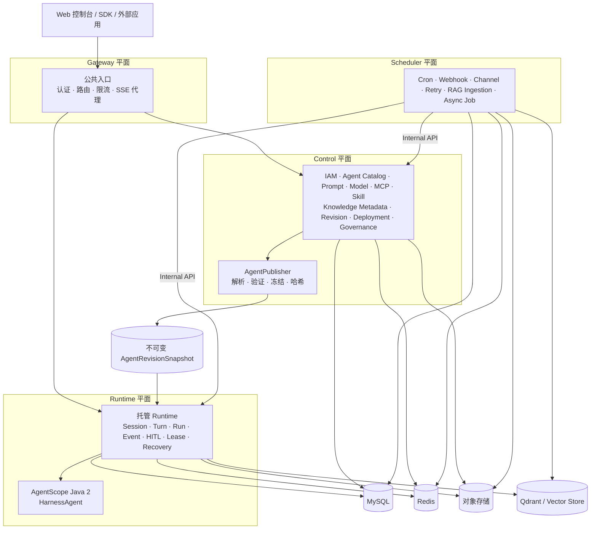
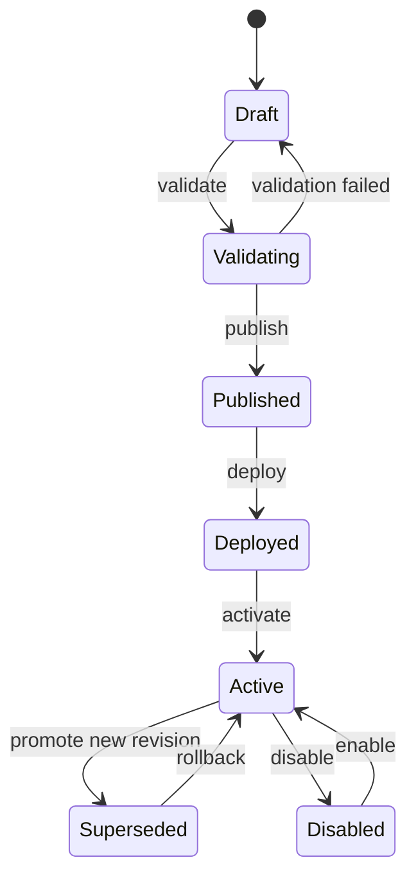

<div align="center">

<h1>AgentArk</h1>

<p>
  <a href="./README.md">English</a> · <strong>简体中文</strong>
</p>

<p>
  <strong>面向生产的 Java Agent 应用平台。</strong>
</p>

<p>
  基于 <a href="https://github.com/agentscope-ai/agentscope-java"><strong>AgentScope Java 2</strong></a>
  构建、版本化、部署、运行、观测和治理 AI Agent。
</p>

<p>
  <a href="https://github.com/Refinex-Space/agentark">
    
  </a>
  <a href="./LICENSE">
    
  </a>
  
  
  
  
</p>

<p>
  <a href="#概览">概览</a> ·
  <a href="#架构">架构</a> ·
  <a href="#项目结构">项目结构</a> ·
  <a href="#技术基线">技术基线</a> ·
  <a href="#路线图">路线图</a> ·
  <a href="#文档">文档</a>
</p>

</div>

---

> [!IMPORTANT]
> **AgentArk 0.1.0 是首个完整开发基线，并不代表已通过生产审批。**
> 四平面实现、契约、Web 控制台、安全控制和部署资产已经可用于集成验证。公共兼容性已冻结在 0.1.0 契约基线，但实际部署在承载生产流量前，仍必须在目标环境中验证 Built-in Identity 或外部 OIDC、Vault/Secret Manager、托管 MySQL/Redis/对象存储/Qdrant 服务、镜像仓库签名、NetworkPolicy 和灾难恢复目标。

## 概览

**AgentArk** 是一个以 Java 为核心、用于管理生产级 AI Agent 完整生命周期的平台。

平台以 **AgentScope Java 2** 作为主要 Harness Runtime，并补充将 Agent 代码与配置转化为可治理产品所需的控制平面能力：

- **构建** — Agent、Prompt、Model、MCP Server、Tool、Skill、Knowledge、Memory、Workspace、Sandbox 和 Policy。
- **发布** — 草稿验证、不可变 Revision、可复现 Runtime Snapshot、Environment、Deployment、Promotion 和 Rollback。
- **运行** — Session、Turn、Run、Event Stream、SSE、HITL Approval、分布式 Lease、Recovery 和 AgentScope Harness 执行。
- **运维** — Scheduling、Webhook、Channel、异步 Job、RAG Ingestion、Retry、Usage 和 Cost。
- **治理** — Organization、Project、RBAC、Service Account、Secret、Audit、Quota、Permission、Observability 和 Evaluation。

AgentArk 的定位并非重新实现 AgentScope。AgentScope 负责 Agent Runtime 原语；AgentArk 负责围绕这些原语的平台生命周期、治理、版本管理、部署和运维模型。

### 为什么选择 AgentArk？

| 关注点 | AgentScope Java 2 | AgentArk |
|---|---:|---:|
| Agent / Harness Runtime | ✅ | 使用 AgentScope |
| Model、Tool、MCP、Skill、Memory、Sandbox | ✅ | 配置与治理 |
| RAG Runtime 原语 | ✅ | Knowledge 版本化与运维 |
| Agent Catalog 和生命周期 | — | ✅ |
| 不可变 Release Snapshot | — | ✅ |
| Environment 和 Deployment 管理 | — | ✅ |
| 多租户 IAM / RBAC | — | ✅ |
| Session / Run 运维 | Runtime 原语 | ✅ 托管平面 |
| HITL 治理 | Runtime 能力 | ✅ Policy + Audit |
| Scheduling / Webhook / Channel Job | — | ✅ |
| Audit / Quota / Cost / 平台可观测性 | — | ✅ |

---

## 核心设计原则

AgentArk 围绕一组不可妥协的架构不变量进行设计。

1. **Runtime 执行不可变 Snapshot。**
   已发布的 `AgentRevision` 会生成不可变的 `AgentRevisionSnapshot`。Runtime 不会通过读取当前的 Prompt、MCP、Skill 或 Knowledge 版本来重新构建正在运行的 Agent。

2. **Session 可复现。**
   Session 创建时会固定其 Deployment、Revision 和 Snapshot。提升新 Revision 只影响新 Session，不影响现有 Session。

3. **Control 与 Runtime 分别拥有不同的数据。**
   禁止跨平面读取数据表。平面之间通过版本化契约、不可变 Snapshot 和持久化 Event 协作。

4. **AgentScope 位于防腐层之后。**
   Provider 中立的 Runtime 逻辑位于 `agentark-runtime`；AgentScope Runtime 类型仅允许出现在 `agentark-runtime-provider-agentscope`。这些类型不会成为 AgentArk REST DTO、持久化模型或平台领域类型。

5. **不设置巨型 `common` 模块。**
   可复用基础设施拆分为职责明确的 Starter；业务持久化和领域逻辑保留在所属模块。

6. **采用四个平面，而不是数十个微服务。**
   Gateway、Control、Runtime 和 Scheduler 是独立的运行平面。Prompt、MCP、Skill 和 Knowledge 默认是领域能力，而不是微服务。

7. **基础设施复杂度渐进增加。**
   MySQL、Redis 和对象存储构成核心；RAG 场景增加 Qdrant；Elasticsearch、Neo4j 和 Kafka 只有在具体负载需要时才启用。

---

## 架构



四个平面有意采用不同的职责和扩缩容特征：

| 平面 | 负责 | **不负责** |
|---|---|---|
| **Gateway** | 公共入口、内置身份认证、Redis Session、路由、限流、CORS、请求身份、SSE 代理 | Agent/Project 等业务状态、Agent 编译、其他平面持久化 |
| **Control** | IAM、Catalog、Draft、Revision、Snapshot、Deployment、Policy、Secret Metadata、Audit | Harness 推理循环、Runtime Event 所有权 |
| **Runtime** | Snapshot、Session/Turn/Run、Event、SSE、HITL、Lease、Recovery、AgentScope 执行 | 可编辑产品 Catalog、用户目录、Cron 扫描 |
| **Scheduler** | Cron、Webhook、Channel、Ingestion、持久化 Job、Retry/Dead-letter | 公共 API 所有权、Harness 推理循环 |

<details>
<summary><strong>不可变发布模型</strong></summary>

<br/>

```text
Agent Draft
    │
    ├── Prompt Version
    ├── Model Profile
    ├── MCP Server Version
    ├── Skill Version
    ├── Knowledge Revision
    ├── Memory / Workspace / Sandbox Profile
    └── Permission Policy
    │
    ▼
publish()
    │
    ▼
AgentRevision
    │
    ▼
AgentRevisionSnapshot  ── immutable / hashed / schema-versioned
    │
    ▼
Deployment
    │
    ▼
Session ── pins revision + snapshot
    │
    ▼
AgentScope Harness Runtime
```

</details>

---

## 项目结构

目标仓库结构如下：

```text
agentark
├── agentark-bom
├── agentark-kernel
│
├── agentark-foundation
│   ├── agentark-starter-web
│   ├── agentark-starter-security
│   ├── agentark-starter-persistence
│   ├── agentark-starter-redis
│   ├── agentark-starter-storage
│   └── agentark-starter-observability
│
├── agentark-control
├── agentark-knowledge
├── agentark-runtime
├── agentark-runtime-provider-agentscope
├── agentark-scheduling
│
├── agentark-services
│   ├── agentark-gateway-server
│   ├── agentark-control-server
│   ├── agentark-runtime-server
│   └── agentark-scheduler-server
│
├── agentark-web
├── contracts
│   ├── openapi
│   ├── asyncapi
│   └── schemas
├── deploy
│   ├── compose
│   ├── container
│   ├── helm
│   ├── observability
│   └── security
├── docs
└── tools
```

### 模块职责

| 模块 | 类型 | 职责 |
|---|---|---|
| `agentark-bom` | BOM | 集中管理第三方和内部依赖版本 |
| `agentark-kernel` | 纯 Java 库 | 稳定 ID、领域规范、Snapshot 模型、最小跨平面契约 |
| `agentark-starter-web` | Starter | Problem Details、请求上下文、Jackson、分页、API 约定 |
| `agentark-starter-security` | Starter | OIDC/JWT、Service Identity、API Key 框架、方法级安全 |
| `agentark-starter-persistence` | Starter | MyBatis-Plus、Flyway、事务、类型处理器、持久化约定 |
| `agentark-starter-redis` | Starter | 类型化 Cache、Lease、Fencing、Idempotency、Rate Limiting |
| `agentark-starter-storage` | Starter | Object Store SPI、受保护的 Local Adapter 和 S3 兼容扩展点 |
| `agentark-starter-observability` | Starter | OpenTelemetry、Micrometer、结构化日志、Agent 遥测约定 |
| `agentark-control` | Domain/Application | IAM、Agent Catalog、Revision、Snapshot、Deployment、Governance |
| `agentark-knowledge` | Domain/Application | Knowledge Base、Ingestion、Revision、Retrieval 和 RAG Adapter |
| `agentark-runtime` | Runtime Domain/Application | Session、Turn、Run、持久化 Work Queue、Event、Agent State、HITL、Fencing 和 Recovery |
| `agentark-runtime-provider-agentscope` | Runtime Provider | Snapshot Compiler、Harness 执行、AgentState Adapter、Event/Error Mapping 和 AgentScope 防腐层 |
| `agentark-scheduling` | Domain/Application | Trigger、持久化 Job、Retry、Webhook/Channel Delivery、Ingestion Worker |
| `agentark-*-server` | Application | 轻量 Spring Boot 组合与部署单元 |
| `agentark-web` | Web 应用 | AgentArk 产品控制台 |
| `contracts` | 仓库契约 | OpenAPI、AsyncAPI、JSON Schema |
| `deploy` | 部署 | Compose、Helm、Kubernetes 资产 |

> [!NOTE]
> 只有四个 `*-server` 模块是后端部署单元，其余均为库或仓库级资产。

---

## 技术基线

AgentArk 有意采用保守的、**LTS 优先且面向生产**的技术基线。

| 领域 | 目标 |
|---|---|
| Java | **JDK 21 LTS** |
| Agent Runtime | **AgentScope Java 2.0.2**，源码证据由 [ADR-0005](./docs/architecture/decisions/0005-upstream-and-technology-baseline.md) 固定 |
| Spring Boot | **4.1.0** |
| Spring Cloud | **2025.1.2** |
| 持久化 | **MyBatis-Plus 3.5.17** + Flyway |
| 关系型数据库 | **MySQL 8.4 LTS** |
| 缓存 / 协调 | **Redis 8.10.x GA** |
| 对象存储 | S3 兼容抽象；开发环境使用 Local/MinIO |
| 默认向量数据库 | **Qdrant 1.18.3** 初始验证基线 |
| 搜索 | Elasticsearch 9.5.1+ — 可选 |
| 图数据库 | Neo4j 5.26 LTS — 可选 |
| 可观测性 | OpenTelemetry + Micrometer + Prometheus/Grafana |
| 前端 | React 19.2 + TypeScript 6 + Vite 8 + Tailwind CSS 4 |
| UI 原语 | Radix UI + Lucide |
| 服务端状态 | TanStack Query |
| 部署 | Docker Compose + Kubernetes/Helm |

### 渐进式基础设施

```text
Core
├── MySQL
├── Redis
└── Object Storage

RAG
└── + Qdrant

Search
└── + Elasticsearch

GraphRAG
└── + Neo4j

High-volume event streaming
└── + Kafka, only when justified
```

Kafka、Elasticsearch 和 Neo4j 有意不作为 AgentArk 基础安装的强制依赖。

---

## Agent 生命周期



已发布的 Revision 不可变。回滚只改变 Deployment 指针，绝不会改写旧 Revision。

---

## Runtime 模型

AgentArk 将 Runtime 执行视为持久化状态，而不是 HTTP 连接的生命周期。

```text
Session
└── Turn
    ├── Run / Attempt
    ├── Runtime Events
    ├── Checkpoints
    ├── HITL Approvals
    └── Usage / Cost
```

Runtime 的关键保证：

- 持久化 Session / Turn / Run 元数据；
- 返回 `202 Accepted` 前持久化 Work Item；
- 只追加的 Runtime Event；
- 支持通过 `Last-Event-ID` 重新连接 SSE；
- 分布式 Lease **加 Fencing Token**；
- 幂等 Command；
- 明确的取消与终态；
- HITL 暂停 / 批准 / 拒绝 / 过期 / 恢复；
- 基于 Snapshot 的恢复；
- Runtime MySQL/对象存储是 Agent State 和 Checkpoint 的权威存储；Redis 绝不是唯一状态副本；
- 在稳定的 AgentArk Event 契约之后完成 AgentScope Event 映射。

---

## 安全模型

安全是默认架构的一部分，不是可选的企业附加功能。

- OIDC / OAuth 2.0 和基于 JWK 的外部身份。
- Project 范围的 API Key 和 Service Account。
- 使用 mTLS 或绑定 Audience 的短期 Token 实现服务间身份认证。
- Organization → Project → Environment 资源层级。
- 对 SQL、向量检索、对象存储和 Job 实施服务端租户过滤。
- 通过 Secret Manager / KMS 抽象存储 Secret；Snapshot 仅存储 `SecretRef`。
- 分层 Tool/MCP/Skill Permission Policy。
- 对敏感操作实施 HITL。
- 对不受信任代码和解析器使用受限 Sandbox。
- 对发布、部署、权限、Secret、Approval 和特权操作进行 Audit。
- 在 System Instruction、User Input、RAG Content 和 Tool Output 之间建立 Prompt Injection 边界。

---

## 文档

仓库指令会将贡献者引导至各项决策的规范来源；`PLAN.md` 负责执行顺序，但不会覆盖架构、ADR、数据库模型、契约或安全规则。

| 文档 | 用途 |
|---|---|
| [`AGENTS.md`](./AGENTS.md) | 仓库安全规则、命令、边界、完成定义和知识地图 |
| [`docs/README.md`](./docs/README.md) | 文档索引和所有权路由 |
| [`docs/architecture/overview.md`](./docs/architecture/overview.md) | 完整目标系统架构、模块边界、Runtime、安全、数据、部署、迁移和 ADR 摘要 |
| [`docs/architecture/decisions/`](./docs/architecture/decisions/) | 已接受的架构决策记录 |
| [`docs/database/`](./docs/database/) | MySQL 约定和 Control/Runtime/Scheduler 逻辑模型 |
| [`PLAN.md`](./PLAN.md) | 规范的 Phase 00–23 执行顺序和证据门禁 |
| [`contracts/`](./contracts/) | 版本化 OpenAPI 3.1、AsyncAPI 3.0 骨架以及 Snapshot、Runtime Event、Problem Detail JSON Schema |
| [`docs/releases/v0-1-0.md`](./docs/releases/v0-1-0.md) | 首个完整开发基线、兼容性、Release Note 和已知限制 |
| [`CONTRIBUTING.md`](./CONTRIBUTING.md) | 贡献流程和验证要求 |
| [`SECURITY.md`](./SECURITY.md) | 受支持基线和私密漏洞报告策略 |

> [!TIP]
> 在引入新模块、跨平面依赖、存储技术、公共契约或 Runtime Provider 前，请先阅读**系统架构**文档。

---

## 开发状态

AgentArk 0.1.0 完成了架构优先的实施序列。Phase 00–23 建立了固定的上游证据、完整的四平面实现、Web 产品流程、治理与安全控制、Java-only 部署目标、HA、备份恢复、性能和故障演练基线，以及首批 Release Readiness 证据、冻结契约、兼容性矩阵、可复现发布产物和运维交接。

该实现借鉴了部分 AgentScope Service 行为，同时有意重塑模块与数据所有权，并通过 Provider 边界隔离 AgentScope Java。Go Aistio 不再是默认部署依赖；外部迁移仍由 Strangler Runbook 控制。

### 计划迁移顺序

1. 冻结并刻画上游 AgentScope Service 基线。
2. 在保留行为和许可证声明的前提下机械迁移选定源码。
3. 建立 AgentArk Kernel、职责明确的 Starter、契约和最终模块边界。
4. 引入不可变 Agent Revision 和 Snapshot。
5. 迁移至 JDK 21 / Spring Boot 4.1。
6. 将 JPA 迁移至 MyBatis-Plus。
7. 将 PostgreSQL 迁移至 MySQL 8.4。
8. 将 Go `aistio` 迁移兼容性置于冻结的内部契约和临时归档的切换门禁之后。
9. 构建独立的 AgentArk Web 体验。
10. 完成生产强化、可观测性、安全和恢复测试。

---

## 路线图

| 里程碑 | 范围 | 状态 |
|---|---|---|
| **A — 架构与工程基础** | BOM、Kernel、Starter、契约、四个服务外壳、CI、Compose | ✅ 完成 — 服务外壳、Core Profile 和持久化基线已验证 |
| **B — Control Plane MVP** | IAM、Agent Catalog、Asset、Revision、Snapshot、Deployment | ✅ 完成 — Control 所有权、不可变发布和部署契约已验证 |
| **C — Runtime MVP** | Session、Turn、Run、Event、SSE、AgentScope Compiler、HITL、Recovery | ✅ 完成 — 中立领域模型、AgentScope Adapter、托管 API、持久化执行、HITL 和 Recovery 已验证 |
| **D — Knowledge / RAG** | Ingestion、Qdrant、Knowledge Revision、Retrieval、Citation | ✅ 完成 — 安全 Pipeline、固定 Revision Retrieval、Citation 和 Qdrant 隔离已验证 |
| **E — Scheduler 与集成** | Cron、Webhook、Channel、Retry/Dead-letter | ✅ 完成 |
| **F — AgentArk Web** | Design System、Agent Builder、Runtime Console、Governance | ✅ 完成 — Phase 17 基础和 Phase 18 真实产品流程已验证 |
| **G — 生产强化** | Kubernetes、HA、安全、DR、Quota、Cost、Evaluation | ✅ 完成 — Phase 22 生产拓扑、HA、Recovery、Capacity 和故障演练基线已验证；目标环境审批仍需外部完成 |

路线图描述架构实施顺序，不代表发布日期。

---

## 开发

### 前置条件

目标开发环境使用：

- JDK 21
- Docker / Docker Compose
- Node.js 24 LTS
- pnpm 11
- Git

克隆仓库：

```bash
git clone https://github.com/Refinex-Space/agentark.git
cd agentark
```

验证固定工具链和根构建策略：

```bash
./mvnw -version
./mvnw -N validate
```

验证完整的 20 项目 Reactor，运行可用的单元/集成测试，检查 License Header，并生成依赖证据：

```bash
./mvnw verify
```

在不运行测试的情况下，将当前 Reactor 安装到本地 Maven 仓库：

```bash
./mvnw -DskipTests install
```

安装并验证独立 Web 控制台：

```bash
pnpm --dir agentark-web install --frozen-lockfile
pnpm --dir agentark-web api:check
pnpm --dir agentark-web lint
pnpm --dir agentark-web typecheck
pnpm --dir agentark-web test
pnpm --dir agentark-web build
pnpm --dir agentark-web test:e2e
pnpm --dir agentark-web test:e2e:real
```

运行仓库固定的安全与 SBOM 门禁：

```bash
./tools/security/scan-repository.sh
./tools/security/generate-sbom.sh
```

生成的 Control、Runtime 和 Scheduler Client 提交在 `agentark-web/src/shared/api/generated/` 下，必须从仓库 Public OpenAPI 契约重新生成；它们不是手工维护的 UI 领域模型。开发与安全边界见 [`agentark-web/README.md`](./agentark-web/README.md)。

启动本地 Core 基础设施、当前服务实现和默认内置账号身份：

```bash
./tools/dev-up.sh
./tools/dev-status.sh
./tools/verify-core.sh
./tools/dev-down.sh
```

执行 `pnpm --dir agentark-web dev` 后访问 `http://localhost:5173/sign-in`，使用用户名 `agentark-admin` 或 Identity 表登记的电子邮箱登录。一次性随机密码只保存在被 Git 忽略的 `deploy/compose/.secrets/identity-user-password`，创建完整 Session 前必须强制修改。Gateway 将 Pepper 保护的 Argon2id 摘要保存到独立 `agentark_identity` MySQL，Redis 只保存 Session/限流；默认不再启动 Keycloak。只有纯 API 栈或已经显式配置外部 OIDC 时才使用 `./tools/dev-up.sh --no-identity`。

创建包含高强度 Grafana 密码且被 Git 忽略的 `deploy/observability/.env` 后，验证可选的本地可观测性栈：

```bash
docker compose \
  --env-file deploy/observability/.env \
  -f deploy/observability/docker-compose.yml \
  config
```

启动或删除本地 Volume 前，请先阅读 [`docs/guides/observability-operations.md`](./docs/guides/observability-operations.md)。

验证生产 Container、Helm 拓扑、Recovery、Performance 和故障演练门禁：

```bash
./tools/production/build-images.sh
./tools/production/validate-chart.sh
./tools/production/restore-rehearsal.sh
./tools/production/performance-rehearsal.sh
./tools/production/kind-rehearsal.sh
./tools/production/fault-rehearsal.sh
```

这些命令只创建名称明确的临时 Docker/kind 资源，并将脱敏证据写入被忽略的 `.agentark/evidence/phase22/` 目录。在类似生产的环境中使用这些命令前，请阅读 [`docs/implementation/phase-22-production.md`](./docs/implementation/phase-22-production.md) 及其链接的 Runbook。

四个 Server JAR 都会暴露经过脱敏的 Actuator Health、Build Information 和 Prometheus Metric。Control、Runtime 和 Scheduler 包含 Phase 21 以前实现的版本化业务 API，本地安全默认值则会以关闭方式失败。Phase 19 增加了 W3C OpenTelemetry 传播、有界 OTLP Export、只追加 Audit、版本化 Usage/Cost、并发安全的 Quota Reservation、确定性 Evaluation/Release Gate 和 Web Governance View。Phase 20 增加了 Threat Model、Vault Secret 生命周期、MCP SSRF/DNS Rebinding 防护、已签名 Skill/SBOM Gate、受限 Sandbox 契约、不受信任 RAG/Tool/Model Output Label，以及固定的安全/供应链 Workflow。Phase 21 冻结 Internal Contract Hash，提供只读 Aistio Export、可恢复 API Migration 和语义 Shadow Gate，并保持默认 Compose 为 Java-only。Phase 22 增加非 Root 生产镜像、Java-only `deploy/helm/agentark/` Chart、NetworkPolicy/SecurityContext、Flyway Job、三节点 HA/Rolling Drain 证据、MySQL PITR、Qdrant/对象存储恢复、k6 Capacity Threshold 和故障演练。Runtime 执行和 Scheduler Worker 在提供所需的生产 Model/Component/Secret、Ingestion、Outbound Endpoint、Channel 和 Sandbox Provider Bean 前保持禁用。Core Profile 使用本地生成的文件型 Secret 启动 MySQL 8.4.11、Redis 8.10.0 和 MinIO；`--profile rag` 还会启动 Qdrant 1.18.3。独立的 `deploy/observability/` 栈仅用于开发。配置生产 IdP、云 Workload Identity、真实外部 Aistio Migration、真实 Model/Provider 验收、托管服务 HA 和生产 Volume RPO/RTO，仍需在目标环境执行并审批；仓库不声明这些外部验收已完成。生成的 SBOM 和第三方报告写入被忽略的根 `target/` 目录。

### 工程规则

贡献实现代码前：

- 不要引入通用 `common` 模块；
- 不要让 Control 依赖 Runtime 实现代码；
- 不要让 Runtime 读取 Control 所有的数据表；
- 不要从 AgentArk 公共 API 暴露 AgentScope 类型；
- 不要将 Redis 或搜索索引用作权威业务存储；
- 不要在生产路径中执行未发布的可变 Draft；
- 不要在缺少工作负载驱动 ADR 的情况下增加 Kafka、Elasticsearch、Neo4j 或额外服务；
- 保持 Migration、Contract、Security、Observability 和 Recovery 行为可测试。

---

## 上游项目与参考

AgentArk 构建于多个开源项目之上，并从中汲取经验：

- [AgentScope Java](https://github.com/agentscope-ai/agentscope-java) — 主要 Java Agent/Harness Runtime。
- [AgentScope Service 固定源码](https://github.com/Refinex-Space/agentscope-java/tree/0c61e7494197ded54eefdeaf9bdeb51807beb752/agentscope-service) — Service Plane 行为和 Runtime Management 参考。
- [DeepSeek Harness 固定参考](https://github.com/Refinex-Space/deepseek-harness/tree/47f943859bef60e4160492346772ded9b24f765a) — 前端视觉与交互参考。

AgentArk 维护独立的平台领域模型、模块架构、UI 系统、部署模型和长期兼容性边界。

迁移或修改 AgentScope 源码时，必须保留适用的 Apache-2.0 Copyright Header、Notice 和署名要求。

---

## 参与贡献

提交变更前请阅读 [`CONTRIBUTING.md`](./CONTRIBUTING.md)。大型变更应先创建 Issue 或发起架构讨论，再引入代码。

影响以下任一内容的变更都需要明确的架构审查：

- 模块或服务边界；
- Control ↔ Runtime 契约；
- Snapshot 或 Runtime Event Schema；
- 存储所有权；
- 认证或授权；
- Runtime Provider 边界；
- 新的强制基础设施；
- 迁移兼容性；
- 安全敏感的 Tool/MCP/Sandbox 行为。

安全报告遵循 [`SECURITY.md`](./SECURITY.md)；发布和回滚流程由 [`docs/README.md`](./docs/README.md) 进行路由。

---

## 许可证

AgentArk 使用 [Apache License 2.0](./LICENSE)。

第三方组件和迁移的上游源码仍受各自许可证和 Notice 要求约束。

---

<div align="center">

<sub>
AgentArk 是一个以 Java 为核心的平台，围绕可复现的 Agent 发布、受治理的 Runtime 执行和明确的架构边界构建。
</sub>

</div>
