# AgentArk Harness 平台系统架构设计

> 本文档定义 AgentArk 的目标产品定位、逻辑架构、领域边界、Maven 模块、服务拓扑、数据与安全架构、运行时契约、技术栈、迁移路径和工程质量约束。本文档是 AgentArk 后续实现、评审、重构和架构决策的主基线。

## 文档信息

| 项目 | 内容 |
|---|---|
| 文档状态 | 生效中的目标架构（Active Target Architecture） |
| 文档版本 | 1.1.0 |
| 适用范围 | AgentArk 后端、前端、运行时、控制面、调度面与基础设施 |
| 基线日期 | 2026-08-15 |
| 核心运行时 | AgentScope Java 2.0.2，源码证据固定至 `0c61e7494197ded54eefdeaf9bdeb51807beb752` |
| 目标 Java 基线 | JDK 21 LTS |
| 目标 Spring 基线 | Spring Boot 4.1.0、Spring Cloud 2025.1.2 |

本文使用以下规范性术语：

- **MUST / 必须**：实现不得违反的架构约束。
- **MUST NOT / 禁止**：明确禁止的实现方式。
- **SHOULD / 应当**：除非存在经过 ADR 记录的充分理由，否则应遵循。
- **MAY / 可以**：可选能力或允许的实现方式。
- **DEFERRED / 延后**：已明确不进入当前基线，但保留触发条件和扩展方向。

---

## 1. 执行摘要

AgentArk 的最终定位不是 AgentScope Service 的目录重命名版，也不是只提供 Prompt、MCP、Skill 和 RAG 表单的配置后台。AgentArk 是一个 **Java-first、AgentScope-native、面向生产环境的 Agent Application Platform**，负责 Agent 从资产建设、组合、版本化、发布、部署、运行、调度到治理和可观测的完整生命周期。

AgentScope Java 2 负责 Agent 推理循环与 Harness Runtime 能力，包括模型调用、工具、MCP、Skill、Memory、Workspace、Sandbox、RAG、Sub-Agent、HITL、状态恢复和事件流。AgentArk 在此之上建立平台控制面与产品域，解决下列问题：

1. 谁可以创建、修改、发布和运行 Agent；
2. Agent 由哪些可版本化资产组成；
3. 某次运行究竟使用了哪一份配置；
4. Agent 如何部署到不同环境并稳定运行；
5. Session、Turn、Run、Event、Approval 如何持久化、恢复和审计；
6. 模型、工具、知识库、凭据与沙箱如何被安全治理；
7. 运行过程如何被观测、计量、评估和追责；
8. 平台如何在不引入不必要基础设施的前提下渐进扩展。

目标系统采用四个逻辑平面和四个后端启动服务：

- **Gateway Plane**：统一入口、认证、路由、限流和流式代理；
- **Control Plane**：租户、项目、Agent 资产、版本、发布、部署、策略和治理；
- **Runtime Plane**：Session、Turn、Run、事件流、HITL、HarnessAgent 执行和状态恢复；
- **Scheduler Plane**：Cron、Webhook、Channel、异步任务、知识摄取、重试和出站投递。

整套架构最重要的三个不变量是：

> **运行时只消费不可变的 `AgentRevisionSnapshot`，不得在执行期间动态读取“当前”产品配置。**

> **Control 与 Runtime 具有独立的数据所有权，任何跨平面协作必须通过版本化契约完成，禁止跨库读表。**

> **AgentScope Runtime 类型只能进入 `agentark-runtime-provider-agentscope`；AgentScope RAG 类型只能进入 `agentark-knowledge` 的受控 Adapter 包，禁止扩散到 Kernel、中立 Runtime、控制面领域、数据库模型和公共 API。**

---

## 2. 背景、来源与约束

### 2.1 项目来源

AgentArk 当前仓库处于低历史负担阶段，其 README 已将项目描述为用于构建、运行、管理和服务生产级 AI Agent 的平台。该阶段适合先确定目标架构，再进行上游源码迁移，而不是先复制代码后被已有目录反向塑造。

AgentArk 的起始实现将参考和迁移 AgentScope Java 仓库中的 `agentscope-service`。上游当前包含：

```text
agentscope-service
├── aistio                  # Go Control Plane
├── service-common          # 共享实体、DTO、认证等
├── service-gateway         # Gateway
├── service-dataplane       # Java Harness Runtime
├── service-scheduler       # Scheduler
├── frontend                # React 前端
├── docker
├── docs
└── scripts
```

上游已经形成 Gateway、Control Plane、Dataplane、Scheduler 四平面思想，这是 AgentArk 应当保留的核心设计；但是其 `service-common` 同时承担 JPA Entity、Repository、DTO、认证 Filter、错误模型、协调存储和 AgentScope 依赖，属于迁移时必须拆解的共享杂物模块。

### 2.2 可继承与不可照搬的内容

| 上游内容 | AgentArk 决策 |
|---|---|
| 四平面职责边界 | 保留并强化 |
| Dataplane 的 Harness Runtime、Event、SSE、HITL、Lease 思路 | 迁移到 Runtime Plane |
| Scheduler 不拥有推理循环 | 作为长期硬约束 |
| Go Aistio 的产品资源与控制面能力 | 通过语言中立契约逐步迁移到 Java |
| `service-common` | 拆解，不保留同义 `agentark-common` |
| JPA + PostgreSQL | 迁移阶段暂留，最终改为 MyBatis-Plus + MySQL |
| Shared JWT Secret/长期内部 Token | 仅限开发过渡，生产改为 OIDC/JWK 与服务身份 |
| 上游前端 | 功能和协议参考，不作为最终视觉/代码基线 |

### 2.3 前端参考关系

前端采用“双参考源、单一实现”的策略：

| 来源 | 主要借鉴内容 | 不直接继承的内容 |
|---|---|---|
| AgentScope Service Frontend | Agent、Session、Event、HITL、Team 等功能语义和 API 交互 | 现有视觉体系及与上游目录的强耦合 |
| DeepSeek Harness Frontend | 视觉语言、布局、终端感、交互密度、开发者工具体验 | “everything-is-a-plugin”的完整应用架构和开发预览兼容风险 |
| AgentArk Web | 独立信息架构、设计系统、组件库、权限模型和产品体验 | 不作为任一上游前端的长期 Fork |

### 2.4 迁移约束

迁移 MUST 遵循以下约束：

1. 保留所迁移 Apache-2.0 源码的版权、许可证头和 NOTICE 义务；
2. 将“机械迁移”和“架构重构”拆为不同阶段，确保问题可定位；
3. Go `aistio` 通过契约逐步替换，不进行一次性 Big Bang 重写；
4. 先维持上游可运行基线，再逐步迁移 JDK、Spring Boot、持久层和数据库；
5. 不允许因为上游已有模块名而固化 AgentArk 的最终领域边界；
6. JPA → MyBatis-Plus 与 PostgreSQL → MySQL 必须分成两个可验证阶段；
7. AgentScope 升级必须在专用兼容测试通过后进行；
8. 生产基础设施版本必须锁定精确 GA Patch 或镜像 Digest，禁止 `latest`。

---

## 3. 产品定位与能力边界

### 3.1 产品定义

> **AgentArk 是一个基于 AgentScope Java 2 的企业级 Agent 应用平台，为组织和开发团队提供 Agent 资产管理、版本发布、运行托管、知识增强、工具接入、任务调度、安全治理与全链路可观测能力。**

AgentArk 的平台价值不是重新实现 ReAct 或 Harness，而是将 AgentScope 的运行能力产品化、平台化、可治理化。

### 3.2 目标用户

| 用户 | 核心诉求 |
|---|---|
| Agent 开发者 | 快速配置 Agent、Prompt、MCP、Skill、RAG，并可调试、发布和回滚 |
| 平台管理员 | Organization、Project、Environment、权限、配额、密钥和基础设施治理 |
| 应用开发者 | 通过稳定 API、SDK、Webhook、A2A 或 AG-UI 集成 Agent |
| 运维/SRE | 可观测、容量、故障恢复、升级、备份、成本和运行控制 |
| 安全/合规人员 | 身份、最小权限、租户隔离、审计、数据保留和供应链追踪 |
| AgentArk 维护者 | 清晰模块边界、可演进契约、可测试性和低耦合升级 |

### 3.3 能力地图

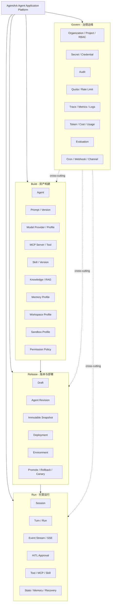

### 3.4 核心业务范围

#### Build

- Agent、Prompt、Model、MCP、Skill、Knowledge、Memory、Workspace、Sandbox、Permission；
- 资产草稿、版本、来源、校验、差异和引用关系；
- Secret 绑定与环境适配；
- Agent Team/Sub-Agent 的组合描述。

#### Release

- Draft 校验；
- 依赖闭包解析；
- 不可变 `AgentRevisionSnapshot`；
- Environment、Deployment、Promote、Rollback、Canary；
- 发布审计和变更摘要。

#### Run

- Session、Turn、Run、Event、SSE；
- HarnessAgent 编译和执行；
- Tool/MCP/Skill/RAG/Sandbox；
- HITL、Checkpoint、Cancellation、Recovery；
- Usage 与 Cost 记录。

#### Govern

- Organization、Project、Membership、Role、Permission；
- API Key、Service Account、Secret；
- Audit、Quota、Rate Limit；
- Trace、Metric、Log、Evaluation；
- Cron、Webhook、Channel、异步 Job。

### 3.5 非目标

当前架构不以以下事项为 v1 目标：

- 重写 AgentScope Java 2 已经成熟提供的 Agent/Harness 核心能力；
- 将 Prompt、MCP、Skill、Knowledge 等每个名词拆成微服务；
- 自研通用向量数据库、搜索引擎、对象存储或消息队列；
- 第一阶段同时支持所有模型厂商、所有图数据库和所有云平台；
- 在无明确需求前强制引入 Kafka、Neo4j、Elasticsearch、Nacos 或 Service Mesh；
- 将 AgentArk 建设为只做模型转发的通用 AI Gateway；
- 允许未版本化 Draft 直接进入生产运行；
- 默认记录或暴露模型隐藏推理链。

---

## 4. 架构驱动因素与质量属性

### 4.1 业务驱动因素

1. Agent 能力需要被非框架开发者配置和治理；
2. Agent 行为需要版本化、可复现、可回滚；
3. Session/Turn 需要支持长时间运行、流式输出和中断恢复；
4. MCP/Skill/Sandbox 带来明显的权限和供应链风险；
5. RAG 需要独立的摄取、索引和版本语义；
6. Go 控制面需要在不中断 Runtime 的前提下逐步 Java 化；
7. 平台需要保持本地启动简单，同时允许生产横向扩展；
8. AgentScope 2.x 仍会演进，平台必须隔离其 API 变化。

### 4.2 关键质量属性

| 优先级 | 质量属性 | 架构响应 |
|---:|---|---|
| P0 | 行为可复现 | 不可变 Revision Snapshot、版本锁定、内容哈希、Session 固定版本 |
| P0 | 安全与租户隔离 | OIDC/JWK、服务身份、资源级授权、SecretRef、Tool Permission、Sandbox |
| P0 | 可恢复性 | 事件日志、持久化 Session/Turn、Lease/Fencing、幂等与断点续传 |
| P0 | 边界可演进 | Control/Runtime 隔离、端口适配器、防腐层、版本化内部契约 |
| P1 | 可观测性 | Trace、Metrics、Structured Log、Audit、Usage/Cost 分离 |
| P1 | 可扩展性 | 无状态服务、横向扩容、外置状态、Provider SPI、渐进式基础设施 |
| P1 | 可维护性 | 聚焦模块、禁止 giant common、ArchUnit、BOM、薄启动模块 |
| P1 | 开发体验 | 本地 Core Profile、统一 API、Testcontainers、明确错误模型 |
| P2 | 多云与多后端 | ObjectStore、VectorStore、Secret、Sandbox 等端口抽象 |

### 4.3 初始设计目标

以下是架构目标，不等同于对外 SLA，正式 SLA 需要经过压测和故障演练后批准：

| 指标 | 初始目标 |
|---|---:|
| Gateway/Control/Runtime API 月可用性 | 99.9% |
| Control 常规读 API P95 | < 300 ms |
| Control 常规写 API P95 | < 800 ms |
| Runtime 创建 Turn 接受 P95 | < 500 ms |
| Runtime Event 持久化到 SSE P95 | < 1 s |
| Scheduler 到期任务启动延迟 P95 | < 5 s |
| Core 数据 RPO | ≤ 5 min |
| Core 平台 RTO | ≤ 60 min |

模型首 Token、外部 MCP、Sandbox 冷启动和 Embedding 延迟必须独立度量，不能混入平台自身开销。

---

## 5. 架构原则与不可破坏约束

### 5.1 平台领域优先

Agent、AgentRevision、Deployment、Session、Approval 等是 AgentArk 领域对象。禁止直接使用 AgentScope 类型作为 REST DTO、数据库 Entity 或跨平面契约。

### 5.2 发布即冻结

- Draft 可以修改；
- Published Revision 不可修改；
- Revision 必须关联完整、可校验、带 `schemaVersion` 和 `contentHash` 的 Snapshot；
- Snapshot 中所有行为配置必须解析到确定版本；
- Secret 只以 `SecretRef` 保存；
- Runtime 只接受 Snapshot，不自行读取当前 Catalog；
- 回滚是 Deployment 指针回退，不是修改旧 Revision。

### 5.3 Control 与 Runtime 隔离

- Control 不得依赖 Runtime 实现；
- Runtime 不得依赖 Control Entity、Mapper、Repository 或数据库；
- 同一 MySQL 实例不代表可以跨 Schema 读表；
- 跨平面交互只通过版本化 Internal API、事件或稳定 Snapshot；
- Runtime 故障不应阻止 Draft 管理；Control 短暂故障不应立即中断已加载运行实例。

### 5.4 四平面而非无限微服务

Gateway、Control、Runtime、Scheduler 是可独立扩缩容和部署的平面。Prompt、MCP、Skill、Knowledge 等首先是平面内部领域模块，只有达到明确拆分阈值后才允许服务化。

### 5.5 通用模块必须聚焦

- 禁止创建 `agentark-common`、`common-utils`；
- Kernel 只包含稳定值对象、领域规范和极少量跨平面契约；
- Starter 只提供基础设施自动配置和类型化能力；
- 业务 Mapper、Entity、Controller、AgentScope Runtime 类型不得进入 Starter；
- “多个模块都用到”不是进入公共模块的充分条件。

### 5.6 端口与适配器

Model、Secret、Object Store、Vector Store、Sandbox、Channel、Control Plane Client 均通过端口隔离。厂商 SDK 只能出现在对应 Adapter 包中。

### 5.7 单一事实源与明确投影

- Control DB 是资产、版本和期望部署状态的事实源；
- Runtime DB/Event Log 是运行事实源；
- Scheduler DB 是 Job 事实源；
- Redis、搜索索引、Dashboard 聚合均为可重建投影或协调状态；
- 禁止用缓存掩盖数据所有权问题。

### 5.8 安全默认开启

身份校验、资源授权、租户上下文、密钥脱敏、审计和 Tool Permission 是默认路径，不能通过前端隐藏或团队约定替代服务端强制执行。

### 5.9 渐进式基础设施

Core Profile 只依赖 MySQL、Redis 和对象存储；RAG Profile 加入 Qdrant；Elasticsearch、Neo4j、Kafka 按激活条件启用。

### 5.10 可观测不是后补功能

Agent 执行链的 Model、Tool、MCP、RAG、Sandbox、Sub-Agent 和 Event 必须从第一版具有 Trace/Metric 语义。Telemetry、Runtime Event 和 Audit 必须分离。

### 5.11 契约优先

跨服务和跨语言协议以 `contracts/` 中的 OpenAPI、AsyncAPI、JSON Schema 为准。禁止共享数据库 Entity 或把 Java 序列化格式当作协议。

### 5.12 一次只改变一个主要变量

模块重命名、架构拆分、JDK 升级、Spring Boot 升级、ORM 迁移、数据库迁移、Go → Java 和前端重写必须分阶段完成。

### 5.13 自动化架构治理

依赖方向、包访问、禁止类型和契约兼容通过 Maven Enforcer、ArchUnit、Contract Test 和 CI 执行，不能只依赖文档。

---

## 6. 系统上下文与四平面逻辑架构

### 6.1 系统上下文

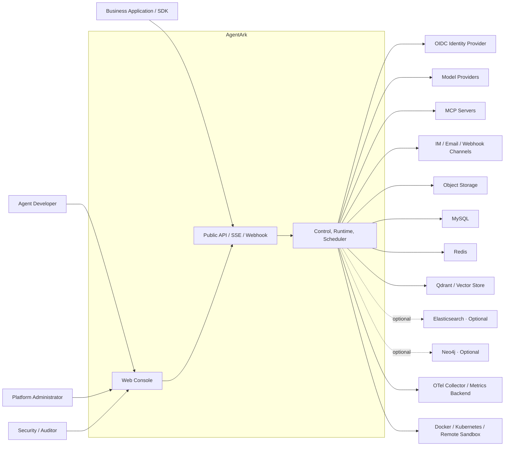

### 6.2 四平面架构

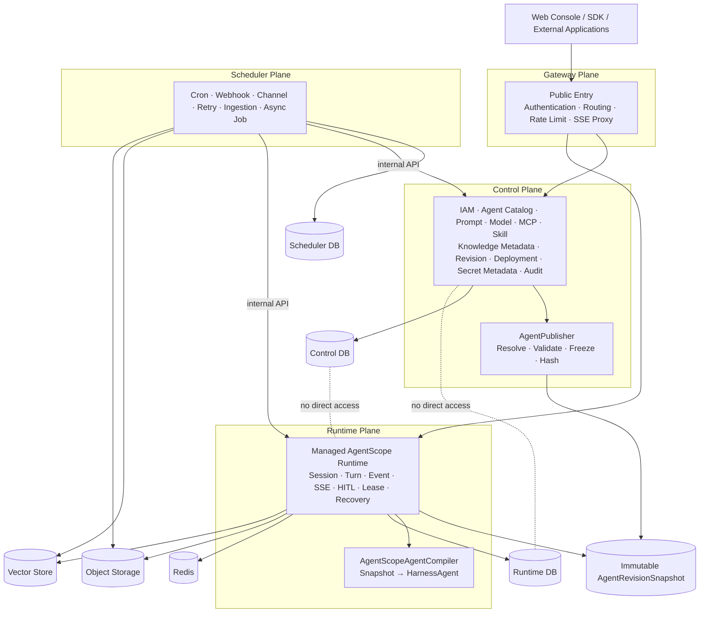

### 6.3 平面职责矩阵

| 平面 | 拥有的能力 | 明确不拥有 | 扩缩容依据 |
|---|---|---|---|
| Gateway | 公共入口、认证前置、路由、CORS、限流、请求标识、SSE 代理 | 业务状态、Agent 编译、业务数据库、定时任务 | HTTP/SSE 连接数、入口吞吐 |
| Control | IAM、Catalog、Draft、Revision、Snapshot、Deployment、校验、审计、Secret Metadata | Harness 推理循环、Session Event Stream、Worker Lease | CRUD/发布吞吐、管理请求 |
| Runtime | Snapshot 加载、HarnessAgent、Session、Turn、Run、Event、SSE、HITL、状态恢复、Lease | Agent Catalog 编辑、用户目录、Cron 扫描 | 并发 Session/Run、流式连接、Tool/Model 等待 |
| Scheduler | Cron、Webhook、Channel、RAG Ingestion、异步任务、重试、死信 | Harness 推理循环、公共 API 入口、Catalog 所有权 | Job 吞吐、外部调用延迟、任务积压 |

### 6.4 主要调用路径

#### 配置与发布路径

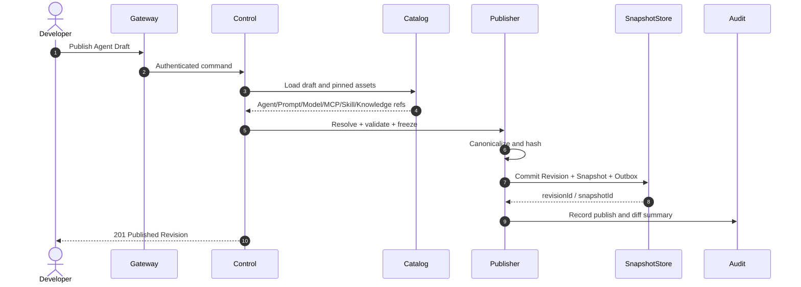

#### 交互运行路径

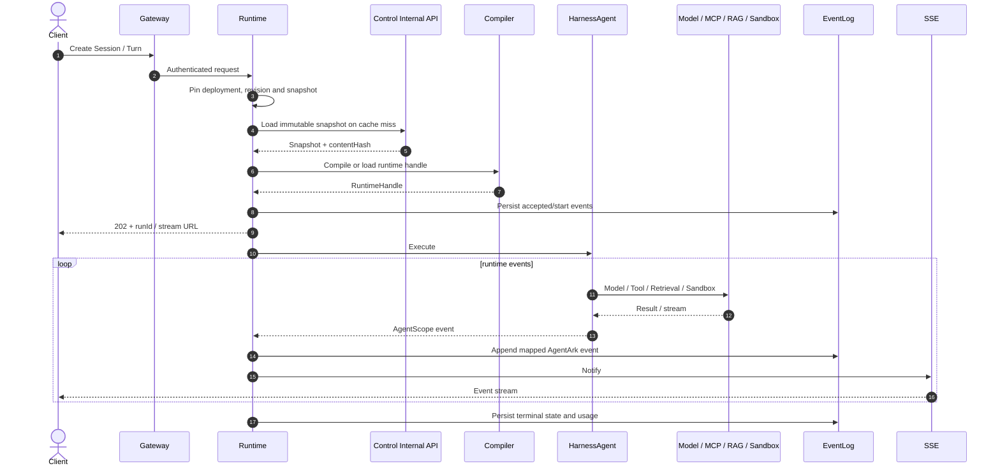

#### 调度路径

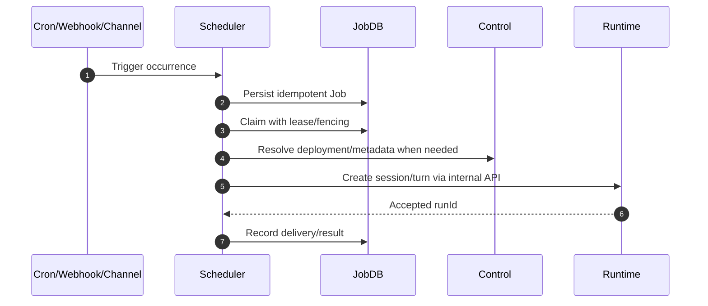

---

## 7. 领域边界与核心模型

### 7.1 顶层租户模型

```text
Platform
└── Organization
    └── Project
        ├── Environment (dev / test / staging / prod)
        ├── Agent & Assets
        ├── Knowledge Bases
        ├── Deployments
        └── Runtime Sessions
```

规则：

- `Organization` 是租户、计费和总体配额边界；
- `Project` 是日常协作、资产和权限边界；
- `Environment` 是部署与密钥隔离边界，不是普通标签；
- 所有可租户化资源必须显式携带 `organizationId` 与 `projectId`；
- 跨 Project 共享必须通过明确发布/授权，不允许直接引用其他 Project 数据行；
- Tenant Context 是授权输入，不是替代业务对象显式 ID 的隐式魔法。

### 7.2 有界上下文

| 有界上下文 | 核心对象 | 所属模块/平面 |
|---|---|---|
| IAM | Organization、Project、User、Membership、Role、API Key | `agentark-control` / Control |
| Agent Catalog | Agent、Draft、Prompt、Model、MCP、Skill、Profile | `agentark-control` / Control |
| Release | Revision、Snapshot、Deployment、Environment | `agentark-control` / Control |
| Knowledge | KnowledgeBase、Document、DocumentRevision、KnowledgeRevision | `agentark-knowledge` / Control + Scheduler + Runtime Read |
| Runtime | Session、Turn、Run、Event、Approval、Checkpoint、Lease | `agentark-runtime` / Runtime |
| Scheduling | Trigger、Job、Attempt、Delivery、DeadLetter | `agentark-scheduling` / Scheduler |
| Governance | Audit、Quota、Usage、Evaluation、Policy | Control + 横切基础设施 |

### 7.3 核心对象关系

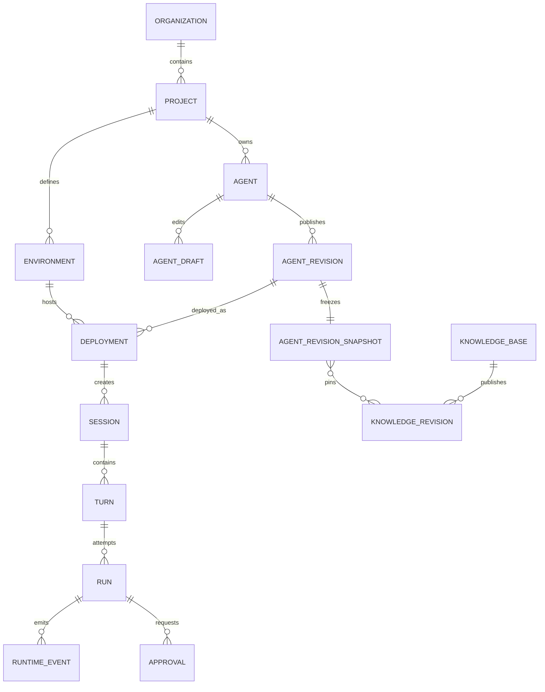

### 7.4 核心对象与不变量

| 对象 | 定义 | 关键不变量 |
|---|---|---|
| `Agent` | Agent 的稳定身份与展示信息 | 不代表某一可执行配置 |
| `AgentDraft` | 可编辑工作副本 | 不能直接进入生产运行 |
| `AgentRevision` | 一次正式发布 | 发布后不可修改；关联唯一 Snapshot |
| `AgentRevisionSnapshot` | 可执行配置的不可变完整快照 | 有 Schema、Hash；不含明文 Secret |
| `Deployment` | Environment 中对 Revision 的稳定部署地址 | 指向确定 Revision；有版本和状态 |
| `PromptVersion` | Prompt 的不可变版本 | Version 发布后不可修改 |
| `ModelProfile` | 模型能力与参数模板 | 非密钥字段冻结；凭据为 SecretRef |
| `McpServerVersion` | MCP Endpoint、Transport、Tool 与策略版本 | 发布时固定；健康状态不属于版本内容 |
| `SkillVersion` | Skill Artifact 的不可变版本 | 有来源、哈希、签名和许可元数据 |
| `KnowledgeRevision` | 一次完整可查询知识索引版本 | READY 后才能被 Agent Revision 引用 |
| `Session` | 连续交互上下文 | 创建时固定 Deployment 与 Revision |
| `Turn` | 一次输入到稳定终态的处理单元 | 同一时刻只有一个有效 Fencing Owner |
| `Run` | Turn 的一次执行尝试 | 可重试；与业务 Turn 分离 |
| `Event` | Runtime 追加式事实 | 单调序号、不可原地修改、可恢复消费 |
| `Approval` | HITL 请求与决策 | 幂等、可审计、具备超时与授权范围 |
| `Job` | Scheduler 持久任务 | 至少一次派发；Handler 必须幂等 |

### 7.5 Agent 生命周期

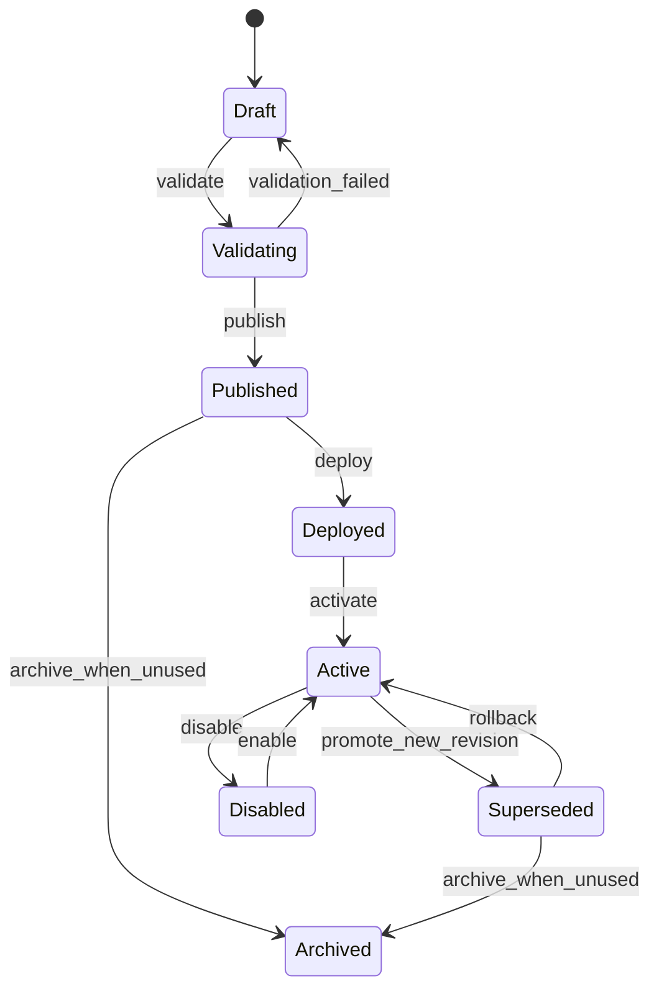

说明：

- `Published` 表示 Revision 与 Snapshot 已创建，不等于已部署；
- `Deployment` 生命周期与 `AgentRevision` 分离；
- `Superseded` Revision 仍可被既有 Session 使用；
- 归档不等于物理删除，仍需满足 Session、回滚和审计保留约束。

### 7.6 期望状态与观察状态

Control 持有期望状态：

```text
Deployment.desiredRevisionId
Deployment.desiredStatus
Deployment.rolloutPolicy
Deployment.resourcePolicy
```

Runtime 持有观察状态：

```text
RuntimeInstance.observedRevisionId
RuntimeInstance.health
RuntimeInstance.lastHeartbeat
RuntimeInstance.activeRuns
RuntimeInstance.compilerVersion
```

两者通过 Reconciliation 协调。禁止 Runtime 直接修改 Control 的期望状态；禁止 Control 伪造 Runtime 健康状态。

---

## 8. 发布、快照与部署设计

### 8.1 为什么必须引入不可变快照

如果 Runtime 在 Session/Turn 开始时分别查询“当前 Prompt”“当前 Skill”“当前 MCP”“当前 Knowledge”，则同一个 Revision 会因资产后续修改而改变行为，导致：

- 运行不可复现；
- 回滚不可靠；
- 审计无法证明实际配置；
- 缓存失效复杂；
- Session 中途行为漂移；
- Control 故障直接影响 Runtime 热路径。

因此，发布必须将 Agent 的运行依赖闭包解析为不可变 Snapshot。

### 8.2 Snapshot 规范

```json
{
  "schemaVersion": 1,
  "snapshotId": "0198...",
  "agentId": "0198...",
  "revisionId": "0198...",
  "revisionNumber": 12,
  "createdAt": "2026-08-14T08:00:00Z",
  "contentHash": "sha256:...",
  "runtimeProvider": "agentscope-java-2",
  "agent": {
    "name": "code-review-agent",
    "entrypoint": "harness"
  },
  "model": {
    "provider": "dashscope",
    "modelName": "qwen-plus",
    "parameters": {
      "temperature": 0.2,
      "maxTokens": 8192
    },
    "credential": {
      "secretRef": "secret://project/model-dashscope-prod",
      "resolutionPolicy": "LATEST_ENABLED"
    }
  },
  "prompts": [
    {
      "role": "system",
      "promptVersionId": "0198...",
      "contentHash": "sha256:...",
      "content": "..."
    }
  ],
  "mcpServers": [
    {
      "mcpServerVersionId": "0198...",
      "transport": "streamable-http",
      "endpoint": "https://mcp.example.com",
      "credential": {
        "secretRef": "secret://project/mcp-prod"
      },
      "allowedTools": ["repository.read", "pull_request.comment"]
    }
  ],
  "skills": [
    {
      "skillVersionId": "0198...",
      "artifactUri": "s3://agentark-skills/...",
      "artifactHash": "sha256:..."
    }
  ],
  "knowledge": [
    {
      "knowledgeRevisionId": "0198...",
      "retrievalProfile": {
        "topK": 8,
        "scoreThreshold": 0.72,
        "reranker": "default-reranker"
      }
    }
  ],
  "memory": {
    "profileVersionId": "0198..."
  },
  "workspace": {
    "profileVersionId": "0198..."
  },
  "sandbox": {
    "profileVersionId": "0198..."
  },
  "permissions": {
    "defaultDecision": "ASK",
    "rules": [
      {
        "resource": "tool:filesystem.write",
        "decision": "DENY"
      }
    ]
  },
  "limits": {
    "turnTimeoutSeconds": 600,
    "maxToolCalls": 64,
    "maxSubAgents": 8
  }
}
```

Snapshot 约束：

- 使用规范化 JSON 计算 SHA-256 `contentHash`；
- 使用独立 JSON Schema，禁止 Java 原生序列化；
- 数据只追加，不覆盖；
- Runtime 至少支持当前 Schema 与前一版本；
- Prompt 正文可内嵌以保证可复现；
- 大型 Skill/Artifact 使用带哈希的 Object URI；
- Secret 只保存引用，运行时按权限解析；
- Knowledge 必须固定到 READY 的 `KnowledgeRevision`；
- Provider 扩展字段进入受控命名空间，禁止任意 Map 扩散到领域模型；
- Snapshot 包含 `runtimeProvider`、Compiler 兼容要求和必要 Capability 声明。

### 8.3 发布校验

发布前必须验证：

- Draft 乐观锁版本；
- 所有引用资产存在且可访问；
- Prompt/Model/MCP/Skill/Knowledge 版本完整；
- Model Capability 满足 Tool、Vision、Structured Output 等要求；
- MCP Tool 名称冲突、Transport 和认证配置；
- Skill Artifact 哈希、签名、许可和运行要求；
- Knowledge Revision 状态为 READY；
- SecretRef 在目标 Environment 可绑定；
- Permission Policy 与平台/组织策略不冲突；
- Sandbox/Workspace 资源和网络策略；
- Token、Tool、Sub-Agent、Timeout 等限制；
- Snapshot Schema 与 Runtime Provider 兼容；
- 发布者具备目标 Project/Environment 权限。

### 8.4 发布事务

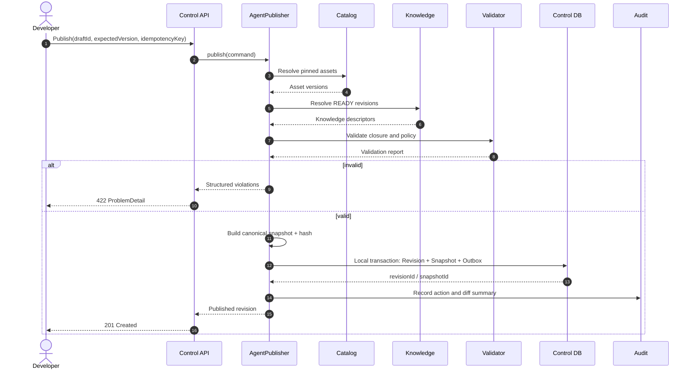

事务规则：

- Revision、Snapshot 元数据和 Outbox 在同一 Control DB 本地事务提交；
- 大 Artifact 先上传临时区并校验，事务成功后标记 committed；
- Runtime 预热、通知和索引刷新通过 Outbox 异步执行；
- 发布命令支持 `Idempotency-Key`；
- 外部 Provider 验证如果耗时或有副作用，应拆成发布前 Validation Operation，而不是拉长数据库事务。

### 8.5 Deployment 模型

```text
Deployment
├── organizationId
├── projectId
├── environmentId
├── agentId
├── desiredRevisionId
├── desiredStatus
├── rolloutPolicy
├── quotaPolicy
├── endpointPolicy
├── version
└── observedStatus summary
```

Deployment 是稳定寻址对象，例如：

```text
/project/{projectId}/environment/prod/agent/code-review
```

Revision 是不可变内容，Deployment 是指向 Revision 的可变期望状态。

### 8.6 Session 固定与回滚

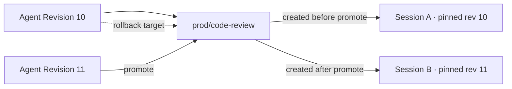

规则：

- Session 创建时写入 `deploymentId`、`revisionId`、`snapshotId` 和 Deployment Version；
- Deployment 更新不迁移既有 Session；
- Canary 只决定新 Session 选择哪个 Revision；
- 回滚只影响新 Session；
- 既有 Session 的强制迁移/终止必须是显式、可审计事故操作；
- Runtime 热路径按 Snapshot ID/Hash 读取，不按 Deployment 名称重新解析“当前 Revision”。

### 8.7 Schema 演进

- Snapshot Schema 使用整数 Major 版本；
- 新增可选字段保持向后兼容；
- 字段含义改变或删除需要新 Schema 版本；
- Runtime 提供显式 Upcaster，但不能静默改变行为语义；
- Control 发布时只生成 Runtime 集群已声明支持的 Schema；
- Runtime 滚动升级期间至少支持 N 和 N-1；
- Snapshot Golden Files 和编译结果进入兼容测试。

---

## 9. 最终 Maven 与代码模块架构

### 9.1 目标目录

```text
agentark
├── pom.xml
├── mvnw
├── mvnw.cmd
├── .mvn/
│
├── agentark-bom
├── agentark-kernel
│
├── agentark-foundation
│   ├── agentark-starter-web
│   ├── agentark-starter-security
│   ├── agentark-starter-persistence
│   ├── agentark-starter-redis
│   ├── agentark-starter-storage
│   └── agentark-starter-observability
│
├── agentark-control
├── agentark-knowledge
├── agentark-runtime
├── agentark-runtime-provider-agentscope
├── agentark-scheduling
│
├── agentark-services
│   ├── agentark-gateway-server
│   ├── agentark-control-server
│   ├── agentark-runtime-server
│   └── agentark-scheduler-server
│
├── agentark-web
├── contracts
│   ├── openapi
│   ├── asyncapi
│   └── schemas
├── deploy
│   ├── compose
│   ├── helm
│   └── kubernetes
├── docs
└── tools
```

说明：

- `agentark-foundation` 和 `agentark-services` 是聚合 POM，不承载混合业务代码；
- `contracts`、`deploy`、`docs`、`tools` 是仓库目录，不是运行模块；
- `agentark-web` 使用 pnpm 独立构建，不进入 Java 编译依赖图；
- 真正可启动的后端制品只有四个 `*-server`；
- 不新增 `agentark-common`、`common-utils` 或其他无边界共享模块；
- 不为 Prompt、MCP、Skill、Knowledge 分别创建微服务；
- 未来拆分模块/服务必须以容量、团队所有权、故障隔离或安全边界为依据，并提交 ADR。

### 9.2 模块依赖图

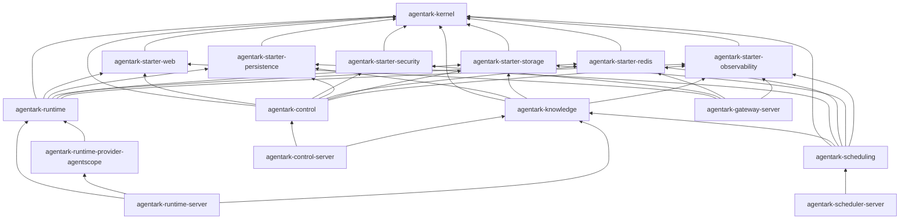

图中箭头表示“依赖于”。以下关系明确禁止：

```text
agentark-control                       -> agentark-runtime / agentark-runtime-provider-agentscope
agentark-runtime                       -> agentark-control implementation
agentark-runtime-provider-agentscope   -> agentark-control implementation / persistence adapters
agentark-scheduling                    -> agentark-runtime / agentark-runtime-provider-agentscope
agentark-gateway-server                -> agentark-control / agentark-runtime / agentark-runtime-provider-agentscope
任意业务模块                    -> 任意 *-server
```

跨平面调用通过版本化 Internal API 或事件完成，不通过 Java 实现依赖或数据库直连完成。

### 9.3 模块总览

| 模块 | 类型 | 是否独立启动 | 核心职责 |
|---|---|---:|---|
| `agentark-bom` | Maven BOM | 否 | 统一第三方与内部模块版本 |
| `agentark-kernel` | Pure Java Library | 否 | 强类型 ID、稳定领域规范、Snapshot 核心模型和最小跨平面契约 |
| `agentark-starter-web` | Spring Boot Starter | 否 | Web 约定、ProblemDetail、Jackson、请求上下文和分页 |
| `agentark-starter-security` | Spring Boot Starter | 否 | OIDC/JWT、API Key 认证框架、服务身份和 Method Security |
| `agentark-starter-persistence` | Spring Boot Starter | 否 | MyBatis-Plus、Flyway、TypeHandler、事务和审计字段 |
| `agentark-starter-redis` | Spring Boot Starter | 否 | Cache、Lease、Fencing、Idempotency、Rate Limit |
| `agentark-starter-storage` | Spring Boot Starter | 否 | Object Store SPI 与 Local/S3/OSS/COS 适配 |
| `agentark-starter-observability` | Spring Boot Starter | 否 | OpenTelemetry、Micrometer、结构化日志和 Agent 指标规范 |
| `agentark-control` | Domain/Application Library | 否 | IAM、Catalog、Draft、Revision、Snapshot、Deployment、Secret Metadata、Audit |
| `agentark-knowledge` | Domain/Application/Adapter Library | 否 | Knowledge、Document、Ingestion、Index、Retrieval 和受控 AgentScope RAG Adapter |
| `agentark-runtime` | Runtime Domain/Application/Adapter Library | 否 | Session、Turn、Run、Event、HITL、Lease、持久化工作队列和 Provider 中立端口 |
| `agentark-runtime-provider-agentscope` | Runtime Provider Adapter | 否 | AgentArk → AgentScope 编译、执行、状态和事件防腐层 |
| `agentark-scheduling` | Domain/Application Library | 否 | Trigger、Job、Retry、Delivery、Channel、Webhook、Ingestion Worker |
| `agentark-gateway-server` | Spring Boot App | 是 | 公共入口、认证前置、路由、限流和 SSE 代理 |
| `agentark-control-server` | Spring Boot App | 是 | Java 控制面和 Knowledge 管理 API |
| `agentark-runtime-server` | Spring Boot App | 是 | 托管 AgentScope Runtime、Session、Turn、Event、SSE、HITL |
| `agentark-scheduler-server` | Spring Boot App | 是 | 持久化调度、RAG 摄取、Webhook、Channel 和重试 |
| `agentark-web` | React App | 独立构建 | AgentArk 产品控制台 |

`contracts/` 保存语言中立的 OpenAPI、AsyncAPI 和 JSON Schema。它不是可以被随意扩充的 Java“共享 DTO”模块。Java DTO 由契约生成或放在对应服务 Adapter；稳定 Snapshot 语义位于 `agentark-kernel`。

### 9.4 `agentark-bom`

**职责**

- 通过 `dependencyManagement` 统一 JDK、Spring Boot、Spring Cloud、AgentScope、MyBatis-Plus、Flyway、Jackson、OpenTelemetry、Testcontainers 等版本；
- 管理 AgentArk 内部模块版本；
- 形成可审计的 Dependency Convergence Point；
- 将安全修复和兼容升级集中在一处；
- 固定 Maven Compiler、Surefire、Failsafe、Enforcer、JaCoCo、CycloneDX 等插件版本。

**约束**

- BOM 不包含业务代码；
- 子模块禁止为 BOM 已管理依赖重复声明版本；
- Maven Enforcer MUST 检查 Java 版本、Dependency Convergence、Upper Bound、重复类、禁止依赖和 Release 中的 Snapshot 依赖；
- 基础设施镜像版本由统一版本清单管理并锁定 GA Patch/Digest。

### 9.5 `agentark-kernel`

`agentark-kernel` 是整个系统的纯 Java 内核，默认不依赖 Spring、Jackson、ORM、Redis、HTTP Client、AgentScope 或厂商 SDK。

**允许内容**

```text
OrganizationId / ProjectId / AgentId / RevisionId
DeploymentId / SessionId / TurnId / RunId / ApprovalId
DomainErrorCode / DomainException / Violation
AgentSpec / AgentRevision / AgentRevisionSnapshot
ModelSpec / PromptSpec / McpSpec / SkillSpec / KnowledgeSpec
MemorySpec / WorkspaceSpec / SandboxSpec / PermissionSpec
SecretRef / ObjectRef / Checksum / SchemaVersion
RuntimeProviderId / EventEnvelope 的稳定核心字段
Clock / IdGenerator 等极少量可测试抽象
```

**禁止内容**

```text
@Controller / @Service / @Mapper / @Entity / @TableName
RedisTemplate / JdbcTemplate / WebClient
AgentScope HarnessAgent / AgentEvent / Message
数据库 DO、API Request/Response DTO
厂商 SDK 类型
万能 StringUtils / BeanUtils / Constants
```

**规范**

- ID 使用强类型值对象；底层采用 UUIDv7 128 位表示，MySQL 使用 `BINARY(16)`；
- 时间统一为 UTC 和 `Instant`；
- Snapshot 使用版本化 JSON Schema 和规范化 JSON 哈希；
- 某接口若只服务单一用例，应归拥有该用例的业务模块，而非进入 Kernel；
- Kernel 不因数据库表、AgentScope API 或 REST DTO 变化而变化。

### 9.6 Focused Foundation Starters

#### 9.6.1 `agentark-starter-web`

提供：

- RFC 9457 `ProblemDetail`；
- `requestId`、`traceId` 和经过认证的租户上下文；
- 日期、枚举、ID、Cursor Pagination、错误序列化；
- API Versioning 与 Media Type 约定；
- 全局异常映射；
- 输入校验、请求大小、敏感字段脱敏；
- OpenAPI 公共配置；
- MVC/WebFlux 条件化配置。

禁止包含业务 Controller、业务 DTO、业务校验规则或统一 `Result<T>` 套壳。

#### 9.6.2 `agentark-starter-security`

提供：

- OAuth 2.0 Resource Server / OIDC JWT；
- JWK 拉取、缓存和 Key Rotation；
- `AgentArkPrincipal`、Tenant Context、Service Identity；
- API Key 和 Service Account 认证扩展；
- Method Security、审计上下文和内部令牌验证；
- Security Header、CORS 基线和拒绝策略。

`User`、`Organization`、`Project`、`Role`、`Membership`、`PermissionBinding` 和 API Key 生命周期属于 `agentark-control`。

#### 9.6.3 `agentark-starter-persistence`

提供：

- MyBatis-Plus Spring Boot 4 集成；
- HikariCP、事务、分页、乐观锁；
- `created_at`、`updated_at`、`created_by`、`version`；
- Flyway 多 Schema/多服务配置；
- UUIDv7/BINARY(16)、JSON、枚举 TypeHandler；
- SQL 日志脱敏、慢查询指标、Testcontainers 支持；
- MySQL 时区、字符集和严格模式基线。

业务 Mapper、DO、Repository Adapter 和 SQL 留在所属业务模块。禁止：

- JPA 与 MyBatis-Plus 在最终架构长期共存；
- Controller 直接注入 Mapper；
- Active Record；
- 泛型 CRUD Service 代替应用服务；
- 全局机械逻辑删除；
- 数据库自动建表。

#### 9.6.4 `agentark-starter-redis`

不得提供无语义 `RedisUtils`。应暴露：

```java
interface DistributedLeaseManager { }
interface FencingTokenSource { }
interface IdempotencyStore { }
interface DistributedLockManager { }
interface RateLimiter { }
interface TypedCache<K, V> { }
```

Starter 负责连接、序列化、Key 前缀、TTL、指标和脚本版本；业务模块负责业务语义。Redis 不得成为 Revision、Deployment、Job、Approval 的唯一事实源。

#### 9.6.5 `agentark-starter-storage`

定义稳定 Object Store 能力：

```java
interface ObjectStore {
    ObjectRef put(PutObjectCommand command);
    InputStream get(ObjectRef ref);
    ObjectMetadata head(ObjectRef ref);
    void delete(ObjectRef ref);
    SignedUrl sign(ObjectRef ref, Duration ttl);
}
```

支持 Local、MinIO/S3-compatible、OSS、COS。对象路径由服务端生成，必须记录哈希、大小、媒体类型和加密元数据。

#### 9.6.6 `agentark-starter-observability`

提供：

- OpenTelemetry 与 W3C Trace Context；
- Micrometer Metric 命名和 Tag 白名单；
- JSON Structured Logging；
- Model、Tool、MCP、Retrieval、Sandbox Span Convention；
- Token、Cost、Latency、Error Category 指标；
- Trace ID 与 Runtime Event ID 关联；
- 健康检查、Build Info、Runtime Info；
- Prompt、Tool Argument、文档正文和 Secret 默认不采集。

### 9.7 `agentark-control`

内部建议按上下文组织：

```text
space.refinex.agentark.control
├── iam
├── catalog.agent
├── catalog.prompt
├── catalog.model
├── catalog.mcp
├── catalog.skill
├── catalog.profile
├── release
├── deployment
├── secret
├── governance
└── audit
```

**拥有能力**

- Organization、Project、Environment、User、Service Account、Membership、Role、Permission；
- Agent、AgentDraft、AgentRevision、AgentRevisionSnapshot、Deployment；
- Prompt、Model、MCP、Skill、Memory、Workspace、Sandbox、Permission Policy；
- Secret Metadata/Binding、Quota、Audit 和治理；
- `AgentPublisher`、`RevisionValidator`、`SnapshotBuilder`、`DeploymentService`。

**端口示例**

```text
AgentRevisionRepository
AgentSnapshotRepository
KnowledgeRevisionResolver
SecretDescriptorResolver
RuntimeDeploymentClient
AuditLogPort
OutboxPort
```

Control 禁止：

- 依赖 `agentark-runtime` 或 `agentark-runtime-provider-agentscope`；
- 创建 HarnessAgent；
- 读取 Runtime/Scheduler 表；
- 在发布事务中同步执行模型、MCP 或索引；
- 保存 Secret 明文；
- 让 Draft 直接成为 Runtime 输入。

### 9.8 `agentark-knowledge`

包结构：

```text
space.refinex.agentark.knowledge
├── domain
├── application
├── port
└── adapter
    ├── in
    └── out
        ├── persistence
        ├── storage
        ├── vector.agentscope
        └── provider
```

**拥有能力**

- Knowledge Base、Data Source、Document、Document Revision；
- Parser、Chunk Strategy、Embedding Profile、Vector Index；
- Knowledge Revision、Retrieval Profile、Retriever、Reranker；
- Ingestion Handler、索引发布；
- 文档级 ACL 和租户过滤。

AgentScope Simple Knowledge / `VDBStoreBase` 可以在 `adapter.out.vector.agentscope` 使用，以复用 Qdrant、Elasticsearch、Milvus、PgVector 等实现。Domain/Application/API/Kernel 不得暴露 AgentScope 或数据库类型。

运行方式：

- Control Server 装配管理 API；
- Scheduler Server 装配 Ingestion Handler；
- Runtime Server 装配只读 Retrieval Facade；
- Bean 必须按 Profile/AutoConfiguration 裁剪，避免 Control 启动 Worker 或 Scheduler 暴露公共管理 API。

禁止：

- 查询“最新 KnowledgeRevision”；
- 将向量库作为原文唯一存储；
- 只依赖 Collection 名实现租户隔离；
- HTTP 请求内同步完成大文档 Embedding；
- 为每个向量库复制一套业务模型。

### 9.9 `agentark-runtime`

该模块拥有 Provider 中立的 Runtime Domain/Application 和平台持久化 Adapter：

```text
space.refinex.agentark.runtime
├── domain
│   ├── session
│   ├── turn
│   ├── run
│   ├── event
│   ├── approval
│   ├── state
│   └── lease
├── application
├── port
│   ├── in
│   └── out
└── adapter
    ├── in.web
    └── out
        ├── persistence
        ├── redis
        ├── control
        └── storage
```

**职责**

- Session、Turn、Run、Event、Approval 和 Agent State 状态机；
- 持久化 Runtime Work Queue、Lease/Fencing、Idempotency、Cancellation 和 Recovery；
- Snapshot Load、Event Append/Read、State/Checkpoint、Usage 等 Port；
- Provider 中立的 `AgentExecutionEngine` 抽象；
- Runtime Instance 协调和公共 Runtime Event/SSE 稳定映射。

该模块禁止导入任何 AgentScope Runtime 类型。Domain/Application 单元测试必须能使用 Fake `AgentExecutionEngine` 验证状态机，无需启动 AgentScope。

核心接口示例：

```java
public interface AgentExecutionEngine {
    RuntimeHandle compile(AgentRevisionSnapshot snapshot);
    Flux<EngineEvent> execute(TurnExecutionCommand command);
    Mono<Void> cancel(CancelRunCommand command);
    Mono<Void> resume(ResumeApprovalCommand command);
}

public interface ControlPlaneClient {
    Mono<AgentRevisionSnapshot> getSnapshot(SnapshotId snapshotId);
    Mono<DeploymentDescriptor> getDeployment(DeploymentRef ref);
}
```

禁止：

- 依赖 `agentark-control`；
- 读取 Control Catalog 表；
- 将 Session 可变状态保存在共享 Agent 单例；
- 在 Runtime 编辑 Prompt、MCP、Skill。

### 9.10 `agentark-runtime-provider-agentscope`

该模块是 AgentScope Java 2.0.2 的专用 Provider 防腐层，只包含：

```text
space.refinex.agentark.runtime.provider.agentscope
├── compiler
├── engine
├── state
├── event
└── error
```

职责：

- 将 Snapshot 映射为 AgentScope Model、Toolkit、MCP、Skill、Memory、Workspace、Sandbox、Sub-Agent 和 Permission Engine；
- 构建并执行 HarnessAgent；
- 通过 `agentark-runtime` 的 State/Checkpoint Port 适配 AgentScope 状态，不自行建表或启动 Auto-DDL；
- 将 AgentScope Event、异常和能力声明映射为 AgentArk 稳定模型。

只有本模块允许导入 AgentScope Runtime 类型。本模块只能依赖 `agentark-runtime` 的公开端口，禁止依赖 Control 实现、Runtime 持久化 Adapter 或任意 `*-server`。

### 9.11 `agentark-scheduling`

拥有：

- Trigger、Schedule、Job、JobExecution、Delivery、DeadLetter；
- Cron、Webhook、Channel、Knowledge Ingestion、异步 Tool/Integration Job；
- Retry、Backoff、Timeout、Idempotency、Lease/Fencing；
- Runtime Command、Knowledge Ingestion Command Outbound Port；
- Channel/Webhook 中立消息模型。

规则：

- 生产 Job 必须持久化；
- 派发语义为至少一次，Handler 必须幂等；
- Worker Claim 使用 Lease + Fencing；
- 外部 Channel 回执与 Job 状态分离；
- 触发 Agent 只通过 Runtime Internal API；
- 可以依赖 `agentark-knowledge` Ingestion API；
- 禁止依赖 `agentark-runtime`、`agentark-runtime-provider-agentscope` 或运行 Harness 推理循环；
- 禁止无限重试和无 Dead Letter 状态。

### 9.12 四个启动服务

#### `agentark-gateway-server`

- Spring Cloud Gateway、WebFlux、Spring Security；
- 公共入口、认证前置、路由、CORS、限流、Request ID、SSE 代理；
- 不连接业务数据库；
- Redis 只用于限流、Nonce、短期认证缓存；
- 不依赖 Control/Runtime 业务实现；
- 本地默认端口 `8080`。

#### `agentark-control-server`

- Spring MVC、MyBatis-Plus、MySQL、Redis、Object Storage；
- 组合 `agentark-control`、`agentark-knowledge` 和 Foundation Starters；
- 提供 Public 管理 API、Knowledge API、Internal Snapshot/Deployment API；
- 可使用 JDK 21 Virtual Threads 处理适合的阻塞路径，但需压测连接池和第三方 SDK；
- 是 Go `aistio` 的最终 Java 替代物；
- 本地默认端口 `8081`。

#### `agentark-runtime-server`

- WebFlux/Reactor、AgentScope、Redis、Runtime MySQL、Object Storage；
- 组合 `agentark-runtime`、`agentark-runtime-provider-agentscope` 与 Knowledge 只读检索；
- 负责 Session、Turn、Run、Event、SSE、HITL、Lease、Harness 执行；
- 不因 Virtual Threads 强制改成阻塞；
- 只通过 Internal Contract 获取 Snapshot；
- 本地默认端口 `8082`。

#### `agentark-scheduler-server`

- Worker Model、MyBatis-Plus、MySQL、Redis、Object Storage；
- 组合 `agentark-scheduling` 与 Knowledge Ingestion；
- 负责 Cron、Webhook、Channel、Delivery、Retry、Dead Letter；
- 通过 Runtime Internal API 启动 Turn/Run；
- 不包含 Harness 推理循环；
- 本地默认端口 `8083`。

### 9.13 统一包结构

推荐包前缀：`space.refinex.agentark`。在首次公开 Maven 坐标前，项目 MUST 确认对 `refinex.space` 命名空间具有可验证控制权；若没有，应一次性改用实际控制域名反写包名。

业务模块内部采用按业务能力切片的 Hexagonal Architecture：

```text
space.refinex.agentark.<domain>.<feature>
├── domain
│   ├── model
│   ├── service
│   └── event
├── application
│   ├── command
│   ├── query
│   └── service
├── port
│   ├── in
│   └── out
└── adapter
    ├── in
    │   ├── web
    │   └── internal
    └── out
        ├── persistence
        ├── redis
        ├── client
        ├── storage
        └── provider
```

依赖方向：

```text
adapter -> application -> domain
application -> port
adapter implements port
```

不是每个小功能都必须机械创建所有目录，但 Domain 禁止反向依赖 Adapter。

### 9.14 服务与模块启动矩阵

| 运行单元 | 组合模块 | 基础设施 |
|---|---|---|
| Gateway Server | Web/Security/Redis/Observability Starter | Redis 可选但生产推荐 |
| Control Server | Control + Knowledge + Foundation | Control MySQL、Redis、Object Storage；RAG 管理按需 Qdrant |
| Runtime Server | Runtime + AgentScope Provider + Knowledge Retrieval + Foundation | Runtime MySQL、Redis、Object Storage、模型/MCP/向量服务 |
| Scheduler Server | Scheduling + Knowledge Ingestion + Foundation | Scheduler MySQL、Redis、Object Storage；按任务 Qdrant |
| AgentArk Web | 通过 OpenAPI Client 调用 | CDN 或独立静态托管 |

### 9.15 自动化依赖规则

CI 必须建立以下 ArchUnit/Maven 规则：

```text
kernel must not depend on spring, persistence, redis, agentscope or vendor SDKs
domain packages must not depend on adapter packages
control must not depend on runtime or runtime-provider-agentscope
runtime must not depend on control implementation or AgentScope
runtime-provider-agentscope must depend only on runtime public ports
scheduling must not depend on runtime or runtime-provider-agentscope
server modules must not be dependencies of library modules
gateway must not depend on control/runtime business implementation
only runtime-provider-agentscope may import AgentScope Runtime types
only knowledge adapter.out.vector.agentscope may import AgentScope RAG types
no cycles between Maven modules
no cross-domain mapper/DO imports
only *-server modules contain @SpringBootApplication
no business Controller/Mapper/Entity in foundation starters
```

`contracts/` 的 OpenAPI、AsyncAPI 和 JSON Schema 由 CI 执行 Lint、Breaking Change 检查和代码生成一致性检查；生成代码不得反向成为领域模型。

---

## 10. Runtime Plane 详细设计

### 10.1 Runtime 内部组件

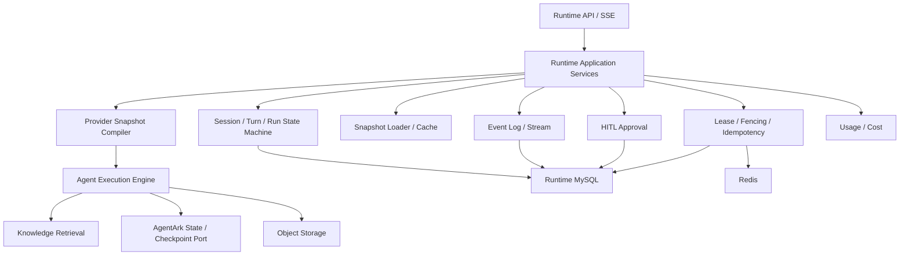

### 10.2 Snapshot Compiler

编译流程：

```text
AgentRevisionSnapshot
    ↓ schema/hash/runtime compatibility validation
ModelSpec
PromptSpec
McpSpec
SkillSpec
KnowledgeSpec
MemorySpec
WorkspaceSpec
SandboxSpec
PermissionSpec
    ↓ adapter mapping
AgentScope Model / Toolkit / MCP / Skill / Knowledge
Memory / Workspace / Sandbox / PermissionEngine
    ↓
HarnessAgent / RuntimeHandle
```

Compiler 要求：

- 编译前校验 Schema、Hash、Runtime Provider、Capability；
- 对每类资产产生结构化错误；
- 不在编译时修改 Snapshot；
- 编译结果标记 `compilerVersion`；
- Cache Key 为 `runtimeProvider + schemaVersion + contentHash + compilerVersion`；
- 只缓存无 Session 可变状态泄漏的产物；
- Secret 解析结果仅允许短时内存缓存，不能进入 Redis/持久化编译缓存；
- Deployment 预热失败不影响 Revision 已发布事实；
- AgentScope 升级只影响 Adapter 与兼容测试，不强迫 Control/API/DB 同步重构。

### 10.3 Session、Turn 与 Run

```text
Session
├── pinned deployment / revision / snapshot
├── participant and channel metadata
├── state backend reference
└── Turns
    └── Turn
        ├── input
        ├── current fencing token
        ├── Runs / Attempts
        ├── Events
        ├── Checkpoints
        ├── Approvals
        └── Usage
```

语义：

- Session 是连续上下文；
- Turn 是业务上一次输入处理；
- Run 是 Turn 的一次执行尝试；
- 失败后可创建新的 Run，而不是覆盖旧 Run；
- Event 属于 Run，同时带 Session/Turn 关联；
- Session 固定 Snapshot，Run 记录实际 Compiler/Provider/Secret Version Metadata；
- Cancellation、Timeout、Failure、Completion 均是明确终态；
- 同一 Turn 不允许两个有效 Worker 同时写入。

### 10.4 Turn 接收与执行解耦

公共 Turn API 必须完成以下工作并提交所属事务后才能返回 `202 Accepted`：

- 身份与资源授权；
- Session/Revision 校验；
- Idempotency 建档；
- Turn/Run 创建；
- 进入 Runtime Work Queue。

客户端随后通过 SSE 消费事件。可提供“创建 Turn 并立即连接流”的组合接口，但底层仍以持久化 Turn/Run 为事实，不能将 HTTP 连接作为唯一执行状态。

### 10.5 一次 Turn 的完整路径

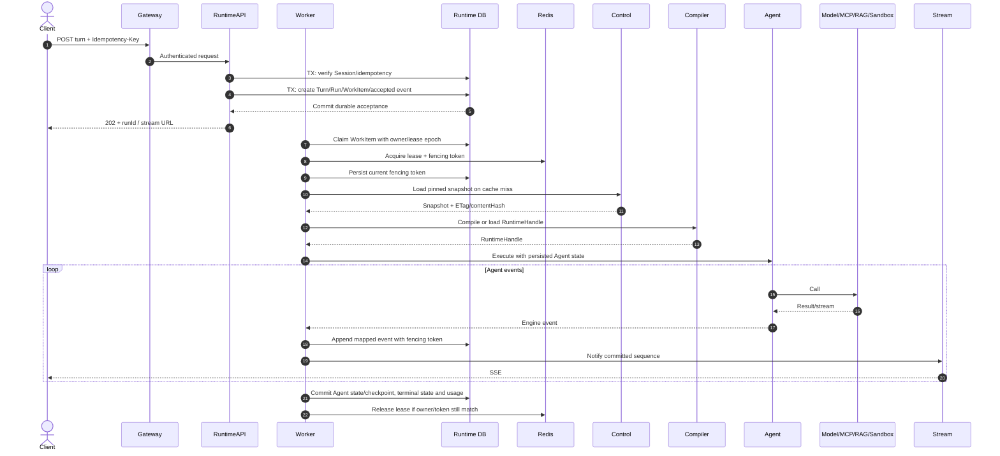

`202 Accepted` 的唯一前提是 Turn、首个 Run、Runtime Work Item、Idempotency 结果和 `run.accepted` 事件已经在同一 Runtime MySQL 本地事务提交。Snapshot 获取、编译、Lease 和外部调用属于 Worker 阶段，任何失败都必须形成可重试或终态事件，不能使已返回的 `runId` 消失。

### 10.6 Lease 与 Fencing

只使用“Redis 锁未过期”不足以防止暂停、GC、网络分区或超时 Worker 在 Lease 失效后继续写入。AgentArk 必须使用 Lease + 单调 Fencing Token：

1. Worker 获取 Turn Lease 时获得递增 Token；
2. Event Append、Checkpoint、Approval Resume 和终态写入携带 Token；
3. Runtime DB 记录当前有效 Token；
4. Token 小于当前值的陈旧 Worker 写入被拒绝；
5. Worker 定期续租，续租失败后停止新外部调用；
6. 无法取消的外部调用返回后，持久化前再次验证 Token；
7. Release 必须校验 Owner/Token，避免误删新 Owner Lease；
8. Lease 冲突、续租失败和陈旧写入均产生指标与诊断事件。

Lease 是执行权协调，数据库状态机与 Fencing 才是最终写保护。

### 10.7 Idempotency

必须支持：

- 创建 Session；
- 创建 Turn；
- 发布 Revision；
- 更新 Deployment；
- Approval Decision；
- Scheduler Job/Delivery；
- 外部 Webhook 接收。

Idempotency Record 至少包含：

```text
scope
idempotencyKey
requestHash
resourceId/resultRef
status
createdAt
expiresAt
```

同一 Key 不同 Request Hash 返回冲突；已完成请求返回原结果；处理中请求返回当前 Operation 状态。

### 10.8 Event Log 与 SSE

Event 约束：

- 全局唯一 `eventId`；
- 每个 Session/Run 单调 `sequence`；
- 追加后不可修改；
- 终态由明确 Event 表示；
- 大 Payload 可外置 Object Store；
- AgentScope Event 映射为稳定 AgentArk Event Type；
- 消费者按至少一次语义，以 `eventId` 去重；
- Event 先持久化，再对外通知；
- 实时通知丢失不丢事实，可从 Event Log 回放。

SSE 约束：

- `id` 使用可恢复 Event ID；
- 客户端通过 `Last-Event-ID` 恢复；
- Runtime 先回放持久事件，再切换实时通知；
- Gateway 禁用不适合 SSE 的缓冲；
- 心跳不进入持久 Event 序列；
- 慢客户端使用有界缓冲，超限后断开并允许恢复；
- SSE 连接关闭不是 Run 终态。

事件族至少包括：

```text
session.created
run.accepted
run.started
message.delta
message.completed
model.call.started
model.call.completed
model.call.failed
tool.call.requested
tool.call.started
tool.call.completed
tool.call.failed
knowledge.retrieval.started
knowledge.retrieval.completed
knowledge.retrieval.failed
approval.requested
approval.resolved
approval.expired
checkpoint.created
run.completed
run.failed
run.cancelled
turn.completed
turn.failed
turn.cancelled
```

平台不承诺暴露模型隐藏推理链。可展示 Reasoning 只能是模型/Agent 显式生成且策略允许的摘要。

### 10.9 HITL

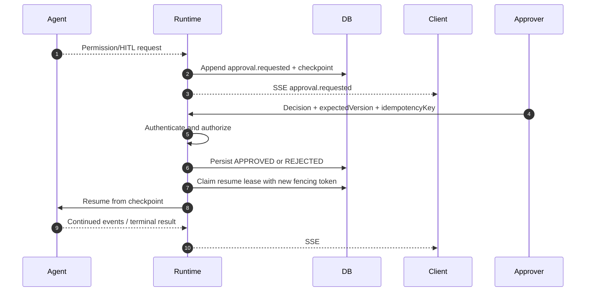

Approval 状态：

```text
PENDING → APPROVED | REJECTED | EXPIRED | CANCELLED
```

规则：

- 决策幂等；
- 审批人需要 Project/Environment/Tool Scope；
- 默认不展示完整敏感 Tool Argument；
- 超时策略由 Snapshot/Deployment 固定；
- 恢复获取新 Lease/Fencing；
- Approval 绑定具体动作摘要、参数哈希、Tool/MCP 身份和策略版本，避免审批后参数被替换。

### 10.10 Brain 与 Hands 边界

Runtime 中“Brain”负责模型推理、工具选择和 Agent 状态；“Hands”负责有副作用或长耗时外部执行。边界建议：

- 低延迟、可取消、无副作用 Tool 可以在 Runtime 直接执行；
- 长耗时、需要强隔离、可重试或产生外部副作用的任务应进入 Sandbox/Hands Worker；
- Scheduler 可以管理异步 Hands Job，但不拥有 Agent 推理循环；
- Runtime Event 记录 Tool Request、Execution ID、结果摘要和 ArtifactRef；
- 重试策略必须依据 Tool 的幂等声明；
- 写操作默认不自动重试，除非具有 Provider Idempotency Key。

### 10.11 状态与文件存储

| 类型 | 存储 | 说明 |
|---|---|---|
| Session/Turn/Run 元数据 | Runtime MySQL | 权威状态 |
| Runtime Event | Runtime MySQL + Object Store Payload | 追加事实 |
| Agent/Memory State | Runtime MySQL `runtime_agent_state` + Object Store Payload | AgentArk 管理 Schema/Flyway；Provider 仅经 State Port 读写，Redis 不得成为唯一副本 |
| Lease/Fencing/短期协调 | Redis + DB Token | 可恢复协调 |
| Workspace/Sandbox Artifact | Object Store | 有租户前缀、哈希和保留策略 |
| 编译缓存 | Runtime Memory/受控 Cache | 可丢失优化 |
| 实时通知 | Redis Stream/PubSub/内部总线 | 只通知，事实仍在 DB |

### 10.12 取消、超时与恢复

- Cancellation 为协作式，向模型/Tool/Sandbox 传播；
- Tool/Sandbox 另有硬超时和资源限制；
- 取消后 Worker 仍需持久化 `run.cancelled`；
- Pod 终止时停止 Claim 新 Run，并在 Grace Period 内完成或写 Checkpoint；
- 过期 Lease 的 RUNNING Run 进入 Reconciliation；
- 可恢复 Run 从 Checkpoint 继续，不可恢复 Run 创建新 Attempt；
- Runtime 重启后客户端可从 Event Log 恢复；
- Secret/Permission 被紧急吊销时，可触发运行中断或阻止下一外部调用。

### 10.13 Runtime Provider 能力描述

Runtime Provider 应声明：

```text
providerId
providerVersion
supportedSnapshotSchemas
supportedCapabilities
supportedModelFeatures
supportedWorkspaceTypes
supportedSandboxTypes
supportedStateBackends
supportedEventSchemaVersions
```

Control 发布时根据能力声明校验，不允许发布 Runtime 无法执行的 Snapshot。

---

## 11. 数据架构与存储所有权

### 11.1 数据库拓扑

开发环境可以使用同一 MySQL 实例，但必须使用独立 Schema 与账号：

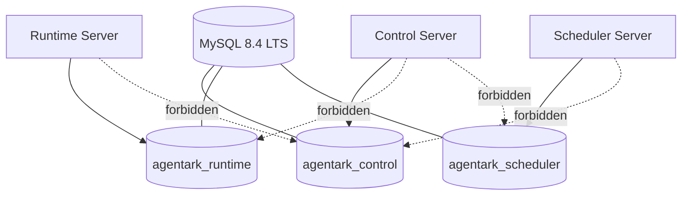

生产可将三个 Schema 迁移到不同实例，不改变领域代码与 API。

### 11.2 数据所有权

| 数据 | Owner | 其他平面的访问方式 |
|---|---|---|
| Organization/Project/IAM | Control | Internal API/授权投影 |
| Agent/Prompt/Model/MCP/Skill | Control | Snapshot |
| Revision/Snapshot/Deployment | Control | Internal API/缓存/事件 |
| Knowledge Metadata/Revision | Knowledge on Control DB | Internal Facade/Snapshot；Scheduler 通过命令/API 回写状态，不直连 Control DB |
| Session/Turn/Run/Event/Approval | Runtime | Runtime API/Event |
| Runtime Work Item/Agent State/Checkpoint | Runtime | Runtime API/Event；Redis 只做协调和通知 |
| Trigger/Job/Attempt/Delivery | Scheduler | Internal API/状态投影 |
| Usage 明细 | 产生该用量的平面 | 异步聚合到 Governance |
| Audit | Control/Governance | 专用审计查询 |
| Redis Cache/Lease | 对应平面 | 不作为跨平面查询接口 |

### 11.3 MySQL 逻辑模型的规范来源

架构文档只定义数据所有权和跨平面约束。表、字段、索引、唯一约束、状态迁移和 Flyway 规则的唯一规范来源是：

- [MySQL 公共规范](../database/mysql-conventions.md)
- [Control Schema](../database/control-schema.md)
- [Runtime Schema](../database/runtime-schema.md)
- [Scheduler Schema](../database/scheduler-schema.md)

实现阶段 MUST 先更新对应逻辑模型，再提交所属平面的 Flyway Migration、Repository Adapter 和迁移测试。开发环境可以共用 MySQL 实例，但不得合并 Schema、账号或迁移历史。

### 11.4 持久化适配约束

```text
Domain Aggregate
        ↑ Repository Port
Application Service
        ↓ Repository Adapter
Persistence DO + Mapper + SQL
```

- Domain 不添加 MyBatis 注解；
- 持久化对象使用 `*DO`；
- Mapper 只服务所属模块；
- Repository Adapter 负责 Domain/DO 映射；
- 复杂 SQL 使用显式命名 Query/XML；
- Tenant Interceptor 只是防御层，不替代显式条件与授权；
- 禁止跨 Schema Mapper；
- 禁止 ServiceImpl 泛型 CRUD 直接公开；
- 批量写有数量上限、事务边界和背压；
- 生产 SQL 日志不记录敏感参数；
- 软删除由聚合语义决定，不做全局默认。

### 11.5 Redis 语义

| 用途 | 允许 | 权威事实位置 |
|---|:---:|---|
| Control 查询缓存 | 是 | Control MySQL |
| RBAC 缓存 | 是 | Control MySQL |
| Rate Limit | 是 | 策略在 Control |
| Idempotency | 是 | 关键结果在所属 DB |
| Turn/Job Lease | 是 | DB 状态 + Fencing Token |
| Session/Agent State 唯一保存 | 否 | Runtime MySQL + Object Store Payload |
| Job 唯一事实 | 否 | Scheduler DB |
| Pub/Sub 通知 | 是 | Event/Job 事实在 DB |
| Secret 明文缓存 | 原则禁止 | Secret Provider |

Key 规范：

```text
agentark:{environment}:{plane}:{organizationId}:{projectId}:{capability}:{resourceId}:{suffix}
```

规则：

- 所有临时 Key 显式 TTL；
- Key/Value 格式版本化；
- 不使用 `KEYS` 扫描生产；
- Cache Stampede 使用 Single Flight/Jitter；
- Lua Script/Function 版本化并测试；
- 不用分布式锁掩盖错误数据所有权；
- 不以跨多个 Redis 主节点的非严格锁作为关键一致性基础。

### 11.6 Object Storage

```text
/{organizationId}/{projectId}/
├── knowledge/source/{documentId}/{revisionId}/...
├── knowledge/chunks/{knowledgeRevisionId}/...
├── skills/{skillId}/{version}/...
├── runtime/{sessionId}/{runId}/artifacts/...
├── runtime/{sessionId}/{runId}/events/...
├── sandbox/{sessionId}/{runId}/...
├── exports/...
└── backups/...
```

规则：

- ObjectRef 记录 SHA-256、Size、Content-Type、Encryption Metadata；
- 下载使用短时签名 URL 或服务端代理；
- 上传采用临时区 → 校验 → Commit；
- 删除采用标记 + 异步回收；
- 生命周期策略与 DB Retention 协同；
- Object Key 不是授权凭据；
- 不在数据库存长期公开 URL。

### 11.7 跨服务一致性

AgentArk 不使用跨服务分布式事务：

1. 单聚合修改使用本地事务；
2. 业务变化与 Outbox 在同一事务写入；
3. Outbox 至少一次投递；
4. Consumer 按 Event ID/业务键幂等；
5. 读模型和聚合允许最终一致；
6. Compensation 是显式业务动作；
7. 失败不得退化为跨库直连。

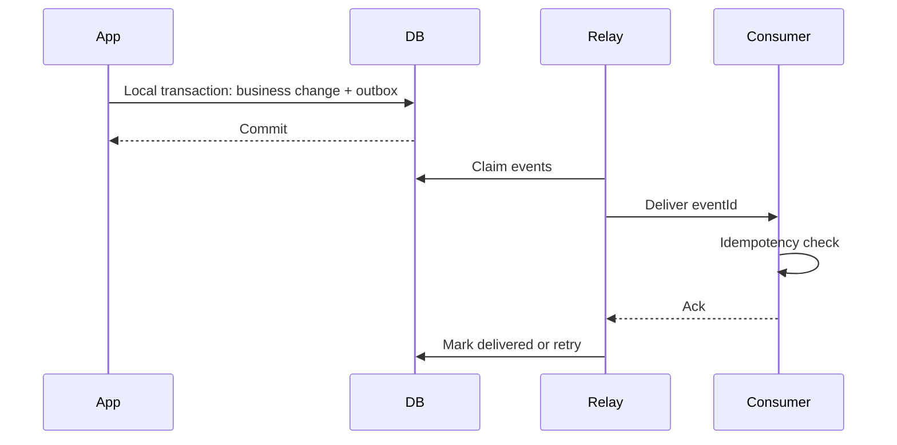

### 11.8 数据保留

| 数据 | 默认策略 |
|---|---|
| Revision/Snapshot | 长期保留；无部署、会话和审计需求后才归档 |
| Session/Turn/Event | 按项目策略；先归档/聚合，再删 Payload |
| Prompt/Response 内容 | 默认最小化保留；支持禁存、脱敏、保留期 |
| Audit | 防篡改、长期、严格访问 |
| Usage/Cost | 聚合长期；明细可压缩归档 |
| Knowledge Source | 按数据源策略；删除传播到 Chunk/Vector/Cache |
| Secret | Provider 管理版本；DB 只存引用 |

---

## 12. Knowledge 与 RAG 架构

### 12.1 设计目标

Knowledge 子系统必须实现：

- 原始内容可追溯；
- 解析、分块、Embedding、索引配置可版本化；
- 生产查询只引用已提交的 Knowledge Revision；
- Ingestion 可恢复、可重试、可观测；
- 检索具备租户、项目、资源和文档级过滤；
- Vector Store 可替换，平台领域不随实现变化；
- 文档删除能传播到派生数据；
- Retrieval 结果可引用来源并纳入 Trace。

### 12.2 组件边界

```text
Knowledge Domain
├── KnowledgeBase
├── DataSource
├── Document
├── DocumentRevision
├── ChunkSet
├── KnowledgeRevision
└── RetrievalProfile

Ports
├── DocumentParser
├── ChunkingStrategy
├── EmbeddingProvider
├── VectorIndex
├── Retriever
├── Reranker
└── KnowledgeObjectStore
```

### 12.3 Ingestion 流程

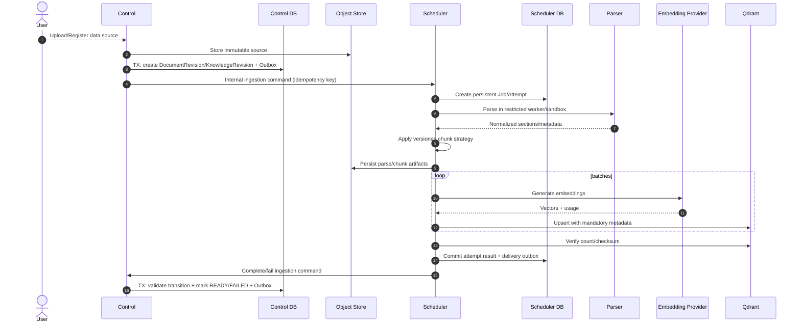

Scheduler 只拥有 Job、Attempt 和 Delivery 状态，不得直接写 Control DB。Control 是 Document/Knowledge Revision 状态机的唯一写入者；命令至少一次投递，双方以 `operation_id`/`idempotency_key` 去重。

### 12.4 Knowledge Revision 状态

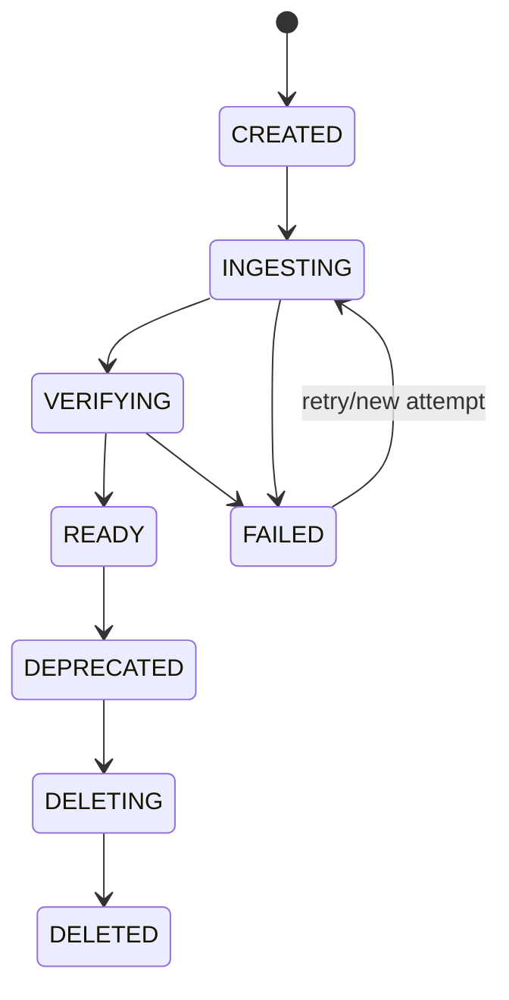

只有 `READY` Revision 可以进入 Agent Snapshot。修复内容或更改 Parser/Chunk/Embedding 配置必须创建新 Revision。

### 12.5 查询路径

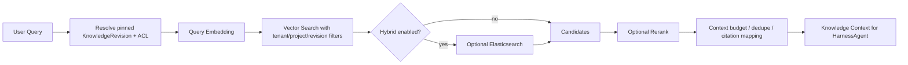

### 12.6 默认 Vector Store

默认采用 **Qdrant 1.18.3** 作为初始兼容基线。选择理由：

- 专注向量工作负载；
- 与 AgentScope RAG 适配路径直接；
- 本地 Docker 和生产集群部署清晰；
- 不需要为向量检索把 Elasticsearch 变成 Core 依赖；
- 支持 Payload Filter、Index、Collection Alias 等多租户与版本发布所需能力。

Qdrant 1.19.x 及后续版本必须在 AgentScope Adapter、Filter、Payload Index、Alias、Backup/Restore 和滚动升级测试通过后升级。

### 12.7 Collection 与租户策略

- 中小规模：按 Environment/Embedding Model 共享 Collection；
- Payload 强制包含 `organization_id`、`project_id`、`knowledge_revision_id`、`document_id`；
- 高频过滤字段建立 Payload Index；
- 查询过滤由服务端注入，客户端不可覆盖；
- 高隔离客户可使用独立 Collection/Cluster；
- Collection 名称不是授权机制；
- 新 Knowledge Revision 完整构建后再原子切换逻辑引用；
- 删除先撤销引用，再异步清理向量。

### 12.8 可选后端

| 技术 | 状态 | 触发条件 |
|---|---|---|
| Elasticsearch 9.5.1+ | Optional | 全文/混合检索、全局搜索、大规模 Event/Audit 搜索 |
| Neo4j 5.26 LTS | Deferred/Optional | 明确 GraphRAG、多跳关系、实体图谱、Lineage |
| Milvus | Provider Option | 向量规模、索引/GPU 能力或既有基础设施要求 |
| PgVector | Provider Option | PostgreSQL 部署方案或小规模一体化场景 |

禁止因“未来可能 GraphRAG”在 Core Profile 强制 Neo4j。

### 12.9 文档与检索安全

- 文件类型、大小、病毒、恶意内容、压缩炸弹检查；
- Parser/转换器在受限 Worker/Sandbox；
- 文档 ACL 与向量 Metadata 同步；
- 查询强制注入租户与资源过滤；
- RAG Context 进入模型前执行敏感信息策略和长度预算；
- Citation 保存 `documentId/documentRevisionId/chunkId`；
- 删除传播到源对象、解析产物、向量、搜索索引和缓存；
- Prompt Injection 防护不能只依赖模型，应区分系统指令、用户输入和不可信文档；
- 文档中的指令默认作为数据，不自动提升为系统/工具权限。

---

## 13. 安全、鉴权与多租户架构

### 13.1 信任边界

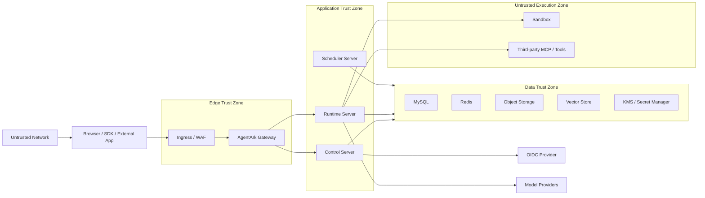

### 13.2 外部认证

#### 用户

- 外部 OIDC Provider；
- Authorization Code + PKCE；
- Gateway 与下游服务按 Resource Server 验证 JWT；
- 校验 `iss`、`aud`、`exp`、`nbf`、算法白名单、`kid`；
- JWK 可缓存，但支持轮换和未知 Key ID；
- 浏览器不长期保存高权限 Token，部署允许时优先安全 Cookie/BFF。

#### API Key

- 归属 Project/Service Account；
- 创建时只展示一次；
- 保存前缀、不可逆摘要、Scope、到期、最后使用；
- 高熵、可轮换、可吊销；
- Gateway 做格式/速率检查，目标服务做资源授权；
- 不允许 Query Parameter 传递。

### 13.3 服务间身份

- 生产优先 mTLS 工作负载身份；
- 内部 Token 短时、受 Audience 限制、可轮换；
- 内部 API 不因“集群内”而匿名；
- Scheduler、Runtime、Control 使用不同服务身份；
- 下游重新验证 Token/服务身份，不盲信 Gateway Header；
- 开发固定 Token 只在显式 `dev` Profile，启动时输出风险告警；
- 禁止所有服务共享长期 HMAC Secret 作为生产基线。

### 13.4 RBAC 与资源授权

资源层级：

```text
Platform
└── Organization
    └── Project
        └── Environment / Agent / Knowledge / Session / Secret
```

角色建议：

| 角色 | 权限 |
|---|---|
| Platform Admin | 平台级设置与组织治理 |
| Organization Owner | 组织、项目、成员、配额 |
| Project Admin | 项目资产、环境、成员、部署 |
| Agent Developer | 编辑 Agent/资产、调试、提交发布 |
| Deployer | 发布到授权环境、Promote、Rollback |
| Operator | 查看运行态、取消 Run、处置故障 |
| Approver | 对限定 Tool/Environment 做 HITL |
| Auditor | 只读 Audit/Usage/Deployment 历史 |
| Viewer | 普通只读 |

规则：

- Role Binding 必须带 Scope；
- Environment、Secret、Prod Deployment 可附加条件；
- 显式 Deny 优先于 Allow；
- 内置角色可固定，Custom Role 由权限集合构造；
- 授权决策记录 Principal、Resource、Action、Policy Version、Decision；
- Cache 由成员/角色变化事件失效并保留短 TTL；
- 高风险操作可强制回源而非依赖缓存。

### 13.5 Tenant Context

- 每个外部请求从已验证身份与目标资源解析 Organization/Project；
- 客户端提交的 Tenant Header 只能作为选择意图，不是授权事实；
- Repository Query 必须包含租户条件；
- SQL Interceptor 是防御层，不是唯一隔离；
- Qdrant/Elastic/Object Store/Sandbox 同样携带租户边界；
- 后台 Job 持久化 Tenant Context，执行时重新验证资源状态；
- 跨租户平台运维必须使用显式高权限路径和审计。

### 13.6 Secret 管理

```text
Control DB
└── SecretMetadata
    ├── secretId
    ├── provider
    ├── externalPath
    ├── scope
    ├── status
    └── version metadata

Secret Provider
└── encrypted secret values
```

规则：

- Control DB 不保存明文；
- 生产使用云 Secret Manager、Vault 或 KMS；
- Snapshot 保存 `SecretRef`；
- Runtime 在授权上下文按需解析；
- 不将 Secret 写入 Event、Trace、Log、Error、Artifact；
- Secret 访问审计但不记录值；
- 支持轮换、禁用、紧急吊销和影响分析；
- 删除前检查 Revision/Deployment 引用；
- 本地 Secret 文件进入 `.gitignore`；
- Emergency Rotation 可不创建新 Agent Revision，但必须记录解析到的 Secret Version Metadata。

### 13.7 Tool、MCP 与 Skill 权限

决策层级：

```text
Platform Guardrail
    ↓
Organization Policy
    ↓
Project Policy
    ↓
Environment Policy
    ↓
Agent Revision Policy
    ↓
Tool/MCP/Skill Requirement
    ↓
Runtime Context / Approval
```

任何上层 `DENY` 不可被下层 `ALLOW` 覆盖。

高风险能力默认 `ASK` 或 `DENY`：

- 文件写入、进程执行、网络访问；
- 数据库写；
- Git Push、Issue/PR 修改；
- 邮件、IM、支付、工单；
- Secret 访问；
- Sandbox 特权操作；
- 大额 Token/Cost 消耗。

审批应展示受控参数摘要，支持单次/会话授权和到期时间。

### 13.8 MCP 与外部工具安全

- MCP Server 记录来源、版本、Transport、Endpoint、TLS 与认证配置；
- Tool Descriptor 进入 Snapshot，运行中不能静默新增 Tool；
- Endpoint 使用 Allowlist/SSRF 防护；
- DNS Rebinding、私网地址和云 Metadata Endpoint 默认阻断；
- 每个 Tool 声明读/写、幂等、风险、超时、参数大小、数据分类；
- Tool 返回内容视为不可信输入；
- 外部副作用记录 Provider Request ID/Idempotency Key；
- Tool/MCP 凭据按最小权限、Environment 隔离；
- 禁止 MCP 返回值覆盖平台系统策略。

### 13.9 Sandbox 安全

- 独立信任域；
- 无特权、只读根文件系统、最小 Capability；
- CPU、内存、PIDs、磁盘、时长、输出大小限制；
- 网络默认拒绝，按域名/IP/端口允许；
- 不挂载宿主 Docker Socket；
- Workspace/Artifact 使用租户隔离临时目录；
- 镜像按 Digest 固定、漏洞扫描、签名验证；
- 用户代码、解析器、高风险 Skill 不在 Control/Runtime 主进程执行；
- 完成后销毁或按受控调试策略保留；
- 输出经 Secret/PII 检测后进入 Event/Object Store。

### 13.10 Prompt Injection 与数据泄漏

- 系统指令、用户内容、RAG 文档、Tool 返回必须有不同信任标记；
- 不可信文本不得提升权限或改变 Tool Policy；
- 关键 Tool 调用经过策略引擎和参数校验；
- Secret 不进入模型上下文，除非 Tool Adapter 在服务端直接使用；
- RAG Citation 与权限过滤在服务端完成；
- 对数据外传 Tool 设置 Domain/Egress Allowlist；
- 敏感项目可禁用第三方模型、外部 MCP 或跨区域处理；
- 安全策略命中形成结构化事件，不暴露规则内部细节给攻击者。

### 13.11 审计

审计至少记录：

- Principal、时间、来源；
- Organization/Project/Resource；
- Action、Result、Error Category；
- 变更前后摘要/Revision Diff；
- Role/Policy Version；
- Trace ID、Request ID；
- Secret 只记录引用和操作。

重点动作：

- Membership/Role 变化；
- API Key/Secret 操作；
- Agent 发布、生产部署、回滚；
- HITL 决策；
- Run 取消；
- 数据导出/删除；
- 策略变化；
- Dead Letter 重放；
- Support/平台管理员跨租户访问。

### 13.12 软件供应链

- AgentScope 源码保留 Apache-2.0 头与 NOTICE；
- 记录上游 Commit SHA 与变更；
- 生成 CycloneDX SBOM；
- 依赖与镜像锁定版本/Digest；
- Skill/MCP/Plugin 记录来源、版本、哈希、签名、许可；
- 未知来源或无哈希 Artifact 禁止执行；
- CI 执行 SCA、Secret Scan、Container/IaC Scan；
- 发布镜像签名并生成 Provenance；
- DeepSeek Harness 仅复制代码/资源时履行 MIT 许可，视觉参考不等于可复制品牌资产。

---

## 14. API、事件与集成契约

### 14.1 API 分层

| 路径 | 调用方 | 认证 | 稳定性 |
|---|---|---|---|
| `/api/v1/**` | Web、SDK、外部应用 | 用户/API Key/OAuth | 公共版本化 |
| `/internal/v1/**` | AgentArk 服务间 | mTLS/Service Token | 内部版本化 |
| `/actuator/**` | 运维系统 | 网络隔离 + 服务身份 | 非业务 |
| `/webhooks/v1/**` | 外部回调 | 签名/Nonce/重放保护 | Provider-specific |

公共与内部 API 使用不同 OpenAPI 和安全策略。

### 14.2 REST 约定

- 资源路径使用复数名词；
- 无法自然表达的命令使用动作子资源；
- 创建返回 `201 Created` + `Location`；
- 异步返回 `202 Accepted` + Operation/Run ID；
- 删除默认归档/禁用，物理删除使用异步 Operation；
- 可重试命令使用 `Idempotency-Key`；
- 更新使用 `ETag/If-Match` 或 `expectedVersion`；
- 列表使用 Cursor Pagination；
- 时间为 RFC 3339 UTC；
- 单位明确；
- 客户端容忍未知枚举；
- 不返回统一 `Result<T>`；
- 错误不返回 HTTP 200。

### 14.3 错误模型

```json
{
  "type": "https://docs.agentark.dev/problems/agent-publish-validation-failed",
  "title": "Agent publish validation failed",
  "status": 422,
  "detail": "The draft contains incompatible or unresolved assets.",
  "instance": "/api/v1/agents/0198.../revisions",
  "code": "ARK-CONTROL-AGENT-42201",
  "requestId": "req_...",
  "traceId": "...",
  "violations": [
    {
      "path": "mcpServers[0].credential",
      "code": "SECRET_NOT_ACCESSIBLE",
      "message": "The selected secret is not available in the target environment."
    }
  ]
}
```

要求：

- `code` 稳定；
- 不泄露堆栈、SQL、Secret、内部地址；
- Validation 使用结构化 Violations；
- Provider 错误映射为平台错误类别；
- 可在受限诊断字段保留 Provider Request ID；
- Runtime 流错误使用版本化 Event。

### 14.4 Runtime Event Envelope

```json
{
  "schemaVersion": 1,
  "eventId": "0198...",
  "sequence": 42,
  "eventType": "tool.call.completed",
  "occurredAt": "2026-08-14T08:01:02.123Z",
  "organizationId": "0198...",
  "projectId": "0198...",
  "sessionId": "0198...",
  "turnId": "0198...",
  "runId": "0198...",
  "traceId": "...",
  "payload": {
    "toolCallId": "0198...",
    "toolName": "repository.read",
    "durationMs": 381,
    "status": "SUCCEEDED"
  }
}
```

### 14.5 Internal Snapshot API

```http
GET /internal/v1/agent-revisions/{revisionId}/snapshot
If-None-Match: "sha256:..."
```

响应：

- `200`：Snapshot + ETag；
- `304`：缓存有效；
- `404`：不存在/无权；
- `409`：发布未完成；
- `410`：满足严格条件后归档不可执行。

Runtime 校验 Schema、Hash、Runtime Provider、Session 固定 ID，不在 Turn 中按 Deployment 重新解析当前 Revision。

### 14.6 契约目录

```text
contracts/
├── openapi/
│   ├── public-control-v1.yaml
│   ├── public-runtime-v1.yaml
│   ├── internal-control-v1.yaml
│   ├── internal-runtime-v1.yaml
│   └── internal-scheduler-v1.yaml
├── asyncapi/
│   └── runtime-events-v1.yaml
└── schemas/
    ├── agent-revision-snapshot/v1.json
    ├── runtime-event/v1.json
    └── outbox-event/v1.json
```

CI 执行：

- OpenAPI/JSON Schema Lint；
- Breaking Change 检测；
- Server/Client 兼容检查；
- Consumer-driven Contract Test；
- Snapshot Golden File；
- Event Upcaster/兼容性测试。

### 14.7 MCP、A2A 与 AG-UI

- MCP 是 Tool/Context Provider 协议，不替代 AgentArk Tool Permission；
- A2A 用于外部 Agent 互操作，外部 Agent 应映射为受治理 Runtime/Endpoint 资源；
- AG-UI 可作为前端事件适配层，但 AgentArk 内部 Event Log 仍是权威事实；
- 公共协议 Adapter 不得改变核心 Session/Revision/Permission 语义；
- OpenAI-compatible API 可作为兼容入口，但不能成为平台内部主领域模型；
- 每个协议 Adapter 明确 Capability、认证、限流、映射损失和错误语义。

---

## 15. 可观测性、审计与成本治理

### 15.1 三类记录的边界

| 类型 | 目的 | 典型内容 | 保留与访问 |
|---|---|---|---|
| Telemetry | 系统诊断与性能 | Trace、Metric、技术日志 | 较短保留，运维访问 |
| Runtime Event | Agent 运行事实和客户端恢复 | Message、Tool、Approval、Run State | 按 Session 策略，业务访问 |
| Audit Event | 安全与责任追溯 | 发布、部署、授权、Secret、审批 | 长期、防篡改、严格访问 |

三者通过 `traceId/requestId/resourceId` 关联，但不能互相替代。

### 15.2 Trace 层级

```text
http.server
└── runtime.turn.execute
    ├── runtime.snapshot.load
    ├── runtime.agent.compile
    ├── agent.run
    │   ├── model.call
    │   ├── knowledge.retrieve
    │   │   ├── embedding.call
    │   │   ├── vector.query
    │   │   └── rerank.call
    │   ├── tool.call
    │   │   └── mcp.call
    │   ├── subagent.run
    │   └── sandbox.execute
    └── event.persist_and_stream
```

关键 Span：

```text
control.agent.publish
control.deployment.promote
scheduler.job.execute
runtime.turn.execute
runtime.agent.compile
agent.run
model.call
mcp.call
tool.call
knowledge.retrieve
embedding.call
vector.query
rerank.call
sandbox.execute
event.append
sse.deliver
```

Attribute 约束：

- 允许：Agent/Revision ID、Runtime Provider、Model Provider/Name、Tool Name、Error Type；
- Organization/Project 只在受控后端使用；
- 禁止 Prompt/Response 全文、Secret、Authorization Header、文档正文；
- Session/User 等高基数标识不作为 Metrics Label；
- Provider Request ID 可进入受限 Trace 字段；
- Span 名不得包含动态 ID。

### 15.3 核心指标

#### 平台指标

- HTTP Request Rate/Error/Latency；
- JVM、CPU、Memory、GC、Thread/Virtual Thread；
- DB Pool、SQL Latency、Slow Query；
- Redis Latency、Error、Connection、Eviction；
- Object Store/Qdrant/Provider 调用；
- Outbox Lag、Job Queue Depth、Retry、Dead Letter。

#### Agent 指标

| 指标 | 说明 |
|---|---|
| `agentark_runtime_active_sessions` | 活跃 Session |
| `agentark_runtime_turn_duration_seconds` | Turn 端到端延迟 |
| `agentark_runtime_time_to_first_event_seconds` | 首事件延迟 |
| `agentark_model_call_duration_seconds` | 模型调用延迟 |
| `agentark_model_tokens_total` | 输入/输出 Token |
| `agentark_model_cost_total` | 成本 |
| `agentark_tool_calls_total` | Tool/MCP 调用结果 |
| `agentark_knowledge_retrieval_duration_seconds` | 检索延迟 |
| `agentark_approval_wait_seconds` | HITL 等待 |
| `agentark_runtime_lease_conflicts_total` | Lease/Fencing 冲突 |
| `agentark_runtime_event_delivery_lag_seconds` | Event 到客户端延迟 |
| `agentark_scheduler_job_age_seconds` | 最老待执行任务年龄 |

Metrics Label 只使用有限基数维度：Service、Environment、Provider、Model、Tool Family、Status。

### 15.4 Structured Logging

统一字段：

```text
timestamp
level
service
environment
traceId
spanId
requestId
event
errorCode
```

规则：

- JSON Structured Log；
- 可预期客户端错误不默认打印 ERROR；
- Secret、Token、Cookie、模型 Key、文档正文、用户输入默认脱敏；
- 禁止 `System.out`；
- 禁止每 Token 一条日志；
- Provider 原始响应只按白名单记录；
- 高密度成功日志可采样，Security Audit 不采样。

### 15.5 Usage、Cost 与 Quota

Usage Record 至少包含：

```text
organizationId
projectId
agentId
revisionId
sessionId
turnId
runId
provider
model
inputTokens
outputTokens
cachedTokens
toolCalls
embeddingTokens
sandboxDuration
estimatedCost
currency
priceVersion
occurredAt
```

规则：

- Runtime 记录明细；
- Governance 异步聚合；
- Price Table 版本化；
- Provider 返回 Usage 优先，缺失时标记为 Estimate；
- Quota 可按 Organization、Project、Deployment、Model；
- 达到软限额告警，硬限额拒绝新工作；
- 运行中超过预算按 Snapshot 策略停止/请求审批；
- Metrics 不直接以 Project ID 作为高基数 Label，成本查询走数据聚合。

### 15.6 Evaluation

Evaluation 初期属于 Governance 子域，不独立服务。能力包括：

- Dataset；
- Test Case；
- Agent Revision Candidate；
- Evaluator；
- Score/Threshold；
- Regression Comparison；
- Release Gate。

Evaluation 必须固定 Snapshot、Dataset Version、Evaluator Version、Model/Provider Metadata。达到大规模离线评估、独立算力或团队边界时再拆服务。

### 15.7 Dashboard 与告警

至少提供：

1. Platform Overview；
2. Runtime Overview；
3. Scheduler Queue/Retry/Dead Letter；
4. Control Publish/Validation/Outbox；
5. Cost & Usage；
6. Security；
7. Storage/DB/Redis/Qdrant；
8. Deployment Desired vs Observed；
9. Knowledge Ingestion。

告警以用户影响和错误预算为中心，避免对每个瞬时技术错误告警。

---

## 16. 部署拓扑、扩缩容与容灾

### 16.1 渐进式 Profile

#### Core Profile

```text
Gateway
Control
Runtime
Scheduler
MySQL 8.4
Redis 8.10.x GA
Object Storage
```

#### RAG Profile

```text
Core
+ Qdrant 1.18.3
```

#### Search Profile

```text
RAG
+ Elasticsearch 9.5.1+
```

#### Graph Profile

```text
RAG
+ Neo4j 5.26 LTS
```

#### Event Streaming Profile

```text
Core
+ Kafka（仅达到激活条件后）
```

### 16.2 本地开发拓扑

```mermaid
flowchart TB
    DEV["Developer Browser / CLI"]
    WEB["agentark-web :5173"]
    GW["gateway :8080"]
    CTL["control :8081"]
    RT["runtime :8082"]
    SCH["scheduler :8083"]
    MYSQL[("MySQL 8.4")]
    REDIS[("Redis 8.10.x GA")]
    MINIO[("MinIO / Local Object Store")]
    QDRANT[("Qdrant 1.18.3 · RAG profile")]
    OTEL["OTel Collector · optional dev"]

    DEV --> WEB --> GW
    GW --> CTL
    GW --> RT
    CTL --> MYSQL
    RT --> MYSQL
    SCH --> MYSQL
    CTL --> REDIS
    RT --> REDIS
    SCH --> REDIS
    CTL --> MINIO
    RT --> MINIO
    SCH --> MINIO
    RT -. RAG .-> QDRANT
    SCH -. ingestion .-> QDRANT
    GW --> OTEL
    CTL --> OTEL
    RT --> OTEL
    SCH --> OTEL
```

同一 MySQL Container 使用三个 Schema 和三个账号。Compose Profile：

```text
core
rag
search
graph
observability
```

### 16.3 Kubernetes 生产拓扑

```mermaid
flowchart TB
    USER["Users / Applications"]
    CDN["CDN / Static Web"]
    ING["Ingress / WAF / TLS"]

    subgraph K8S["Kubernetes Cluster"]
        GW["Gateway Deployment<br/>HPA · multiple replicas"]
        CTL["Control Deployment<br/>multiple replicas"]
        RT["Runtime Deployment<br/>HPA/KEDA · multiple replicas"]
        SCH["Scheduler Deployment<br/>worker pools"]
        OTEL["OTel Collector"]
        SANDBOX["Isolated Sandbox Namespace / RuntimeClass"]
    end

    MYSQL[("Managed MySQL / HA")]
    REDIS[("Managed Redis / HA")]
    OBJECT[("S3 / OSS / COS")]
    QDRANT[("Qdrant Cluster")]
    IDP["OIDC Provider"]
    MODEL["Model Providers"]
    MCP["MCP Servers"]

    USER --> CDN
    USER --> ING --> GW
    GW --> CTL
    GW --> RT
    CTL --> MYSQL
    RT --> MYSQL
    SCH --> MYSQL
    CTL --> REDIS
    RT --> REDIS
    SCH --> REDIS
    CTL --> OBJECT
    RT --> OBJECT
    SCH --> OBJECT
    RT --> QDRANT
    SCH --> QDRANT
    CTL --> IDP
    RT --> MODEL
    RT --> MCP
    RT --> SANDBOX
    GW --> OTEL
    CTL --> OTEL
    RT --> OTEL
    SCH --> OTEL
```

### 16.4 服务发现与配置

- Kubernetes 使用 Service DNS，不默认引入 Nacos；
- Compose 使用容器 DNS；
- 非 K8s 使用显式 URL/标准 DNS；
- 只有动态服务注册/配置需求无法由 K8s/DNS/现有配置满足时才评估 Nacos/Consul；
- 配置分为静态应用配置、环境配置、Secret、动态业务策略；
- 动态 Agent 行为必须通过 Control 版本化，不通过 Config Server 隐式改变；
- ConfigMap 不保存 Secret；
- 生产配置变更经 GitOps/审计流程。

### 16.5 扩缩容

#### Gateway

- 无业务状态；
- 按请求率与活跃 SSE 连接扩容；
- 关注文件描述符、代理超时、连接 Drain；
- 滚动升级允许客户端重连。

#### Control

- 无本机业务状态；
- DB Pool 决定阻塞并发；
- Outbox Relay 多副本 Claim；
- 发布/部署命令幂等 + 乐观锁。

#### Runtime

- 横向扩容，不依赖 Session Sticky；
- Lease/Fencing 防止重复 Owner；
- 编译缓存可丢失；
- 指标包括 Active Run、Queue Delay、Event Lag、Provider Concurrency；
- Pod 终止时停止 Claim，完成或 Checkpoint；
- 可用 KEDA/HPA 按队列和自定义指标扩容。

#### Scheduler

- Worker 多副本；
- Job Claim + Fencing；
- Job Type 独立 Pool；
- 按 Queue Depth/Oldest Age 扩容；
- Cron 计算与执行解耦，避免多副本重复触发。

### 16.6 健康检查

| 检查 | 用途 | 规则 |
|---|---|---|
| Liveness | 进程需否重启 | 不因外部依赖短暂故障触发重启风暴 |
| Readiness | 是否接收新流量/任务 | 检查关键依赖；Runtime Drain 时 false |
| Startup | 慢启动保护 | 覆盖 Flyway、缓存/Runtime 初始化 |
| Dependency Health | 运维诊断 | MySQL、Redis、Object、Qdrant、Internal API 分项展示 |

### 16.7 故障与降级

| 故障 | 行为 |
|---|---|
| Control 暂时不可用 | Runtime 继续执行已缓存授权 Snapshot；新 Session 由缓存策略决定 |
| Redis 不可用 | 涉及 Lease 的新 Turn/Job 停止 Claim；只读 Cache 可回源 |
| Qdrant 不可用 | 产生 Retrieval Failure Event；是否无 RAG 继续由 Snapshot 策略决定 |
| MCP 不可用 | 按 Tool 必需/可选和错误策略失败、跳过或 HITL |
| Object Store 不可用 | 依赖 Artifact 的操作失败，不将无限 Payload 塞入 DB |
| OTel Backend 不可用 | 业务继续；Telemetry 有界缓冲/丢弃 |
| Scheduler 不可用 | 已运行 Agent 不受影响；持久 Job 恢复后继续 |
| Runtime Pod 终止 | Lease 到期、Reconciliation、Checkpoint/新 Attempt 恢复 |
| Model Provider 429/Timeout | Provider-specific 重试预算/Fallback，产生明确 Event |

### 16.8 超时与重试

| 调用 | 重试原则 |
|---|---|
| Control → Runtime Query | 网络错误有限重试 |
| Control → Runtime Command | 仅带 Idempotency Key 重试 |
| Runtime → Control Snapshot | 只读可重试；缓存可降级 |
| Model Call | 仅语义允许且未产生不可逆流时 |
| MCP/Tool Read | 按幂等声明 |
| MCP/Tool Write | 默认不自动重试 |
| Vector Query | 有限重试/按策略降级 |
| Embedding/Ingestion | Batch 幂等重试 |
| Object Store | SDK 重试 + 完整性校验 |

禁止 Gateway、Client、Service、SDK 四层叠加无协调重试。所有重试有预算、指数退避和 Jitter。

### 16.9 发布与回滚

- 应用使用 Rolling/Blue-Green；
- DB Migration 遵循 Expand → Migrate → Contract；
- 新服务先兼容旧 Schema/Event；
- 不在同一发布删除不可逆 Schema；
- Runtime 新版本继续执行旧 Snapshot；
- 滚动期忽略新增可选 Event 字段；
- 应用版本回滚与 Agent Deployment 回滚是不同操作；
- 镜像按 Digest 部署；
- 发布前执行 Migration Dry Run 和 Runtime Compatibility Test。

### 16.10 备份与灾难恢复

备份：

- Control/Runtime/Scheduler MySQL：全量 + PITR；
- Object Store：版本化/复制/不可变备份；
- Qdrant Snapshot 与 Knowledge Metadata 对齐；
- Secret Provider 专用恢复；
- Redis 只恢复 Cache/Lease/通知等可重建数据，不参与 Agent State 权威恢复；
- Git 保存 Flyway、Contracts、Helm、配置和文档。

恢复顺序：

```text
1. Identity / Secret dependencies
2. MySQL
3. Object Storage
4. Redis
5. Qdrant / optional search / graph
6. Control
7. Runtime
8. Scheduler
9. Gateway / Web
10. Reconcile outbox, leases, jobs, deployments and runtime instances
```

恢复后检查：

- 未投递 Outbox；
- 过期 Lease；
- RUNNING 但无 Worker 的 Run/Job；
- Snapshot/Object Hash；
- Knowledge Metadata/Vector Count；
- Deployment Desired/Observed；
- Secret Binding 状态。

每季度执行恢复演练并记录实际 RPO/RTO。

---

## 17. AgentArk Web 前端架构

### 17.1 信息架构

```text
AgentArk Web
├── Home / Overview
├── Build
│   ├── Agents
│   ├── Prompts
│   ├── Models
│   ├── MCP & Tools
│   ├── Skills
│   ├── Knowledge
│   ├── Memory / Workspace / Sandbox
│   └── Policies
├── Release
│   ├── Revisions
│   ├── Validation
│   ├── Deployments
│   └── Environments
├── Operate
│   ├── Sessions
│   ├── Runs & Events
│   ├── Approvals
│   ├── Jobs
│   └── Channels / Webhooks
└── Govern
    ├── Organization / Projects
    ├── Members / Roles
    ├── Secrets
    ├── Audit
    ├── Usage / Cost
    └── Settings
```

### 17.2 工程结构

```text
agentark-web/src/
├── app/
│   ├── router/
│   ├── providers/
│   └── layout/
├── features/
│   ├── agents/
│   ├── prompts/
│   ├── mcp/
│   ├── skills/
│   ├── knowledge/
│   ├── deployments/
│   ├── sessions/
│   ├── approvals/
│   └── governance/
├── entities/
├── shared/
│   ├── api/
│   ├── auth/
│   ├── components/
│   ├── hooks/
│   ├── icons/
│   ├── styles/
│   └── utils/
└── widgets/
```

### 17.3 状态与 API

- Server State：TanStack Query；
- 本地编辑：Feature 内部 Form/Store；
- 不复制 Server Cache；
- OpenAPI 生成类型和基础 Client，Feature 封装 Query/Mutation；
- SSE Client 支持 Last-Event-ID、重连、去重、Schema Version；
- 不持久保存 Secret、全量 Token、敏感 Session 内容；
- Revision Diff、Validation、Event Inspector 为一等组件；
- 发布/部署/权限变更以服务端结果为准，不做危险乐观更新。

### 17.4 设计系统

- AgentArk Design Token：颜色、字体、间距、圆角、阴影、动画、语义状态；
- Radix UI 作为可访问 Primitive，AgentArk 封装品牌组件；
- 支持暗色/亮色，开发者工作台可默认高信息密度深色方案；
- Event 使用时间线、调用树、结构化 Payload、Trace 关联，而非只有聊天气泡；
- Prod 危险操作显示环境、影响范围、二次确认、权限；
- 目标 WCAG 2.2 AA；
- 支持键盘、焦点、对比度、Reduced Motion。

### 17.5 参考关系

| 来源 | 借鉴 | 不继承 |
|---|---|---|
| AgentScope Service Frontend | Agent/Session/Event/HITL 功能语义 | 品牌、目录和强耦合实现 |
| DeepSeek Harness | 工作台视觉、暗色、信息密度、交互节奏 | 全局 Everything-is-a-plugin 架构 |
| AgentArk | Design System、领域术语、Revision/Deployment/Governance | — |

---

## 18. 最终技术栈与版本基线

> 以下版本是截至 2026-08-15 的目标基线。AgentScope 源码证据固定到 Commit `0c61e7494197ded54eefdeaf9bdeb51807beb752`，DeepSeek Harness 参考固定到 Commit `47f943859bef60e4160492346772ded9b24f765a`；完整来源规则见 [ADR-0005](decisions/0005-upstream-and-technology-baseline.md)。生产必须通过 AgentArk CI 兼容矩阵后锁定，不自动跟随 `latest`。

### 18.1 后端与运行时

| 分类 | 决策 | 说明 |
|---|---|---|
| Java | **JDK 21 LTS** | 项目编译/运行基线 |
| Build | Maven Wrapper 3.9.x | 可重复构建、统一插件 |
| Agent Runtime | **AgentScope Java 2.0.2** 初始锁定 | 后续通过 Adapter/兼容测试升级 |
| Spring Boot | **4.1.0** | 最终目标；机械迁移阶段暂留 4.0.4 |
| Spring Cloud | **2025.1.2** | Gateway 使用，与 Boot 4.1 兼容 |
| Gateway | Spring Cloud Gateway / WebFlux | 路由、边缘策略、SSE |
| Control | Spring MVC | 管理 API/阻塞持久层；可评估 Virtual Threads |
| Runtime | WebFlux/Reactor | AgentScope 流式事件、SSE |
| Scheduler | Worker Model + Spring MVC 管理端点 | 持久化 Job |
| Persistence | **MyBatis-Plus 3.5.17** | Boot 4 Starter；最终不保留 JPA |
| Migration | Flyway | 各平面独立 Schema 历史 |
| Validation | Jakarta Validation | API/Command |
| API | OpenAPI 3.1 | Public/Internal |
| Event | AsyncAPI/JSON Schema | Runtime/Outbox |

### 18.2 数据与基础设施

| 分类 | 决策 | Core | 说明 |
|---|---|:---:|---|
| Relation DB | **MySQL 8.4.x LTS** | 是 | IAM/Catalog/Runtime/Scheduler |
| Cache/Coordination | **Redis 8.10.x GA Patch** | 是 | Cache/Lease/Fencing/Idempotency |
| Object Storage | S3-compatible SPI | 是 | 文档、Artifact、Workspace、Payload |
| Vector DB | **Qdrant 1.18.3** 初始基线 | RAG | 稳定兼容基线 |
| Search | **Elasticsearch 9.5.1+** | 否 | 全文、混合、全局搜索 |
| Graph | **Neo4j 5.26 LTS** | 否 | GraphRAG 后启用 |
| Broker | Outbox + DB Job + Redis Notification | v1 | 降低初期复杂度 |
| Kafka | 扩展 | 否 | 高吞吐/Fan-out/重放触发后 |
| Secret | External Secret Manager/KMS | 生产应有 | 本地受控 Provider |

### 18.3 可观测与测试

| 分类 | 选择 |
|---|---|
| Trace | OpenTelemetry + OTel Collector |
| Metrics | Micrometer + Prometheus/Grafana |
| Log | Structured JSON；后端由部署决定 |
| Test | JUnit 5、AssertJ、Mockito、Awaitility |
| Integration | Testcontainers：MySQL、Redis、Qdrant、MinIO |
| Architecture | ArchUnit、Maven Enforcer |
| Contract | OpenAPI、JSON Schema、WireMock/Pact 按需 |
| Load | k6/Gatling |
| Security | SCA、SBOM、Container、IaC、Secret Scan |

### 18.4 前端

| 分类 | 决策 |
|---|---|
| Runtime | Node.js 24 LTS |
| Package Manager | pnpm 11.x，`packageManager` 精确锁定 |
| UI Framework | **React 19.2** |
| Language | **TypeScript 6.x** |
| Build | **Vite 8.x**，初始采用经 CI 验证的 8.2.1 |
| Styling | Tailwind CSS 4 |
| UI Primitives | Radix UI |
| Server State | TanStack Query |
| Routing | React Router |
| Icons | Lucide |
| Test | Vitest、Testing Library、Playwright |
| API Client | OpenAPI generated + handwritten feature layer |

默认 SPA，不因 React 19 引入不必要 Server Components。SSR/BFF 需单独 ADR。

### 18.5 选型理由

#### JDK 21 而非 17

AgentScope 与 Spring Boot 4 的最低要求允许 Java 17，但 AgentArk 是 2026 年新建的长期平台。JDK 21 提供成熟 LTS、Virtual Threads、Records、Pattern Matching 等能力，同时降低采用更前沿基线的验证成本。

#### Spring Boot 4.1.0

最终固定 Boot 4.1.0 + Cloud 2025.1.2。迁移初期保留上游 Boot 4.0.4，避免重命名、模块拆分、ORM/DB 迁移和框架升级同时发生。

#### MySQL 8.4

关系数据以 IAM、Catalog、Revision、Runtime Metadata、Job 为主；RAG 使用独立 Qdrant，不需要为 PgVector 将整个平台绑定 PostgreSQL。PostgreSQL 可作为未来 Provider，但 v1 先保证 MySQL 基线。

#### Qdrant 默认、ES 可选

Qdrant 聚焦向量工作负载、AgentScope 适配直接。Elasticsearch 只有全文/混合/全局搜索需求时加入，避免 Core 资源过重。

#### Neo4j、Kafka 不默认

GraphRAG 和大规模事件流必须由真实场景驱动。Port、Outbox、版本化 Event 保留演进路径，不提前增加运维负担。

### 18.6 版本治理

- 后端版本在 `agentark-bom`；
- 前端版本在 `package.json`/Lockfile；
- Docker 使用精确 Patch/Digest；
- Patch 自动化 PR 仍需完整回归；
- Minor/Major 需兼容报告和 ADR；
- AgentScope 升级运行 Snapshot Compile、Event Mapping、State Recovery、MCP、Skill、RAG、HITL 套件；
- Spring/Jackson/MyBatis 重大升级不与大领域重构同 PR；
- RC/Milestone/Snapshot 不进入生产基线。

---

## 19. 测试与工程质量体系

### 19.1 测试分层

```text
Unit Tests
├── Domain invariants
├── Snapshot canonicalization/hash
├── Permission policies
└── Error mapping

Architecture Tests
├── Maven dependency rules
├── ArchUnit package/module rules
└── Forbidden imports

Integration Tests
├── MySQL / Redis / Object Storage / Qdrant Testcontainers
├── Flyway migration
├── Repository adapters
├── Lease/Fencing
└── Outbox/Job recovery

Contract Tests
├── OpenAPI producer/consumer
├── Snapshot JSON Schema
├── Runtime Event compatibility
└── Control ↔ Runtime ↔ Scheduler clients

Runtime Compatibility Tests
├── AgentScope Harness execution
├── Model stub streaming
├── MCP/Skill/Tool mapping
├── HITL pause/resume
├── State recovery
└── RAG provider adapters

End-to-End Tests
├── Build → Publish → Deploy → Session → Turn
├── SSE reconnect
├── Approval
├── Rollback
└── Ingestion → Retrieval
```

### 19.2 Testcontainers 基线

集成测试优先真实兼容服务：

- MySQL 8.4；
- Redis 8.10.x GA；
- MinIO；
- Qdrant 1.18.3；
- 可选 Elasticsearch/Neo4j Profile；
- WireMock/MockWebServer 模拟 Model、MCP、OIDC、Secret Provider；
- Docker/Sandbox 测试在隔离 Runner。

每个 Flyway Migration 必须验证：

1. 空库全量升级；
2. 上一发布版本升级；
3. 回滚策略或 Forward Fix；
4. 数据约束与索引；
5. 多副本滚动期兼容。

### 19.3 Runtime 必测场景

- 同一 Revision 多 Session 并发，不泄漏状态；
- 同一 Turn 重复提交；
- Worker Lease 过期后陈旧写入被 Fencing 拒绝；
- Runtime Pod 执行中终止，其他 Pod 恢复；
- SSE 从 Last-Event-ID 回放，无丢失、允许去重；
- HITL 重复决策、超时、无权审批、恢复竞争；
- Model 流中断、MCP 超时、Tool 副作用与取消；
- Snapshot 当前版与前一版；
- Secret 轮换/吊销；
- Qdrant 不可用与降级；
- 大 Event Payload 外置；
- Rollback 不改变既有 Session Revision；
- Control 短暂不可用时缓存 Snapshot 运行；
- AgentScope 小版本升级前后 Event Mapping 一致；
- Runtime 滚动升级期间旧 Session 继续运行。

### 19.4 性能与韧性

- Gateway 大量 SSE 长连接；
- Runtime 高并发 Turn、慢模型、慢 Tool；
- Event 写入/回放；
- Snapshot 编译 Cache 冷/热；
- Scheduler 大量到期 Job、Retry Storm；
- 大文档 Ingestion、Embedding Rate Limit；
- MySQL/Redis/Qdrant 故障注入；
- Pod 滚动升级、节点驱逐；
- Provider 429、Timeout、Partial Response；
- Object Store 高延迟/错误；
- 租户噪声邻居；
- 权限缓存失效风暴；
- Outbox 长时间积压与恢复。

### 19.5 CI Pipeline

每个 Pull Request：

1. Format/Lint；
2. JDK 21 Compile；
3. Unit Test；
4. ArchUnit；
5. Integration Test；
6. Contract Breaking Change Check；
7. Dependency Convergence；
8. License/NOTICE；
9. SCA/CVE；
10. Secret Scan；
11. SBOM；
12. Container Scan；
13. Frontend Type Check/Test/Build；
14. Markdown/Mermaid/Link/Code Fence Check。

主分支/发布分支额外：

- Full E2E；
- Runtime Compatibility Matrix；
- Migration Upgrade Test；
- Performance Smoke；
- Helm/Compose Startup；
- Image Signing/Provenance；
- Release Notes/Upgrade Notes；
- 目标基础设施版本矩阵。

### 19.6 Pull Request 门禁

- 架构规则全部通过；
- 新公共 API 有 OpenAPI 变更；
- 新 Event/Snapshot 字段有 Schema/兼容说明；
- 新数据库字段有 Flyway；
- 新 Provider 有 Capability/Timeout/Retry/Security 定义；
- 新外部副作用有 Idempotency/Permission/Audit；
- 新 Metric Label 通过基数审查；
- 新 Secret/PII 流转有威胁分析；
- 复制上游源码有许可证头与来源记录；
- 禁止未解释的模块反向依赖。

### 19.7 发布门禁

发布候选版本至少通过：

- 全部测试与契约；
- MySQL/Redis/Qdrant 目标矩阵；
- Snapshot 兼容和 Migration；
- AgentScope 核心 Smoke；
- 无未豁免 Critical 安全问题；
- DB Migration Dry Run；
- 备份恢复演练证据；
- 性能无超阈值退化；
- Release/Upgrade/Rollback 文档；
- 镜像签名与 SBOM；
- 生产配置校验。

---

## 20. 从 AgentScope Service 迁移到 AgentArk

### 20.1 上游模块映射

| AgentScope Service | AgentArk 目标 | 迁移处理 |
|---|---|---|
| `service-common` | Kernel + focused Starters + 各平面持久化 | 拆解，不保留 giant common |
| `service-gateway` | `agentark-gateway-server` | 保留路由/SSE，移除业务耦合 |
| `service-dataplane` | `agentark-runtime` + `agentark-runtime-provider-agentscope` + `agentark-runtime-server` | Runtime Domain 与 AgentScope Provider 在 Maven 模块级隔离 |
| `service-scheduler` | `agentark-scheduling` + `agentark-scheduler-server` | 保留“不拥有 inference loop” |
| `aistio` | 过渡运行，最终 `agentark-control` + `agentark-control-server` | Internal Contract 绞杀替换 |
| `frontend` | 功能/Event UX 参考 | 不作为最终视觉/代码架构 |
| DeepSeek Harness | 视觉/交互参考 | 不继承完整插件架构 |

### 20.2 总体原则

禁止在单一变更中同时完成：

```text
package rename
+ module redesign
+ JDK upgrade
+ Spring Boot upgrade
+ JPA → MyBatis-Plus
+ PostgreSQL → MySQL
+ Go → Java
+ API redesign
+ frontend rewrite
```

每阶段必须：

- 可构建；
- 可运行；
- 可测试；
- 有明确退出条件；
- 可回滚或 Forward Fix；
- 保留上游来源和差异；
- 不破坏已固定 Internal Contract。

架构 Wave 用于表达依赖顺序，不是可执行任务编号；唯一 Phase 编号和验收命令由根目录 [PLAN.md](../../PLAN.md) 定义：

| 架构 Wave | 对应 PLAN Phase | 关注点 |
|---|---|---|
| Wave A | 00–01 | 来源、Harness、工程基线 |
| Wave B | 02 | 机械迁入与行为等价 |
| Wave C | 03–04 | 模块边界与 Snapshot 契约 |
| Wave D | 05、10–13 | Java Control、发布、Knowledge、治理 |
| Wave E | 02–05 | JDK/Spring 目标基线的渐进收敛 |
| Wave F | 06–15 | MySQL/Flyway、Runtime、Scheduler、Gateway |
| Wave G | 21 | Go Control 绞杀替换 |
| Wave H | 16–18 | 契约与 Web 重建 |
| Wave I | 19–20、22–23 | 可观测、安全、部署、Go/No-Go |

### 20.3 Wave A：来源固化与基线

任务：

- 固定 AgentScope 上游 Commit SHA；
- 使用 `git subtree`、`git filter-repo` 或独立 Vendor Commit 保留来源；
- 建立 `UPSTREAM.md`、`THIRD_PARTY_NOTICES`；
- 运行上游测试和 Compose；
- 保存关键 API、DB、Event、Session/HITL Golden Baseline；
- 建立 AgentArk CI、Maven Wrapper、格式化、许可检查。

退出条件：未改变行为的上游基线可重复构建、启动和验证。

### 20.4 Wave B：机械迁入

任务：

- 迁入必要源码；
- 仅修改 GroupId、Package、ArtifactId、配置前缀、镜像、品牌；
- 暂保 JDK 17、Boot 4.0.4、Cloud 2025.1.2、JPA、PostgreSQL、Go；
- 为 Gateway、Dataplane、Scheduler 建 Characterization Tests；
- 不在该阶段重构领域或 API。

退出条件：AgentArk 命名后的行为与上游 Golden Baseline 等价。

### 20.5 Wave C：最终模块边界

任务：

- 建立 `agentark-kernel`；
- 拆 Web/Security/Persistence/Redis/Storage/Observability Starter；
- 将中立 Runtime 归入 `agentark-runtime`，AgentScope 防腐层归入 `agentark-runtime-provider-agentscope`；
- 将 Scheduler 归入 `agentark-scheduling`；
- 业务 Entity/Repository 回归各域；
- 引入 ArchUnit/Maven 依赖白名单；
- 建立 `contracts/` 语言中立目录。

退出条件：

- 不存在 giant common；
- 无 Maven 环；
- Control/Runtime 无实现依赖；
- Runtime 状态机可用 Fake Engine 测试；
- Gateway 不依赖业务模块。

### 20.6 Wave D：Snapshot 与 Java Control 骨架

任务：

- 定义 Agent/Draft/Revision/Snapshot/Deployment；
- 定义 Snapshot JSON Schema、Hash、Upcaster；
- 实现 `AgentPublisher`；
- 定义 Internal Control API 和 `ControlPlaneClient`；
- Runtime 只通过 Client 获取 Snapshot；
- Session 固定 Revision；
- AgentScope Event 映射为 AgentArk Event；
- Java Control 以 Read/Shadow 模式对比 Go 输出。

退出条件：

- Runtime 不读 Control Catalog 表；
- Go/Java 对同一输入生成语义等价 Snapshot；
- 已发布 Agent 可仅凭 Snapshot 运行。

### 20.7 Wave E：JDK 与 Spring 升级

任务：

- JDK 17 → 21；
- Boot 4.0.4 → 4.1.0；
- Cloud 固定 2025.1.2；
- 检查 Security、Actuator、WebFlux、Jackson 行为；
- Control/Scheduler 评估 Virtual Threads；
- 运行 Runtime/SSE/HITL/Lease/Provider 全回归。

退出条件：目标 Java/Spring 基线稳定，性能和行为无不可接受回归。

### 20.8 Wave F：持久化迁移

#### A. JPA → MyBatis-Plus，先保持 PostgreSQL

- 按聚合实现 Mapper/Repository Adapter；
- Domain 与 Persistence Entity 分离；
- 仓储 Golden Test/双读校验；
- 逐域删除 JPA；
- 外部 API 和 DB 暂不同时变化。

#### B. PostgreSQL → MySQL 8.4

- 建 MySQL Schema/Flyway；
- 处理 JSON、时间、大小写、索引、锁、方言；
- 编写幂等迁移/校验工具；
- 分批迁移；
- 校验行数、主键、关系、Hash、抽样业务；
- 停机窗口或受控双写切换；
- 保留回退只读备份。

退出条件：所有平面使用 MyBatis-Plus + MySQL 8.4，JPA/PostgreSQL 不再是默认生产依赖。

### 20.9 Wave G：Go Aistio 绞杀替换

```mermaid
flowchart LR
    subgraph P1["A · Go Primary"]
        RTA["Java Runtime"] --> CTA["Internal API v1"] --> GOA["Go aistiod"]
    end

    subgraph P2["B · Shadow Compare"]
        RTB["Java Runtime"] --> CTB["Internal API v1"]
        CTB -->|primary| GOB["Go aistiod"]
        CTB -. shadow .-> JAVAB["Java Control"]
    end

    subgraph P3["C · Java Primary"]
        RTC["Java Runtime"] --> CTC["Internal API v1"]
        CTC -->|primary| JAVAC["Java Control"]
        CTC -. fallback .-> GOC["Go aistiod"]
    end

    subgraph P4["D · Java Only"]
        RTD["Java Runtime"] --> CTD["Internal API v1"] --> JAVAD["Java Control"]
    end

    P1 --> P2 --> P3 --> P4
```

迁移顺序：

1. 只读 Catalog/Version；
2. Agent/Prompt/Model/MCP/Skill；
3. Revision/Snapshot/Deployment；
4. Session Metadata/Runtime Command；
5. Team/其他资源；
6. 删除 Go 路由与遗留 Schema。

每项能力：

- 固化旧行为；
- Java 实现 Port；
- 数据迁移/校验；
- Tenant/Capability 灰度；
- Shadow Compare；
- 切主；
- 停旧写；
- 观察后删除。

退出条件：Java Control 全量承担功能，Runtime/Scheduler Client 不变，Go 从生产删除。

### 20.10 Wave H：AgentArk Web 重建

任务：

- 先稳定 OpenAPI Client；
- 迁移 Agent、Session、Event、HITL 基础；
- 建 Design Token/核心组件；
- 引入 DeepSeek Harness 视觉参考；
- 增加 Revision Diff、Deployment、Approval、Audit、Usage；
- 删除对上游前端内部结构依赖。

退出条件：Web 独立构建，Build → Release → Run → Govern 主链路完整。

### 20.11 Wave I：生产加固

- Kubernetes/Helm；
- HA、备份、恢复；
- Threat Model、渗透、安全审计；
- 性能、混沌、滚动升级；
- SLO、Dashboard、Runbook；
- SBOM、签名、Provenance；
- Quota/Cost/Audit/Evaluation Gate；
- 正式兼容矩阵与升级指南。

### 20.12 许可证与来源

- 保留 Apache-2.0 文件头、LICENSE、NOTICE；
- 记录复制/修改/重写来源；
- 每次上游同步记录 Commit 与差异；
- DeepSeek Harness 代码/资源按 MIT 处理；
- CI 扫描 License Header 与第三方许可证；
- 发布物包含必要 Notice。

---

## 21. 架构决策记录摘要

| ADR | 决策 | 状态 |
|---|---|---|
| [ADR-0001](decisions/0001-platform-boundaries.md) | 四平面、四启动服务、Schema 所有权和跨平面契约边界 | Accepted |
| [ADR-0002](decisions/0002-release-and-data-ownership.md) | 不可变 Revision/Snapshot、Session 固定版本和本地事务 + Outbox | Accepted |
| [ADR-0003](decisions/0003-runtime-provider-isolation.md) | 中立 Runtime 与 AgentScope Provider 使用 Maven 模块隔离 | Accepted |
| [ADR-0004](decisions/0004-storage-and-async-work.md) | 三 Schema、持久工作队列、Agent State 权威存储和异步写入边界 | Accepted |
| [ADR-0005](decisions/0005-upstream-and-technology-baseline.md) | 上游证据 SHA 与技术版本基线 | Accepted |

ADR 只有在本文、知识地图和相关数据库/契约文档同步后才生效。发现冲突时必须先停止实现、修正文档并提升相应版本，不允许选择性引用。

---

## 22. 实施路线与里程碑

### Milestone A：架构与工程底座

交付：

- Parent POM、BOM、JDK 21 Toolchain；
- Kernel、Starters；
- `contracts/`；
- 四个空启动服务；
- MySQL/Redis/MinIO Compose；
- CI、ArchUnit、Enforcer、Testcontainers；
- OIDC/JWT、ProblemDetail、Trace Context。

验收：模块依赖符合本文，Core Profile 一键启动，无业务反向依赖。

### Milestone B：Control MVP

交付：

- Organization、Project、Member；
- Agent、Prompt、Model、MCP、Skill；
- Draft、Revision、Snapshot；
- Environment、Deployment；
- Secret Metadata、Audit 基础。

验收：Draft 可校验并发布不可变 Snapshot；Internal API 可按 Hash 获取。

### Milestone C：Runtime MVP

交付：

- Session、Turn、Run、Event、SSE；
- AgentScope Compiler；
- Model、MCP、Permission/HITL；
- Lease/Fencing、Idempotency、Recovery。

验收：已发布 Agent 可运行；重启后 Event 可重放；Draft 变化不影响 Session。

### Milestone D：Knowledge/RAG

交付：

- Upload/Data Source；
- Parser、Chunk、Embedding；
- Qdrant；
- Knowledge Revision；
- Retrieval Trace/Citation。

验收：摄取异步可重试；Snapshot 固定 Knowledge Revision；租户过滤不可绕过。

### Milestone E：Scheduler 与集成

交付：

- Cron、Webhook、Channel；
- Ingestion Job、Retry、Dead Letter；
- Runtime Command；
- Job Dashboard。

验收：重复触发不重复副作用；Scheduler 无 Harness 推理代码。

### Milestone F：AgentArk Web

交付：

- Design System；
- IAM、Agent Builder；
- Revision/Deployment；
- Run Console/Event Timeline；
- Approval Center；
- Knowledge UI；
- Audit/Usage。

验收：Build → Publish → Deploy → Run → Observe 主链路完整。

### Milestone G：生产加固

交付：

- Kubernetes/Helm；
- HA、Secret Manager；
- 完整 OTel；
- Quota/Cost/Audit；
- Backup/Restore；
- Security Hardening；
- Evaluation Gate。

验收：完成故障恢复、安全隔离、容量、滚动升级、备份恢复演练。

---

## 23. 主要风险与缓解措施

| 风险 | 影响 | 缓解 |
|---|---|---|
| AgentScope 2.x 快速演进 | Adapter/Event/State 不兼容 | 防腐层、版本锁定、兼容矩阵、Golden Test |
| 同时迁移过多技术 | 问题无法归因 | 分阶段、每阶段退出条件 |
| Snapshot 不完整 | Runtime 回读 Catalog、不可复现 | 依赖闭包、完整性校验、Contract Test |
| Secret 泄露 | 严重安全事件 | SecretRef、脱敏、短时解析、扫描、审计 |
| Lease 过简 | 重复 Run、乱序、副作用 | Fencing、DB 状态机、故障注入 |
| Event 无限增长 | DB 膨胀 | 分区、Retention、Payload Offload、归档 |
| 租户过滤遗漏 | 越权 | Tenant Context、Repository 约束、向量强制过滤、安全测试 |
| 过早微服务 | 复杂度失控 | 固定四服务，量化拆分条件 |
| 可选基础设施默认化 | 本地难启动、成本高 | Profile/Provider SPI、Core 最小化 |
| MCP/Skill 供应链 | 任意代码/凭据泄露 | 来源、Hash、签名、Sandbox、Egress、Permission |
| Go/Java 双轨过长 | 分歧与维护成本 | Shadow Compare、切换指标、退出日期 |
| 前端只换皮 | 产品体验割裂 | 独立信息架构/Design System |
| MySQL/PostgreSQL 差异 | SQL/事务问题 | ORM 与 DB 分阶段、双库测试 |
| RAG 版本漂移 | 历史不可复现 | Knowledge Revision、实际检索版本 Event |
| Cost 估算不准 | 配额/计费争议 | Provider Usage、Price Version、Estimate 标记 |
| Runtime 缓存状态泄漏 | 跨 Session 污染 | Cache 可重用标记、Fake/并发测试、状态外置 |

---

## 24. 延后决策及触发条件

| 延后项 | 当前决策 | 触发条件 |
|---|---|---|
| Kafka | 非 Core | Outbox 吞吐不足、多消费者、长期重放、CDC |
| Neo4j | 不默认 | GraphRAG、多跳关系、实体图谱明确 |
| Elasticsearch | Optional | 全文/混合/全局搜索达到 MySQL/Qdrant 不适合规模 |
| 独立 Knowledge Service | 先模块 | 摄取资源独立扩缩容/团队边界/故障隔离 |
| 独立 Evaluation Service | 先 Governance 子域 | 大规模离线评估、独立算力/团队 |
| Workflow Engine | 不引入 | 长周期多步骤补偿流程难以由 Scheduler 状态机维护 |
| Service Mesh | 不强制 | 多集群、复杂零信任流量治理成熟 |
| Nacos/Consul | 不强制 | K8s/DNS/现有配置无法满足 |
| 第二 Runtime Engine | 保留 Port | 出现真实外部 Runtime/替代引擎需求 |
| Graphical Workflow | 非 v1 | Team/Sub-Agent 不能满足明确编排场景 |
| 独立 Audit Storage | 初期 MySQL/可选 Search | 规模、合规不可变存储或查询压力触发 |
| Multi-region Active-Active | 非初期 | 明确跨地域 SLA、数据主权和流量需求 |

---

## 25. 术语表

| 术语 | 说明 |
|---|---|
| Control Plane | 管理产品资源、期望状态、发布和治理 |
| Runtime/Data Plane | 执行 Agent、维护活动状态和事件 |
| Scheduler Plane | 触发、任务、重试、摄取和投递 |
| Harness | 围绕 Agent 推理循环提供工具、状态、技能、沙箱和治理能力 |
| Snapshot | 发布时冻结的完整运行规范 |
| Revision | Agent 一次不可变发布 |
| Deployment | Environment 中对 Revision 的可寻址期望状态 |
| ACL | Anti-Corruption Layer，防止外部模型污染内部领域 |
| Desired State | Control 声明希望达到的部署状态 |
| Observed State | Runtime 实际健康/运行状态 |
| Lease | 带有效期和 Owner 的执行权 |
| Fencing Token | 防止过期 Owner 继续写入的单调令牌 |
| HITL | Human-in-the-Loop |
| MCP | Model Context Protocol |
| A2A | Agent-to-Agent |
| AG-UI | Agent 与 UI 的事件交互适配 |
| RAG | Retrieval-Augmented Generation |
| Outbox | 业务事务内写事件，再可靠投递 |
| Projection | 从权威数据构建的可重建查询视图 |
| Runtime Provider | 将 Snapshot 编译并执行的运行引擎实现 |
| Knowledge Revision | 一次完整、不可变、可查询的知识索引版本 |

---

## 26. 参考资料

实施时应固定具体 Commit/Tag，而不是长期依赖分支最新内容。

1. [AgentArk Repository](https://github.com/Refinex-Space/agentark)
2. [AgentScope Java 固定源码](https://github.com/Refinex-Space/agentscope-java/tree/0c61e7494197ded54eefdeaf9bdeb51807beb752)
3. [AgentScope Service](https://github.com/Refinex-Space/agentscope-java/tree/0c61e7494197ded54eefdeaf9bdeb51807beb752/agentscope-service)
4. [AgentScope Service README](https://github.com/Refinex-Space/agentscope-java/blob/0c61e7494197ded54eefdeaf9bdeb51807beb752/agentscope-service/README.md)
5. [AgentScope Service Parent POM](https://github.com/Refinex-Space/agentscope-java/blob/0c61e7494197ded54eefdeaf9bdeb51807beb752/agentscope-service/pom.xml)
6. [AgentScope Service Common POM](https://github.com/Refinex-Space/agentscope-java/blob/0c61e7494197ded54eefdeaf9bdeb51807beb752/agentscope-service/service-common/pom.xml)
7. [AgentScope Service Dataplane POM](https://github.com/Refinex-Space/agentscope-java/blob/0c61e7494197ded54eefdeaf9bdeb51807beb752/agentscope-service/service-dataplane/pom.xml)
8. [AgentScope Service Frontend package.json](https://github.com/Refinex-Space/agentscope-java/blob/0c61e7494197ded54eefdeaf9bdeb51807beb752/agentscope-service/frontend/package.json)
9. [AgentScope Java 2 Release Notes](https://github.com/Refinex-Space/agentscope-java/blob/0c61e7494197ded54eefdeaf9bdeb51807beb752/docs/v2/zh/docs/others/release-notes.md)
10. [AgentScope Java Simple RAG 固定文档](https://github.com/Refinex-Space/agentscope-java/blob/0c61e7494197ded54eefdeaf9bdeb51807beb752/docs/v2/en/integration/rag/simple.md)
11. [DeepSeek Harness 固定参考](https://github.com/Refinex-Space/deepseek-harness/tree/47f943859bef60e4160492346772ded9b24f765a)
12. [Spring Boot System Requirements](https://docs.spring.io/spring-boot/system-requirements.html)
13. [Spring Cloud](https://spring.io/projects/spring-cloud)
14. [MyBatis-Plus Spring Boot 4 Installation](https://baomidou.com/en/getting-started/install/)
15. [MySQL 8.4 Reference Manual](https://dev.mysql.com/doc/refman/8.4/en/)
16. [Redis Open Source Release Notes](https://redis.io/docs/latest/operate/oss_and_stack/stack-with-enterprise/release-notes/redisce/)
17. [Qdrant Changelog](https://qdrant.tech/documentation/private-cloud/changelog/)
18. [Qdrant Multitenancy](https://qdrant.tech/documentation/guides/multitenancy/)
19. [Elasticsearch Releases](https://www.elastic.co/downloads/past-releases)
20. [Neo4j Versioning](https://neo4j.com/docs/operations-manual/current/introduction/versioning/)
21. [React Versions](https://react.dev/versions)
22. [TypeScript](https://www.typescriptlang.org/)
23. [Vite](https://vite.dev/)
24. [Tailwind CSS](https://tailwindcss.com/)

---

## 27. 附录 A：架构检查清单

### 发布与运行

- [ ] 行为变化是否产生新 Revision？
- [ ] Snapshot 是否解析完整依赖闭包？
- [ ] Snapshot 是否有 Schema Version 与 Content Hash？
- [ ] Snapshot 是否只包含 SecretRef？
- [ ] Session 是否固定 Revision/Snapshot？
- [ ] Runtime 是否避免读取 Control Catalog 表？
- [ ] Deployment Rollback 是否不修改旧 Revision？
- [ ] Knowledge 是否固定 READY Revision？

### 模块与代码

- [ ] 是否新增了 giant common 或万能 Utils？
- [ ] Kernel 是否保持无框架/无 AgentScope？
- [ ] AgentScope Runtime Import 是否仅在 `agentark-runtime-provider-agentscope`？
- [ ] AgentScope RAG Import 是否仅在 Knowledge Adapter？
- [ ] Control 与 Runtime 是否无实现依赖？
- [ ] Scheduler 是否无 Harness 推理循环？
- [ ] Server 是否保持薄装配？
- [ ] Mapper/DO 是否留在所属域？
- [ ] 是否存在 Maven/包循环？

### 数据与一致性

- [ ] 数据是否有唯一 Owner？
- [ ] 是否存在跨 Schema 读表/外键？
- [ ] 跨服务变化是否使用 Outbox/幂等？
- [ ] Redis 是否被误用为唯一事实？
- [ ] Lease 是否配合 Fencing？
- [ ] Event 是否先持久化再通知？
- [ ] Object/Vector 删除是否与元数据一致？
- [ ] Migration 是否支持滚动期兼容？

### 安全

- [ ] Tenant/Project 条件是否服务端强制？
- [ ] 服务间是否验证身份/Audience？
- [ ] MCP/Tool/Sandbox 是否最小权限与 Egress 控制？
- [ ] Approval 是否绑定参数 Hash 与策略版本？
- [ ] Secret 是否可能进入 Log/Trace/Event/Artifact？
- [ ] API Key 是否高熵、不可逆保存、可轮换？
- [ ] Provider 返回是否视为不可信？
- [ ] 第三方 Skill/MCP 是否有来源、Hash、许可？

### 运维

- [ ] 服务实例失效后是否可恢复且不依赖本地状态？
- [ ] 基础设施是否属于 Core 或有 Profile？
- [ ] 新版本是否有兼容、Migration、Rollback？
- [ ] 是否提供 Metrics、Trace、Audit、Cost？
- [ ] 备份是否真实恢复验证？
- [ ] SSE 是否支持 Last-Event-ID？
- [ ] Runtime Drain 是否正确？
- [ ] Dead Letter 是否有 Runbook？

---

## 28. 附录 B：最终架构结论

```text
AgentArk Web
    ↓
Gateway Plane
    ↓
Control Plane ── publish immutable snapshot ──> Runtime Plane
    │                                             │
    └──────────── Scheduler / Knowledge ──────────┘
                                                  ↓
                                         AgentScope Java 2
                                                  ↓
                              Model / MCP / Skill / RAG / Sandbox
```

AgentArk 负责平台的 **Build、Release、Run、Operate、Govern**；AgentScope Java 2 负责 Harness Runtime。四平面、不可变 Snapshot、单一数据所有者、AgentScope 防腐层、持久事件语义和渐进式基础设施共同构成系统的长期稳定边界。

任何后续设计如果破坏以下任一约束，都不应被视为普通实现细节，而必须通过正式 ADR 重新评估：

1. Runtime 只执行不可变 Snapshot；
2. Control 与 Runtime 不跨库；
3. AgentScope 类型不污染平台领域；
4. 四服务边界不被业务名词随意拆碎；
5. Redis/索引不是权威业务事实；
6. 安全、审计和可观测默认存在；
7. 迁移一次只改变一个主要变量。
